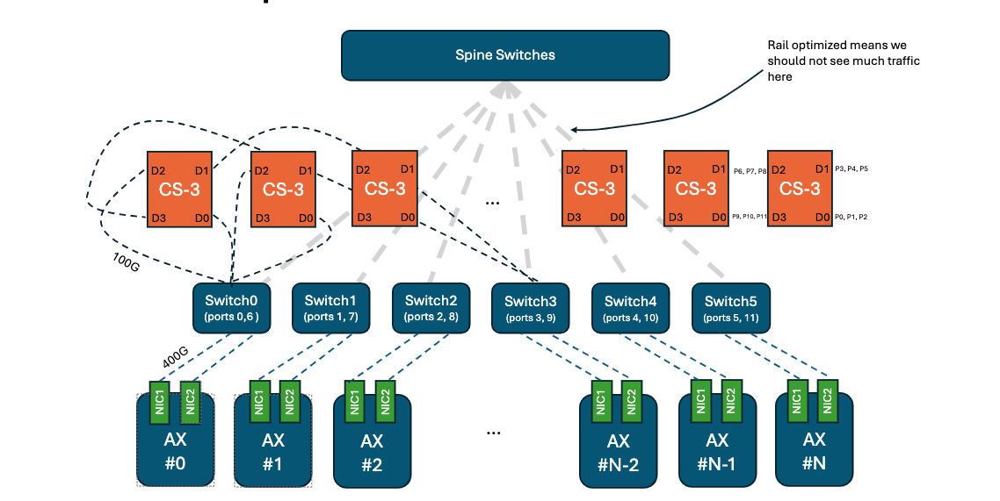
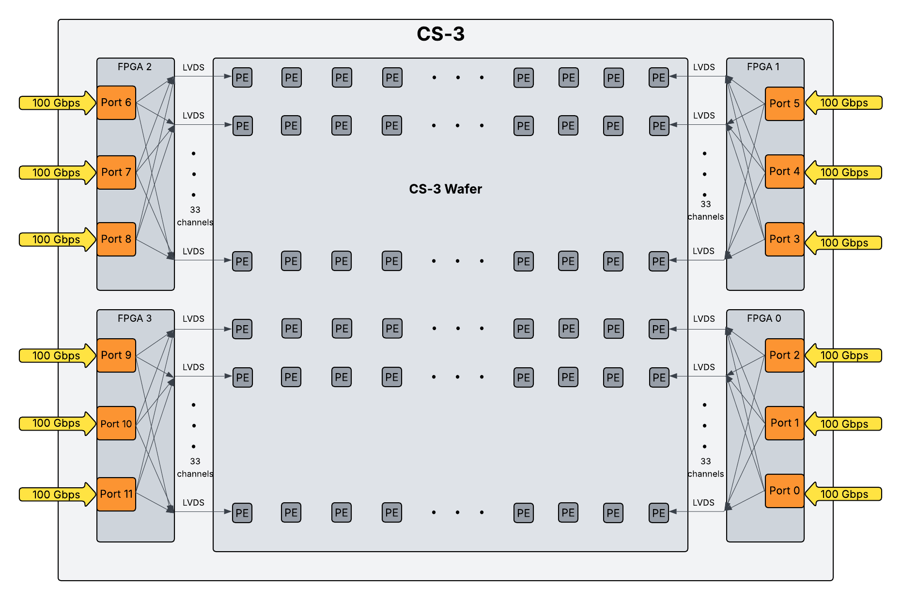
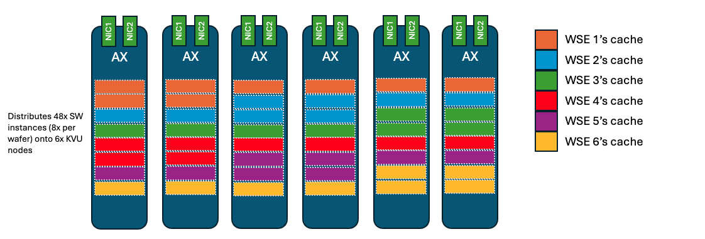

# Inference Cluster Topology - with Focus on Prompt Caching

| Field      | Value                                                                  |
|------------|------------------------------------------------------------------------|
| Author     | Eva Winterschön                                                        |
| Section    | research/prompt-cache                                                  |
| Version    | 0.1                                                                    |
| Date       | 2025-07-29                                                             |
| Repo       | [https://github.com/evaw-cerebras/](https://github.com/evaw-cerebras/) |
| Summarized | Prompt Cache, Cluster Design, Perf References                          |
| Inferenced | Qwen3-235B-Instruct                                                    |

---
## Purpose and Presence of Prompt Caching
Summarizing the current state of prompt caching on Cerebras CS-3 clusters requires substantial awareness of the arachitecture. Resource re-use, memory optimization, latency improvements, potential power efficiency gains, and other improvements are all factors worth consideration when describing the benefits of prompt caching. 

### Areas of Focus
1. Improving its internal functions as a core component of cluster architecture
2. Design and integration of a separate RDMA based storage layer for expanded cache footprint  

### Storage Sourcing
This background information is necessary for conceptualizing the potential methods upon which Prompt Cache Storage may be integrated. The source of this medium may fall on several options:

1. Internal designs using COTS
2. Customer supplied NAS w/ RDMA
3. Vendor collaborated design

---

## **Key Node Types for Inference**
1. **USR (User Node)**: Entry point for user requests; communicates with D-MGMT and C-MGMT.
2. **C-MGMT (Control Management)**: Manages cluster control plane.
3. **D-MGMT (Data Management)**: Data-plane manager; communicates with all AX nodes.
4. **AX (Activation Node)**: Hosts critical inference tasks; has physical affinity to CSX (CS-3) systems.

## **Inference Tasks (for Prompt Caching)**
- **API Server (USR)**: Receives user requests.
- **Coordinator (D-MGMT)**: Orchestrates all appliance tasks; interface between API server and internal tasks.
- **Chief (AX)**: Programs the wafer at job start; enables debug; controlled by Coordinator.
- **SwDriver (AX)**:  
  - Controls inference execution (token input/output, prompt processing).  
  - Manages KVSS tasks (evict/invite cache commands).  
  - No dedicated process — first ACT host assumes this role.  
  - **CPU-bound**: Handles scheduling, KV cache, structured outputs, gRPC streaming.  
  - Performance degrades if multiple SwDrivers share the same AX node → scheduling avoids this.
- **ACT (AX)**:  
  - Sends initial weights to connected CSX.  
  - Mostly idle after startup.  
  - Controlled by Coordinator.
- **KVSS (AX)**:  
  - Stores and manages KV cache for specific wafer regions.  
  - Critical for **prompt caching** (not used otherwise).  
  - Controlled by SwDriver.

---

## **Cluster Topology Overview**
- **CS-3 (Cerebras System 3)**:  
  - 4 domains (FPGAs), each with 3× 100Gbps Ethernet ports → 1.2 Tbps total.  
  - Ports connect to wafer via 33 LVDS channels; optimal balance: ≤11 channels per port.
- **AX Node IO**:  
  - 2× 400Gbps NICs, connected to leaf and spine switches.
- **Switching Architecture**:  
  - **Rail-optimized path**: Direct one-hop AX-to-CS-3 connection (lower latency, avoids spine).  
  - **Spine path**: Shared among all AX/CS-3; adds 3–4 μs latency and risk of bottleneck.
  - All CS-3 communication goes through rails; spine traffic must route back via rails.
  - **No cross-stamp rail connections**: Communication between stamps requires spine.

### CS3 Cluster - AX Spine Connections

### CS3 Wafer IO Diagram

### **Rail Configurations**
| Rails | Ports per Rail | Notes |
|-------|----------------|-------|
| 4x    | 3 ports        | Older design (e.g., DH1); less optimal |
| 6x    | 2 ports        | Current standard |
| 8x    | 3 ports        | Planned for future (CS-4) |
| 12x   | 1 port         | Highest granularity; avoids spine contention |

---

## **SwDriver Considerations**
- Always communicates with **Domain 3 of the first CS-3 box**.
- Tokens propagate chain-wise across domains (D3 → D0 → next D3, etc.).
- **Bandwidth**: Low demand (~512 Kb max per prompt); not a bottleneck.
- **Latency**: Spine adds ~4 μs → **<1% drop in generation speed** (~2000 tokens/s).
  - Rail-optimized path preferred but **not critical**.
- **CPU Usage**: High — scheduling, cache control, structured outputs, gRPC.
  - **Key Finding**: Co-locating multiple SwDrivers on one AX node reduces performance.
  - **Solution**: Custom scheduler ensures SwDrivers are isolated on separate AX nodes.

---

## **Optimizing for Prompt Cache Performance**
- Prioritize **KVSS placement** and **SwDriver isolation** (one per AX node).
- **Rail-optimized paths** are beneficial but not essential for SwDriver.
- Avoid spine congestion by leveraging rail connectivity where possible.
- Future scaling (e.g., CS-4) will support higher rail counts for better performance isolation.

---

## **KVSS Deployment Considerations for Prompt Caching**

### **Resource Perspectives**
- **KVSS** is critical for prompt caching performance; requires **rail-optimized** AX–CS-3 connections.
- **Memory allocation** is fair and proportional to model size.
- **CPU contention** is low — multiple KVSS shards can safely share AX nodes.
- **Namespace design** must balance CS-3 and AX counts and maximize rail coverage.
- **Job sharing and SwDriver isolation** must be enabled in Kubernetes.
- **Avoid spine congestion** — rail optimization is a best practice for scalability and stability.

--- 

### **KVSS (Key-Value Storage Server) Overview**
- **Role**: Manages off-wafer **KV cache** for a specific region of the wafer.
- **Controlled by**: SwDriver, which sends commands to **evict** or **refill** KV cache values.
- Each **KVSS shard** corresponds to one wafer region and communicates with a single CS-3 domain.

#### Example: KV Cache distribution on a 6x rail-optimized cluster

---

### **KVSS Connectivity**
- **High IO demand**: Unlike SwDriver, KVSS handles frequent, high-volume data transfers for cache refill/evict.
- **Rail-optimized connections are critical**:
  - To reduce spine switch load (shared across jobs).
  - Avoid bottlenecks and maintain performance predictability.
- Breaks 1:1 AX ↔ CS-3 mapping → enables **many-to-many connectivity**.
- Even for a **1-box model**, up to **12 KVSS shards** may be needed (one per CS-3 port) for full rail optimization.
- **Multiple jobs can share an AX node** — KVSS shards from different jobs can coexist on the same AX.

---

### **KVSS Resource Usage**
- **CPU**: Lightly utilized — mainly handles gRPC and WHOSTNET communication; no significant CPU contention when multiple shards share an AX.
- **Memory**:
  - More memory → higher **cache hit rate** → better performance.
  - Memory is **fairly shared** across jobs based on model size (number of CS-3 boxes used).
  - **Allocation formula**:

    $$
    M_{s,j} = \frac{B_j}{B_{\text{total}}} \cdot \frac{R_k}{N_{\text{KVU}}}
    $$

    Where:
    - $ M_{s,j} $: Memory for KVSS shard $ s $ of job $ j $
    - $ B_j $: Number of boxes used by job $ j $
    - $ B_{\text{total}} $: Total boxes in cluster
    - $ R_k $: RAM on KVU (AX) node $ k $
    - $ N_{\text{KVU}} $: Total number of AX nodes

  - Effectively, an **N-box job** gets memory equivalent to **N full AX nodes**, regardless of how shards are distributed.

---

## **Optimal Cluster Configuration for Prompt Caching**

### **Step 1: Determine AX Port Affinity**
To enable rail-optimized connections:
- Identify number of **rails** in cluster: 4x, 6x, 8x, or 12x.
- Map which AX nodes connect to which CS-3 ports.

### **Step 2: Create Namespace**
Must be within the **same stamp**. Requirements:

1. **Minimum CS-3 Systems**: At least **N** CS-3s for an N-box model.
2. **Minimum AX Nodes**: At least **N** AX nodes (due to memory fairness).
3. **Full Rail Optimization**: 
   - AX nodes must be selected to ensure **balanced, full coverage** of all 12 CS-3 ports.
   - Minimum AX nodes required depends on:
     - $ N $: Number of CS-3s per replica
     - $ R $: Number of rails in cluster

   > Formula: Choose AX nodes such that their port affinities **evenly cover all 12 ports** across all CS-3s.

**Example Table (Minimum AX Nodes Needed)**:

| CS-3s/Replica | Rails | Min AX Nodes |
|---------------|-------|--------------|
| 1             | 6     | 1            |
| 2             | 6     | 6            |
| 3             | 6     | 14           |
| 6             | 12    | 1            |
| 7             | 12    | 12           |
| 8             | 12    | 26           |

> ⚠️ Prompt caching can cause **imbalanced namespaces** (more AX or CS-3s than needed). Best practice: **use the entire cluster as one namespace**, or minimize imbalance when partitioning.

### **Step 3: Enable Job Sharing**
Required to allow multiple jobs to share AX nodes.

---

## **Impact of Non-Fully-Rail-Optimized Setup**
- **Not catastrophic**, but **suboptimal**.
- Current prompt processing: ~2–3 GB/s per CS-3 → with 10× faster refill via caching, need ~30 GB/s per box.
- Each AX provides up to 100 GB/s aggregate bandwidth (2× 400Gbps NICs).
- **Spine capacity** (e.g., DH1: 3× 51 Tbps) is high, but:
  - Real-world bursty traffic can cause congestion.
  - CS-3 ports are only 100G → funneling creates bottlenecks.
  - Spine is shared with **other traffic** (weights, multiple jobs).
  - Future improvements will increase IO demands.

> 🔍 **Rule of thumb**: Stay well below spine limits to avoid silent performance degradation.

---

## Additional Docs for Later Reference
- [KVSS memory-aware scheduling](https://cerebras.atlassian.net/wiki/spaces/AIC/embed/4343791644)
- [QA Test Plan for Prompt Caching](https://cerebras.atlassian.net/wiki/spaces/QA/pages/4274520121/QA+Test+Plan+for+Prompt+Caching)
