# Structured Design Stages for the KVSS Cache Storage System

| Field      | Value                                                                  |
|------------|------------------------------------------------------------------------|
| Author     | Eva Winterschön                                                        |
| Section    | research/prompt-cache-decision-workflow                                |
| Version    | 0.2                                                                    |
| Date       | 2025-07-29                                                             |
| Repo       | [https://github.com/evaw-cerebras/](https://github.com/evaw-cerebras/) |
| Summarized | Prompt Cache, Cluster Components, Performance Concerns                 |
| Aggregates | Docs + Reqs + Components (June+July 2025), RAG Analysis                |
| Inferenced | Qwen3-235B-Instruct                                                    |

---

## **Summary of Design Stages**
We'll cover the following design decisions via sectional analysis. These are echo'd in the repo's existing ADR structures.

1. Storage Tiering Strategy
2. Data Movement & Tiering Control
3. Coherence & Scalability Model
4. System Arch, Pooled vs Distributed
5. Technology Dependencies
6. Network Topology & Scalability
7. KVSS Placement Decisions
8. Backward Compatibility
9. Cache Discovery & Cache Miss Costs
10. System API Design
11. Third-Part Compatibility
12. Fault Tolerance & Resilience

### **Stage 1: Storage Tiering Strategy**
- **Requirement**: Support high throughput and low latency for prompt reuse.
- **Decision**: Implement a **two-tiered system**:
  - **Tier 1 (Hot)**: DRAM (on AX nodes) → fast access, managed by KVSS.
  - **Tier 2 (Warm/Cold)**: Low-latency, high-endurance **NVMe SSDs** (potentially disk-backed SharedKVSS).
- **Rationale**: Balance cost, capacity, and performance; enable long-term retention without bloating memory.
- **Tier Design Notes**:
  - A **three-tiered** system is technically possible on Xeon
  - Requires PMem/NVDIMM tech not present for AMD EPYC
  - Potential future designs may leverage EPYC compatible SKUs via ODM

---

### **Stage 2: Data Movement & Tiering Control**
- **Question**: Who controls movement between tiers?
- **Design**:
  - **Hybrid approach**:
    - **Passive (on demand)**: Data moves up on cache miss (triggered by SwDriver).
    - **Proactive (background)**: Use heuristics (e.g., reuse frequency, TTL) to promote high-value entries.
  - **Controller**: **SwDriver** (via policy) or a **dedicated cache manager daemon**.
- **Data Recall**: SwDriver queries Tier 2 on L1 miss; Tier 2 sends data back to L1 (KVSS) if available.

---

### **Stage 3: Coherence and Scalability Model**
- **Namespace Options**:
  - ❌ Per-replica: limits sharing, reduces hit rate.
  - ✅ **Per-model (across trusted replicas)**: balances isolation and reuse.
  - ⚠️ Single global namespace: complex coherence, higher risk.
- **Conclusion**: Use **per-model namespace** with secure isolation (via `isolation_id`).
- **Implication**: Software must track global state → more complex, but manageable with centralized metadata.

---

### **Stage 4: System Architecture – Pooling vs Distributed**
- **Option A: Centralized Pool (RDMA + NVMe-oF)**
  - Pool memory/storage across machines.
  - Managed by **external indexer/controller**.
  - Pros: unified view, easier load balancing.
  - Cons: added complexity to avoid single point of failure, network overhead, complex coherence.

- **Option B: Distributed (Local Index + Replication)**
  - Each replica manages its own KVSS + disk.
  - Optional DPU per node (ie, Xsight E1) for index compute + on-device mem + RoCE offload
  - Indexing logic co-located with storage.
  - Pros: fault-tolerant, scalable, aligned with current rail-optimized design.
  - Cons: lower global hit rate without affinity.

- **Decision**: **Distributed model preferred**, with optional **SharedKVSS** as Tier 2.

---

### **Stage 5: Technology Dependencies**
- **RDMA & NVMe-oF**:
  - ✅ **Use if available and low-latency**.
  - Enable zero-copy, high-throughput data movement.
  - But **not required** for initial implementation.
  - **Fallback**: TCP/IP with efficient batching.
- **Guideline**: Design interface to be **abstraction-layered** — support both RDMA/NVMe-oF and traditional storage.

---

### **Stage 6: Network Topology & Scalability**
- **Constraints**:
  - Not all-to-all connectivity (cost-prohibitive).
  - Must respect **rail-optimized paths** between AX and CS-X.
- **Design**:
  - KVSS runs on **AX nodes** → already rail-optimized.
  - Tier 2 (disk) can be on **same or adjacent AX nodes**.
  - Use **spine-leaf** with **multi-hop optimization**.
  - Avoid spine for KVSS ↔ CS-X; allow spine for Tier 2 ↔ KVSS if needed.
- **Scaled Topology**: 6x/12x rail clusters with spine for cross-stamp, leaf for intra-stamp.

---

### **Stage 7: KVSS Placement**
- **Requirement**: Must maintain **rail-optimized connectivity** to CS-X.
- **Decision**: Run **KVSS on AX nodes** (as today).
  - Ensures low-latency, high-bandwidth access to wafer.
  - Tier 2 (disk) can be co-located or nearby, but KVSS stays on AX.

---

### **Stage 8: Backward Compatibility**
- **Firm Requirement**: Build **on existing KVSS and network architecture**.
- **Implication**:
  - Extend KVSS protocol (e.g., `kvss_refill`, `kvss_evict`) to support disk tier.
  - Do not redesign core data path.
  - Add **Tier 2 hooks** as optional extensions.

---

### **Stage 9: Cache Discovery & Miss Cost**
- **Problem**: Querying remote cache may be high-latency.
- **Solutions**:
  - **Option 1**: SwDriver **always queries** → simple, but high miss cost.
  - **Option 2**: **Local metadata cache** in SwDriver (PrefixMap) → fast lookup.
    - On miss: query Tier 2 asynchronously.
    - Overlap with computation to hide latency.
  - **Option 3**: **Hint-based prefetch** using `continue_id` or prompt hashing.
- **Decision**: Use **local PrefixMap + async Tier 2 query** on miss.

---

### **Stage 10: System Interface Design**
- **Required Operations**:
  - `load`, `store`, `query`, `delete`, `set_priority`, `set_ttl`, `evict_policy`
- **Goal**: Maximize **alignment with third-party prompt caching systems** (e.g., vLLM, Redis, TensorRT-LLM).
- **Design**:
  - Define **standardized API layer** (gRPC/REST) over KVSS.
  - Support **priority tags**, **TTL**, **eviction hints** (LRU, LFU).
  - Use **column-based addressing** (aligned with current design).

---

### **Stage 11: Third-Party Research & Compatibility**
- **Need**: Investigate APIs from:
  - vLLM (GPU-focused, but has prompt caching)
  - Redis / KeyDB (in-memory stores)
  - TensorRT-LLM, Hugging Face, etc.
- **Risk**: Most systems are **GPU-only**, may not support wafer-scale or CS-X.
- **Strategy**: Build **general-purpose interface**, then add GPU-compatible adapters if needed.

---

### **Stage 12: Fault Tolerance & Resilience**
- **Failure Scenarios**:
  - **Disk failure**: Lose warm/cold data → acceptable (not critical).
  - **Machine (AX) failure**: Lose L1 cache → impact only current replicas.
- **Requirements**:
  - System must **remain functional**.
  - No single point of failure.
  - Fast recovery via load balancer rerouting.
- **Design**:
  - **No strong persistence required** for L1.
  - Tier 2 can use **replication** or **erasure coding** for critical data.
  - SwDriver handles **graceful degradation** on miss.

---

## 🌐 **Flowchart - KV Cache System Design Stages**

```mermaid
flowchart TD
    A[Start: KV Cache System Design] --> B{Two-Tiered System?}
    B -->|Yes| C[Tier 1: DRAM KVSS on AX]
    B -->|Yes| D[Tier 2: NVMe SSDs SharedKVSS]
    
    C --> E{Data Movement Control}
    D --> E
    E --> F[Hybrid: Passive + Proactive]
    F --> G[SwDriver or Cache Manager Controls Movement]

    G --> H{Namespace Scope?}
    H --> I[Per-Model Trusted Replicas]
    I --> J{Architecture: Pool or Distributed?}
    
    J -->|Distributed| K[Distributed KVSS + Local Index]
    J -->|Pooled| L[RDMA/NVMe-oF Pool + Central Index]
    K --> M[Preferred: Fault-Tolerant, Rail-Optimized]
    L --> N[Higher Complexity, Risk of Bottleneck]
    M --> O[Use RDMA/NVMe-oF]

    O --> P{Network Topology}
    P --> Q[Rail-Optimized AX ↔ CS-X]
    P --> R[Spine for Cross-Stamp]
    Q --> S[KVSS Runs on AX Nodes]

    S --> T{Backward Compatible?}
    T -->|Yes| U[Extend KVSS Protocol]
    U --> V{Cache Discovery Mechanism?}
    
    V --> W[Local PrefixMap + Async Tier 2 Query]
    W --> X{Standardized Interface?}
    X --> Y[Support: load/store/query/set_priority/TTL]
    Y --> Z{Third-Party API Research}
    Z --> AA[vLLM, Redis, TensorRT-LLM, etc.]

    AA --> AB{Fault Tolerance?}
    AB --> AC[Accept Data Loss on Failure]
    AB --> AD[System Must Stay Functional]
    AC --> AE[Replicate Tier 2 if Needed]
    AD --> AE
    AE --> AF[Final Design: Scalable, Secure, Rail-Optimized KV Cache]

    style AF fill:#d4f7d4,stroke:#333,color:black
```

---

## ✅ **Final Design Principles**
1. **Two-tiered**: DRAM + NVMe for capacity/performance balance.
2. **Distributed**: KVSS on AX, Tier 2 nearby; no central bottleneck.
3. **Rail-optimized**: KVSS placement respects network affinity.
4. **SwDriver-centric**: Manages cache logic, discovery, and refill.
5. **Fault-tolerant**: Data loss acceptable; system resilience critical.
6. **Extensible interface**: Aligns with industry standards, supports future integration.

This design **respects existing infrastructure** while enabling **scalable, performant, and secure** prompt caching across large clusters.
