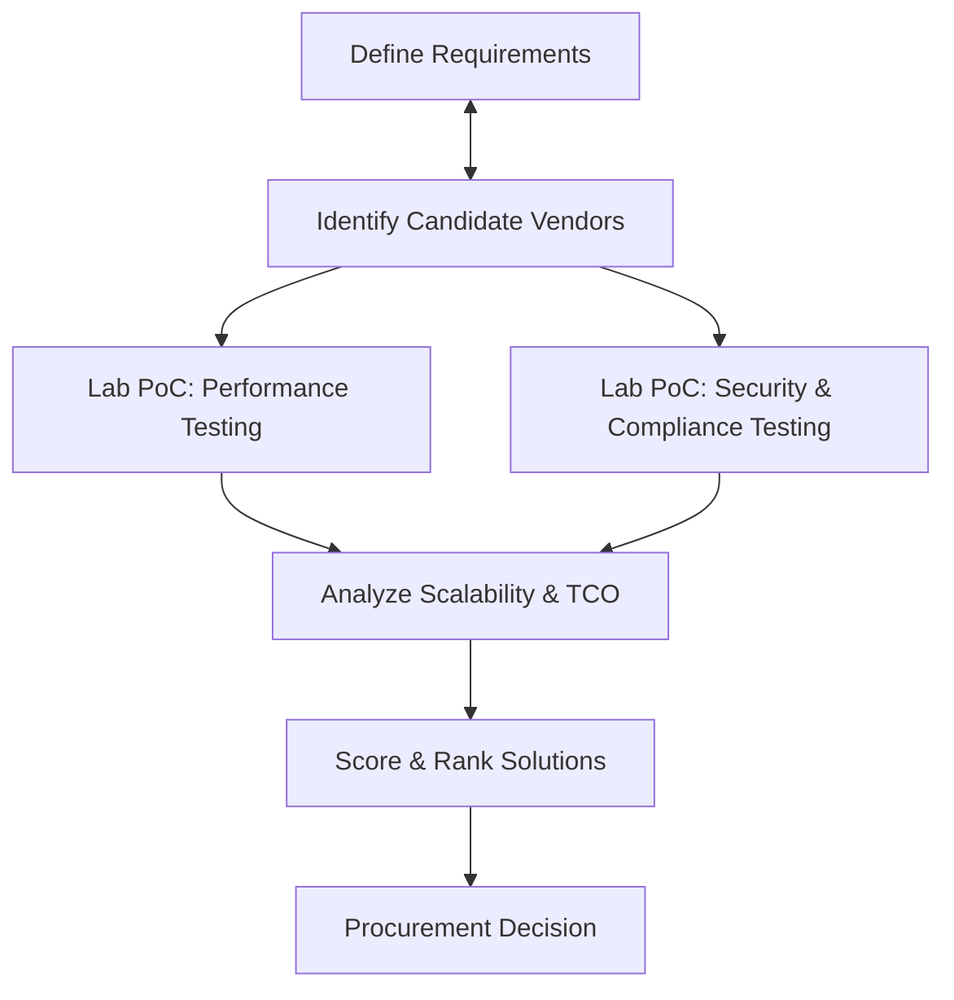

# Cerebras Storage Vendor Assessment for Distributed Cluster Workloads

| Field      | Value                                                                  |
|------------|------------------------------------------------------------------------|
| Author     | Eva Winterschön                                                        |
| Section    | research/vendor-assessment                                             |
| Version    | 0.4.0                                                                  |
| Date       | 2025-08-08                                                             |
| Repo       | [https://github.com/evaw-cerebras/](https://github.com/evaw-cerebras/) |
| Summarized | HPC, Cluster Storage, Performance Benchmarking                         |
| Aggregates | Docs + Reqs + Components (June+July 2025), RAG Analysis                |
| Inferenced | Qwen3-235B-Instruct                                                    |

## Introduction

High-Performance Computing (HPC) and modern AI/ML clusters demand storage solutions that deliver extreme performance and robust security at scale. Traditional storage often becomes a bottleneck in such environments. The industry trend (noted by Gartner) is a convergence of file and object storage into unified **all-flash** platforms that support both standard file protocols and object interfaces (NFS and S3-compat)[\[1\]](file://file-W1QgU8drbuMaFSxuTYfzy1#:~:text=extreme%20performance%20and%20robust%20security,compliant%20%20file%20%20access).

This analysis focuses on flash-based Network Attached Storage (NAS) systems that support **NFS over RDMA** (for low-latency POSIX file access) and **S3 object** protocols – a critical combination for HPC workloads that require both high-speed file I/O and scalable data lakes for unstructured data. 

We outline a standardized evaluation workflow, define a **reference cluster scale (100 TB to 10 PB)** with performance expectations (no degradation at scale), and compare leading vendor solutions (VAST Data, Pure Storage FlashBlade, Oracle ZFS, TrueNAS, IBM Spectrum Scale, Qumulo, Scality RING, and WekaIO) against key criteria.

The key evaluation dimensions are **Performance**, **Security/Compliance** (primary weight), and **Total Cost of Ownership (TCO)** and **Scalability** (secondary weight).

## Considerations on Assessing Storage for Cerebras Clusters
Due to the inherent design differences between Cerebras Systems 'Wafer Scale' approach to GPU-centric Ai/ML 
infrastructure, from physical hardware to software integrations, there are no direct comparisons yet possible when 
looking at existing storage vendor's solutions for Ai/ML workloads. We can approximate certain workload properties, 
baseline requirements for performance, and then evaluate the systems once we have an applicable integration. 

Though we cannot directly compare Cerebras vs Nvidia _(and its common connectors like vLLM)_, we still need to analyze 
the potential solutions from all available sides of comparative analysis which provide insight into the potential of 
each product. Therefore, in this document there are references to vLLM and Nvidia and GPUDirect and so forth. These 
are included for the aforementioned reason. 

## Standardized Product Evaluation Workflow

A **standard evaluation workflow** ensures a fair and comprehensive assessment of each storage product. The process combines product testing with verification of vendor capabilities and compliance.

## Define Use Case & Requirements

Gather specific workload requirements and constraints. Identify primary use cases (e.g. AI/ML training data, scientific simulations, virtualization datastores) and their I/O patterns. For example, AI/ML training involves streaming large datasets and checkpoint files (emphasizing high throughput), whereas virtualization hosts generate mixed random I/O (emphasizing low latency). Determine needed protocols (e.g. NFS for POSIX file access, with RDMA for low latency; S3 for object access and data lake integration) and target performance metrics (throughput in GB/s, IOPS, and latency). Also note capacity needs (scaling from ~100 TB up to 10+ PB) and whether multi-tenancy or multi-site replication is required.

---

## Identify Candidate Vendors

Shortlist vendors known for high-performance file/object storage (e.g. those recognized in Gartner’s Magic Quadrant for Distributed File and Object Storage). Ensure each candidate meets the protocol needs (NFS and S3 support, RDMA capability) and advertised performance scale. In our case, candidates include the following:

- **VAST Data** (all-flash "Universal Storage" with NFS over RDMA and S3 interfaces)[\[2\]](https://assets.ctfassets.net/2f3meiv6rg5s/5tqomuR2cznjq7BXxZvndL/b099318352e46687901fc42137869a72/the-vast-data-platform-for-multi-category-security.pdf#:~:text=White%20Paper%20,as%20S3%20objects%20through%20analytics)

- **Pure Storage FlashBlade** (scale-out flash file/object storage supporting NFS v3/v4 and S3)[\[3\]](https://www.purestorage.com/content/dam/pdf/en/white-papers/wp-flashblade-ethernet-for-hpc-workloads.pdf#:~:text=Pure%20Storage%20FlashBlade%2F%2FS%3A%20High,systems%20begin%20with%20a%20highly)[\[4\]](https://www.purestorage.com/content/dam/pdf/en/white-papers/wp-flashblade-ethernet-for-hpc-workloads.pdf#:~:text=FlashBlade%20NFS%20over%20Ethernet%20is,the%20Myths%20of%20NFS%20Deficiencies)
 
- **Oracle ZFS Appliance** (Oracle’s unified storage with NFS/SMB, block, and S3 API support)[\[5\]](https://www.oracle.com/storage/nas/#:~:text=Oracle%20ZFS%20Storage%20Appliance%20is,TCO)[\[6\]](https://www.oracle.com/storage/nas/#:~:text=,deployments)

- **TrueNAS** (open-source ZFS-based storage, can be all-flash, with NFS and S3 support via MinIO), **Qumulo** (scale-out NAS with integrated S3 API)[\[7\]](https://docs.qumulo.com/cloud-native-aws-administrator-guide/encryption-data-security/#:~:text=S3%20API%20%C2%B7%20Configuring%20and,Core%20%C2%B7%20OpenMetrics%20API%20Specification)

- **Scality RING** (scale-out object store with NFS/SMB file gateways)[\[8\]](https://www.slideshare.net/PhillipTribble/scality-ring-security-white-paper-72290799#:~:text=detail%20to%20get%20a%20better,net)

- **WekaIO (WekaFS)** (a distributed parallel filesystem with RDMA support and an S3 protocol front-end)[\[9\]](https://www.weka.io/resources/solution-brief/wekafs-s3-protocol/#:~:text=WekaFS%E2%84%A2%20includes%20high,capacity%20object%20storage).

---

## Lab Testing & Evaluation Phases

### Lab Proof-of-Concept (PoC): Performance Testing
Set up a test cluster (or use vendor provided test results) to measure performance under realistic conditions. Use a **reference cluster scale** (for example, start at ~100 TB and scale up to multi-PB) to verify that throughput and latency do not degrade at scale. Conduct single-node tests (one client node driving I/O to measure maximum per-client performance) and distributed tests (multiple clients in parallel to measure aggregate throughput and IOPS). Tools like **fio** (for low-level I/O patterns), **IOR** (for MPI-parallel large file throughput), and **mdtest** (for metadata operations like file creation) should be used to simulate real workloads. For example, run fio with random 4K reads/writes to simulate virtualization IOPS, run IOR with large sequential writes/reads for AI data streaming, and mdtest for file create/stat rates. Document the achieved throughput (GB/s), IOPS, and metadata ops, and ensure these meet requirements at 100 TB and at 1 PB+ with **no significant performance drop-off**.

### Lab PoC: Security & Compliance Testing
Evaluate each product’s security features in a controlled environment. Enable encryption (at-rest and in-transit) and measure any performance impact. Test access controls: set up NFSv4.1 or SMB shares with **ACLs** and verify that user and group permissions are enforced correctly across protocols. Test audit logging by generating file access events and ensuring they are recorded (and forwarded to a SIEM, if applicable). If possible, enable **compliance modes** (e.g. WORM/immutable snapshots for regulatory retention) and attempt tamper scenarios. Verify integration with security frameworks like LDAP/AD (for identity) and KMIP (for external key management). This step ensures the product can meet standards like **FIPS 140-3 encryption**, **NIST SP 800-53 controls**, and **ISO 27001** policies if required.

### Analyze Scalability & TCO
Examine the architecture for scalability bottlenecks. Check maximum cluster size (number of nodes, total capacity supported) and whether performance scales linearly with capacity and client count. Key architectural features to note are: support for **RDMA networks** (InfiniBand or RoCE for low latency clustering), use of a distributed or centralized metadata design, and any limits on namespace (e.g. max number of files or objects). Also evaluate **TCO** by considering capital costs (price per TB of the solution at the scale needed) and operational costs (power/cooling, maintenance). Include any software license fees, required proprietary hardware, or extra networking costs (for example, solutions that *require* an InfiniBand fabric might increase cost). Some vendors use data reduction (compression, deduplication) and high-density flash (like QLC NAND) to lower \$/TB – these factors should be included in TCO calculation. Normalize costs to a per-terabyte basis at ~1 PB scale for comparison.

### Score & Rank Solutions
For each vendor, compile the results from performance, security/compliance, scalability, and cost analysis. Assign scores (e.g. 1–10) for each category. We use **weighted scoring** – in this scenario, **Security/Compliance** and **Performance** are primary (higher weight) considerations, reflecting a CISO’s priority on security and an HPC architect’s priority on performance. **TCO** and **Scalability** are secondary factors but still included. Calculate a weighted total score for each solution (details in a later section). This quantitative ranking, combined with qualitative findings (e.g. specific feature advantages or gaps), will form the basis of the procurement recommendation.

### Procurement Decision
Finally, use the scorecard and organizational priorities to make a decision. If one solution leads in security and performance but has slightly higher cost, the organization must decide if that premium is justified. The final decision phase may involve negotiations, pilot deployments, and ensuring that the chosen vendor meets any additional requirements (such as support SLAs, data governance policies, etc.). At this stage, **legal and compliance checks** (e.g. verifying the vendor’s certifications like FedRAMP, HIPAA, or supply chain considerations) are also completed before signing a contract.

---

## Reference Cluster Scale and Performance Expectations

Throughout our evaluation, we consider a **reference cluster scaling from 100 TB to 10 PB** of usable capacity. 

All solutions are expected to maintain **near-linear performance scaling** from smaller to larger capacities – i.e., a 1 PB deployment should sustain roughly 10× the workload of a 100 TB deployment (assuming proportionally scaled-out hardware) without performance **bottlenecks** emerging. The storage platforms are assumed to be deployed in a **private colocation data center** with high-speed networking (at least 100 Gbps Ethernet or EDR/HDR InfiniBand where applicable). Latency-sensitive HPC workloads (model training that uses NFS) benefit from Remote Direct Memory Access; thus, **NFS over RDMA** capability is an important criterion. Similarly, for big data workflows, an integrated **S3** object store interface is expected to handle analytics jobs and archival within the same system.

At 10 PB scale, even small inefficiencies can greatly impact performance, so we expect the vendor architectures to include features such as: parallel I/O handling, avoidance of single metadata server bottlenecks, and intelligent client load distribution. For example, the top platforms use techniques like distributing metadata across nodes or using client-side caching/parallelism to achieve high metadata operations per second. We also assume that the **performance is maintained under heavy concurrency** (hundreds of client nodes, or thousands of VMs/containers accessing storage). Our tests therefore stress multi-client concurrency (e.g. 128+ threads in IOR/mdtest) to ensure that throughput and IOPS scale with the number of clients without significant "tail latency" issues.

---

## Key Evaluation Criteria and Weighting

We evaluate the vendors on four main criteria, with **Security/Compliance** and **Performance** as the primary weighted categories, and **Scalability** and **TCO** as secondary.

### **Performance** 
Measures how well the storage delivers I/O throughput, IOPS, and low latency under HPC workloads. This includes sequential read/write bandwidth (for big data and AI), random I/O performance (for virtualization or AI metadata reads), and metadata operation speed (file create/delete, directory listing under load). We also consider support for advanced performance features like direct GPU access (e.g. NVIDIA GPUDirect Storage) and how the system handles small files vs large files. A score of 10 would indicate top-tier, record-setting performance in independent benchmarks, whereas lower scores indicate performance trade-offs or bottlenecks.

### **Security & Compliance** 
Assesses the platform’s security features, encryption, and compliance with industry and government standards. This includes encryption of data at rest (and whether it’s certified to **FIPS 140-3** standards)[\[10\]](https://www.vastdata.com/blog/next-level-security-and-compliance-with-vast-4-6-4-7#:~:text=%2A%20KMIP)[\[11\]](https://www.vastdata.com/blog/next-level-security-and-compliance-with-vast-4-6-4-7#:~:text=%2A%20FIPS%20140,flight%2C%20and%20mgmt%20traffic), encryption of data in transit (end-to-end or via protocols like Kerberos for NFS[\[12\]](https://www.purestorage.com/content/dam/pdf/en/white-papers/wp-flashblade-ethernet-for-hpc-workloads.pdf#:~:text=1,users%20accessing%20data%20from%20NFS)), access control capabilities (support for **ACLs** such as NFSv4 ACLs or Windows NTFS ACLs[\[13\]](https://www.purestorage.com/content/dam/pdf/en/white-papers/wp-flashblade-ethernet-for-hpc-workloads.pdf#:~:text=1,users%20accessing%20data%20from%20NFS), role-based access control for management, multi-tenancy isolation), audit logging of user activities, and any special compliance modes (e.g. SEC 17a-4 WORM retention support, STIG hardening profiles, etc.). We also verify alignment with frameworks like **NIST 800-53** controls[\[14\]](https://www.vastdata.com/blog/next-level-security-and-compliance-with-vast-4-6-4-7#:~:text=Our%20platform%20aligns%20with%20several,across%20an%20organization%E2%80%99s%20entire%20IT) and certifications such as **ISO 27001** (if the vendor has them). Given a CISO perspective, this category has the highest weight. A score of 10 means the product provides comprehensive security features with relevant certifications (e.g. FIPS-validated encryption, built-in audit trails, RBAC, and demonstrated compliance reports), whereas lower scores mean some gaps (for example, lack of audit logging or pending certifications).

### **Scalability** 
This criterion examines both *capacity scalability* (how many petabytes and file count it can grow to) and *performance scalability* (ability to add nodes to increase throughput linearly). It also considers global namespace capabilities (can it present a single namespace across all 10 PB or does it require multiple volumes?), support for geo-distribution or multi-site replication, and client scalability (number of concurrent client mounts supported, etc.). We check if the architecture is truly scale-out (e.g. adding more storage nodes adds performance) and features like **pNFS** or client parallelism that aid scaling. A top score indicates the system can handle **multi-petabyte, billions of files, hundreds of nodes** deployments with ease (examples: proven deployments at \>50 PB, or design with no hard cluster size limit), whereas a lower score might indicate a more scale-up design or practical limits (e.g. max 2 controllers, or degrading performance beyond a certain cluster size).

### **Total Cost of Ownership (TCO)**
We evaluate relative cost-effectiveness, including upfront acquisition cost, licensing, and operational costs over 3-5 years. Lower \$/TB (especially at scale) and efficiency (power/cooling per TB) result in higher scores. We also consider features that improve TCO: inline data reduction (which effectively lowers cost/TB stored), use of commodity components vs proprietary hardware, and the ability to start small and scale without painful forklift upgrades. Furthermore, ease of management (which affects OpEx) can factor in. Since exact pricing is often vendor-specific and negotiated, we score this qualitatively, assuming typical market prices. An open-source or commodity-based solution like TrueNAS or Scality might score very high on TCO (due to low software costs and flexibility), whereas a proprietary all-flash appliance might score lower unless it demonstrates significantly better density or data reduction that justifies its cost.

### **Weighting and Why and How**
Using a normalized scoring process for each priority layer, and accordingly assign percentages.

- **30%** to *Performance*
- **30%** to *Security/Compliance*
- **20%** to *Scalability*
- **20%** to *TCO*

This reflects the primary importance of security and performance in HPC storage selection, with acknowledgment that scalability and cost are secondary, though still significant. Each vendor will receive a numeric score in each category, multiplied by these weights to produce a weighted total.

---

## Security Compliance Feature Matrix (Capabilities vs. Requirements)

The table below summarizes key security and compliance features of each evaluated solution, mapping them to common CISO requirements:

| **Security Feature / Compliance** | **VAST Data** | **Pure FlashBlade** | **Oracle ZFS** | **TrueNAS Enterprise** | **IBM Spectrum Scale** | **Qumulo Core** | **Scality RING** | **WekaFS** |
|----|----|----|----|----|----|----|----|----|
| **Encryption at-rest** (FIPS 140-3 validated?) | Yes – FIPS 140-3 L1 validated (software)[\[10\]](https://www.vastdata.com/blog/next-level-security-and-compliance-with-vast-4-6-4-7#:~:text=%2A%20KMIP). Uses always-on AES-256 XTS. | Yes – FIPS 140-2/3 validated module[\[15\]](https://csrc.nist.gov/CSRC/media/projects/cryptographic-module-validation-program/documents/security-policies/140sp5000.pdf#:~:text=The%20Module%20is%20validated%20to,The%20FlashBlade%20Data%20Encryption)[\[16\]](https://sec-certs.org/fips/iut/6882b5b464573d7663cfdf6f#:~:text=...%20FIPS%20140,3); always-on AES-256. | Yes – via ZFS encryption (FIPS 140-2 in Solaris; Linux kernel crypto FIPS 140-3 mode available)[\[17\]](https://docs.oracle.com/cd/E73148_01/VSMPL/encryption.htm#:~:text=8%20Data%20at%20Rest%20Encryption,person%20enables%20the%20encryption). | Yes – ZFS encryption (AES-256); FIPS 140-3 module available via **TrueSecure** addon[\[18\]](https://www.truenas.com/blog/truenas-is-secure-storage/#:~:text=possible,international%20support%20for%20ISO%2027001)[\[19\]](https://www.truenas.com/blog/truenas-is-secure-storage/#:~:text=FIPS%20140,proof%20mechanisms%20for%20additional%20security). | Yes – supports encryption with external key management[\[20\]](https://www.redbooks.ibm.com/redpapers/pdfs/redp5707.pdf#:~:text=This%20chapter%20provides%20detailed%20instructions,redundant%20servers%20in%20a) (Guardium KLM); FIPS mode available (requires FIPS-certified env)[\[21\]](https://www.oit.va.gov/services/trm/ToolPage.aspx?tid=5485#:~:text=IBM%20Storage%20Scale%20,VA%20sensitive%20information%2C%20where%20applicable). | Yes – AES-256 encryption built-in; FIPS 140-2 compliant software module[\[22\]](https://qumulo.com/wp-content/uploads/2023/10/Qumulo-Security-Architecture-and-Practices.pdf#:~:text=their%20security%20policies.%20Qumulo%E2%80%99s%20software,certified%20as%20compliant%20with%20FIPS). | Yes – via external KMS integration (SafeNet/Entrust); AES-256 encryption of object data. FIPS 140-2 alignment (uses OpenSSL FIPS mode)[\[23\]](https://www.slideshare.net/PhillipTribble/scality-ring-security-white-paper-72290799#:~:text=working%20with%20public%20health%20information,everyone%20should%20have%20privileged%20access)[\[24\]](https://www.slideshare.net/PhillipTribble/scality-ring-security-white-paper-72290799#:~:text=be%20provided%20through%20roles%20such,The%20Scality%20RING%20architecture%20is). | Yes – end-to-end encryption from client to disk[\[25\]](https://www.weka.io/blog/distributed-file-systems/padlocking-petabytes-with-weka/#:~:text=The%20good%20news%2C%20as%20we%E2%80%99ve,on%20the%20last%20two%20years); uses AES-256 (XTS) and is targeting FIPS 140-3 cert[\[26\]](https://www.weka.io/blog/distributed-file-systems/padlocking-petabytes-with-weka/#:~:text=So%2C%20where%20do%20we%20head,3%20certified). |
| **Encryption in-transit** (TLS, Kerberos, etc.) | Yes – TLS for S3 and mgmt; NFS over RDMA with Kerberos support for NFSv4.1. FIPS-validated TLS cipher suites[\[10\]](https://www.vastdata.com/blog/next-level-security-and-compliance-with-vast-4-6-4-7#:~:text=%2A%20KMIP). | Yes – Supports NFS Kerberos (KRB5p)[\[13\]](https://www.purestorage.com/content/dam/pdf/en/white-papers/wp-flashblade-ethernet-for-hpc-workloads.pdf#:~:text=1,users%20accessing%20data%20from%20NFS), SMB encryption, and TLS for object. Always-on encryption for replication traffic[\[27\]](https://www.purestorage.com/content/dam/pdf/en/white-papers/wp-flashblade-ethernet-for-hpc-workloads.pdf#:~:text=over%20POSIX%20ACLs%20for%20directories,of%20security%20for%20HPC%20users). | Yes – Supports Kerberos for NFS/SMB, TLS for object (OCI compatible). IB/FC traffic is not IP (block-level security via zoning). | Yes – TLS for web/UI and replication; supports Kerberos for NFSv4; SMB signing. TrueNAS SCALE supports WireGuard VPN for remote replication. | Yes – Supports Kerberos for NFS/SMB via CES, TLS for GUI and REST API. Client \<-\> cluster typically on trusted network (Spectrum Scale can isolate networks). | Yes – Offers optional encryption on NFSv4.1, SMB, and FTP traffic (TLS)[\[28\]](https://qumulo.com/wp-content/uploads/2023/10/Qumulo-Security-Architecture-and-Practices.pdf#:~:text=%E2%97%8F%20FIPS%20compliant%20software,1%20and%20FTP%20traffic). All inter-node comms are encrypted. | Yes – All access via HTTPS for S3; NFSv3 via Kerberos KDC supported[\[29\]](https://www.slideshare.net/PhillipTribble/scality-ring-security-white-paper-72290799#:~:text=protocol%20supports%20HTTPS%20and%20can,1%20Logging); SMB via AD (TLS). Internal control traffic can be on secure networks. | Yes – SMB protocol encryption supported[\[30\]](https://www.weka.io/blog/distributed-file-systems/padlocking-petabytes-with-weka/#:~:text=Data%20Encryption%20for%20SMB%20Protocol); Weka client traffic is proprietary and encrypted; TLS for S3 API. |
| **Access Control & Multi-tenancy** (ACLs, RBAC, isolation) | Granular multi-tenant support: can segment clients by "CNode pools" (separate front-end pools per tenant)[\[31\]](https://assets.ctfassets.net/2f3meiv6rg5s/5tqomuR2cznjq7BXxZvndL/b099318352e46687901fc42137869a72/the-vast-data-platform-for-multi-category-security.pdf#:~:text=System%20operators%20can%20provide%20varying,to%20a%20CNode%20pool%20and). Supports hybrid RBAC+ABAC for data isolation (tag-based and role-based control)[\[32\]](https://assets.ctfassets.net/2f3meiv6rg5s/5tqomuR2cznjq7BXxZvndL/b099318352e46687901fc42137869a72/the-vast-data-platform-for-multi-category-security.pdf#:~:text=Granular%20Access%20VAST%20provides%20granular,encryption%20keys%20via%20KMIP%20for)[\[33\]](https://assets.ctfassets.net/2f3meiv6rg5s/5tqomuR2cznjq7BXxZvndL/b099318352e46687901fc42137869a72/the-vast-data-platform-for-multi-category-security.pdf#:~:text=In%20summary%2C%20the%20VAST%20Data,for%20an%20authority%20to%20operate). NFSv4 and SMB ACLs supported. | Supports standard UNIX mode bits and NFSv4.1 ACLs[\[13\]](https://www.purestorage.com/content/dam/pdf/en/white-papers/wp-flashblade-ethernet-for-hpc-workloads.pdf#:~:text=1,users%20accessing%20data%20from%20NFS), plus Active Directory integration and LDAP. Management is role-based (admin, read-only roles). Multi-tenancy is limited (one cluster = one namespace; can create multiple file systems for isolation). | Multi-tenant mostly via separate project shares or network segregation. Supports POSIX ACLs and integration with Oracle Identity management. Admin GUI has RBAC for roles. | Supports POSIX and NFSv4 ACLs (ZFS). TrueNAS has GUI RBAC for admin roles. **TrueSecure** adds STIG configuration and upcoming file audit features[\[34\]](https://www.truenas.com/blog/truenas-is-secure-storage/#:~:text=With%20TrueSecure%2C%20iXsystems%20is%20actively,systems%20and%20ensure%20secure%20operation). Multi-tenant isolation is limited (primarily a single-instance appliance per tenant). | Very granular POSIX permissions and Windows ACL support. Integrates with LDAP/AD. Supports file set quotas and isolation per fileset (can be used for multi-tenant-like separation within one cluster). Admin roles can be defined. Multi-tenancy at scale is usually done via separate filesystems and CES zones. | Unified permissions model for SMB/NFS (maps Windows ACL to POSIX). Full Active Directory support with LDAP. **Audit logs** record all file access events[\[35\]](https://docs.qumulo.com/cloud-native-aws-administrator-guide/monitoring-and-metrics/how-audit-logging-works.html#:~:text=How%20Audit%20Logging%20Works%20,client%20sends%20a%20request). Multi-tenant networking available (network-level tenant isolation)[\[36\]](https://qumulo.com/wp-content/uploads/2023/10/Qumulo-Security-Architecture-and-Practices.pdf#:~:text=FIPS%20140,tenant%20networking%2016)[\[37\]](https://qumulo.com/wp-content/uploads/2023/10/Qumulo-Security-Architecture-and-Practices.pdf#:~:text=refer%20to%20the%20cloud%20vendor%E2%80%99s,Active%20Directory%20integration), though not true multi-tenant accounts except via AD trusts. | Multi-tenant via S3 IAM: supports S3 accounts, users, groups, and bucket policies[\[38\]](https://www.slideshare.net/PhillipTribble/scality-ring-security-white-paper-72290799#:~:text=3%3A%20Connector%20and%20User%20Interface,Scaling%20%E2%80%A2%20Limitless%20Infrastructure%20Scaling). File protocols: NFS connector supports Kerberos (per-user security)[\[29\]](https://www.slideshare.net/PhillipTribble/scality-ring-security-white-paper-72290799#:~:text=protocol%20supports%20HTTPS%20and%20can,1%20Logging), SMB connector supports AD and simple ACLs. The Supervisor management UI has role-based admin accounts. Can segregate tenants by separate connectors or rings if needed. | Introduced "Organizations" feature: isolates data by tenant with separate auth tokens for mounts[\[39\]](https://www.weka.io/blog/distributed-file-systems/padlocking-petabytes-with-weka/#:~:text=WekaFS%20and%20Data%20Encryption). This prevents even cluster admins from accessing other org’s data without a token. Supports POSIX ACL inheritance[\[40\]](https://www.weka.io/blog/distributed-file-systems/padlocking-petabytes-with-weka/#:~:text=In%20Weka%E2%80%99s%20subsequent%203,experience%20in%20a%20Windows%20environment) and Windows ACLs (mapped to POSIX)[\[41\]](https://www.weka.io/blog/distributed-file-systems/padlocking-petabytes-with-weka/#:~:text=inheritance,experience%20in%20a%20Windows%20environment). Admin roles are available, and AD/LDAP integration for user auth. |
| **Audit Logging** (File access and admin actions) | Yes – All protocols (NFS, SMB, S3) and admin actions are fully audited in VAST 4.7[\[42\]](https://www.vastdata.com/blog/next-level-security-and-compliance-with-vast-4-6-4-7#:~:text=,1%20%E2%80%93%20Mission%20Critical%20Classified)[\[43\]](https://www.vastdata.com/blog/next-level-security-and-compliance-with-vast-4-6-4-7#:~:text=,admin%20actions%20also%20fully%20audited). Logs can be exported to SIEM. | Partially – Admin activities and configuration changes are logged. File access audit: FlashBlade has an API for audit but not real-time file audit streaming (as of latest version, this is a weaker area). Reliant on client OS audit for NFS. | Yes – The ZFS Appliance logs admin actions and can retain syslog of events. It provides **immutable audit logs** for WORM compliance (e.g. SEC 17a-4 retention)[\[44\]](https://www.oracle.com/a/ocom/docs/storage/oracle-zfs-assessment-report.pdf#:~:text=allows%20for%20consolidated%20file%2C%20object%2C,requirements%20specified%20in%20the%20following)[\[45\]](https://www.oracle.com/a/ocom/docs/storage/oracle-zfs-assessment-report.pdf#:~:text=%E2%97%8F%20Commission%20Delegated%20Regulation%20,1). File-level access audit via NDMP or custom logging possible (not a built-in real-time audit for every NFS operation by default). | Improving – TrueNAS 13/Scale have basic logging (services, login attempts). Full file audit logging is **planned** as part of the Cobia release (with TrueSecure enabling file change auditing)[\[34\]](https://www.truenas.com/blog/truenas-is-secure-storage/#:~:text=With%20TrueSecure%2C%20iXsystems%20is%20actively,systems%20and%20ensure%20secure%20operation). Currently can rely on SMB audit logs and ZFS change logs. | Yes – Spectrum Scale offers a **File Audit Logging** feature[\[46\]](https://www.redbooks.ibm.com/redpapers/pdfs/redp5426.pdf#:~:text=,) that records file access events at scale (designed to meet security requirements). Admin actions via GUI/CLI are also logged. | Yes – Qumulo Core provides detailed audit logs for filesystem operations[\[35\]](https://docs.qumulo.com/cloud-native-aws-administrator-guide/monitoring-and-metrics/how-audit-logging-works.html#:~:text=How%20Audit%20Logging%20Works%20,client%20sends%20a%20request). Every NFS/SMB file open/modify can be recorded and exported (e.g. to Splunk). Admin UI actions are logged as well. | Yes – Extensive audit trails available[\[47\]](https://www.solved.scality.com/scality-customers-can-comply-with-confidence/#:~:text=Scality%20customers%20can%20comply%20with,analysis%20of%20the%20causes). The system logs who accessed what and when, for forensic analysis. Audit log covers user actions on the system (Supervisor, connectors, etc.)[\[48\]](https://www.slideshare.net/PhillipTribble/scality-ring-security-white-paper-72290799#:~:text=Protocols%20%E2%96%A0%E2%96%A0%20The%20Scality%20NFS,performed%2C%20result%20of%20the%20action). S3 access logs can be enabled per bucket as well. | Partial – Weka logs admin operations and system events. File access auditing is not fully integrated (no built-in per-file audit stream as of Weka 4.0). However, one can use OS-level auditing on NFS clients or use Weka’s metadata snapshots to detect changes. (Audit logging is an area where Weka is improving as they target regulated customers.) |
| **Compliance Certifications** (HIPAA, SEC17a-4, etc.) | FIPS 140-3 Level 1 validated encryption[\[10\]](https://www.vastdata.com/blog/next-level-security-and-compliance-with-vast-4-6-4-7#:~:text=%2A%20KMIP); NIST SP 800-53 Rev5 alignment[\[14\]](https://www.vastdata.com/blog/next-level-security-and-compliance-with-vast-4-6-4-7#:~:text=Our%20platform%20aligns%20with%20several,across%20an%20organization%E2%80%99s%20entire%20IT); DISA STIG compliance for OS (Rocky Linux STIG)[\[42\]](https://www.vastdata.com/blog/next-level-security-and-compliance-with-vast-4-6-4-7#:~:text=,1%20%E2%80%93%20Mission%20Critical%20Classified). Common Criteria: not listed (pending). Likely capable of HIPAA and GDPR compliance (with encryption and audit). | FIPS 140-2 validated (FlashBlade encryption module)[\[15\]](https://csrc.nist.gov/CSRC/media/projects/cryptographic-module-validation-program/documents/security-policies/140sp5000.pdf#:~:text=The%20Module%20is%20validated%20to,The%20FlashBlade%20Data%20Encryption); likely FIPS 140-3 (cert in 2024)[\[16\]](https://sec-certs.org/fips/iut/6882b5b464573d7663cfdf6f#:~:text=...%20FIPS%20140,3). Has Common Criteria (NIAP) EAL2 for FlashArray (FlashBlade may be in progress). PCI-DSS compliance for always-on encryption[\[49\]](https://www.purestorage.com/content/dam/pdf/en/white-papers/wp-flasharray-data-security-and-compliance.pdf#:~:text=Storage%20www,efficacy%20of%20our%20data). ISO 27001: as a vendor, Pure Storage operates under ISO 27001 for its services (not a product cert). | SEC 17a-4 / FINRA 4511 compliant (via WORM retention capability validated by Cohasset report)[\[50\]](https://www.oracle.com/a/ocom/docs/storage/oracle-zfs-assessment-report.pdf#:~:text=records,%28Cohasset%29%20assesses%20the%20capabilities)[\[51\]](https://www.oracle.com/a/ocom/docs/storage/oracle-zfs-assessment-report.pdf#:~:text=%E2%97%8F%20Securities%20and%20Exchange%20Commission,45%2C%20when%20properly). FIPS 140-2: Oracle Solaris crypto is certified; the appliance on Oracle Linux relies on FIPS-validated modules for encryption (Oracle docs mention FIPS 140-3 for Oracle Linux kernel crypto)[\[52\]](https://www.oracle.com/a/ocom/docs/140sp4739.pdf#:~:text=%5BPDF%5D%20FIPS%20140,UEK7). Oracle is ISO 27001 certified as a company (for its cloud, which implies practices in products). | Not certified out-of-the-box. However, **TrueSecure** aims for NIST 800-171 (and by extension 800-53) compliance[\[34\]](https://www.truenas.com/blog/truenas-is-secure-storage/#:~:text=With%20TrueSecure%2C%20iXsystems%20is%20actively,systems%20and%20ensure%20secure%20operation). Drives can be FIPS 140-2 SEDs[\[53\]](https://www.truenas.com/blog/truenas-is-secure-storage/#:~:text=will%20be%20specific%20to%20TrueSecure,TrueSecure%20provides%20the%20following%20capabilities). TrueNAS enterprise is used in ISO 27001 environments[\[54\]](https://www.truenas.com/blog/truenas-is-secure-storage/#:~:text=TrueNAS%20is%20Secure%20Storage%20These,their%20way%20into%20TrueNAS) but the product itself has no formal CC or FIPS cert yet (aside from using FIPS drives and modules). | Often used in federal environments but **requires external FIPS module** if handling sensitive data[\[21\]](https://www.oit.va.gov/services/trm/ToolPage.aspx?tid=5485#:~:text=IBM%20Storage%20Scale%20,VA%20sensitive%20information%2C%20where%20applicable). No direct FIPS cert for the whole product. IBM Storage Scale is evaluated for certain regulations (e.g. it can be part of an ISO 27001 ISMS and meet NIST controls when configured). No known Common Criteria certification specific to Spectrum Scale. | FIPS 140-2 certificate achieved for its crypto (Qumulo Core 3.2 got a FIPS 140-2 cert for the TLS KDF and at-rest encryption module)[\[55\]](https://qumulo.com/wp-content/uploads/2023/10/Qumulo-Security-Architecture-and-Practices.pdf#:~:text=compliance%20with%20Federal%20Information%20Processing,certified%20as%20compliant%20with%20FIPS)[\[56\]](https://qumulo.com/wp-content/uploads/2023/10/Qumulo-Security-Architecture-and-Practices.pdf#:~:text=FIPS,at%20the%20end%20of%20this). SOC 2 Type II and ISO 27001 certifications for Qumulo (corporate) have been reported. Supports SEC 17a-4 style WORM via snapshots (not sure if formally certified, but data immutability is supported via snapshot retention). | Cohasset-compliant for SEC 17a-4 WORM when using object lock (versioning + retention) – used by financial customers[\[44\]](https://www.oracle.com/a/ocom/docs/storage/oracle-zfs-assessment-report.pdf#:~:text=allows%20for%20consolidated%20file%2C%20object%2C,requirements%20specified%20in%20the%20following)[\[45\]](https://www.oracle.com/a/ocom/docs/storage/oracle-zfs-assessment-report.pdf#:~:text=%E2%97%8F%20Commission%20Delegated%20Regulation%20,1). RING is Common Criteria EAL2+ certified (older sources mention EAL2 for RING under certain configurations). FIPS: relies on FIPS-enabled OpenSSL; not individually certified. Scality has many government deployments (e.g. military) indicating practical compliance. | No formal cert yet. Weka uses FIPS 140-3 compliant algorithms and is **pursuing FIPS 140-3 certification**[\[26\]](https://www.weka.io/blog/distributed-file-systems/padlocking-petabytes-with-weka/#:~:text=So%2C%20where%20do%20we%20head,3%20certified). It’s a relatively new player, so things like Common Criteria or ISO certifications are likely in progress. That said, Weka can be configured to meet NIST 800-53 controls (encryption, access control, etc.) and works with FIPS 140-3 compliant key managers. |

--- 

#### Simplified Table

| **Security Feature / Compliance** | **VAST Data** | **Pure FlashBlade** | **Oracle ZFS** | **TrueNAS Enterprise** | **IBM Spectrum Scale** | **Qumulo Core** | **Scality RING** | **WekaFS** |
|----|----|----|----|----|----|----|----|----|
| **Encryption at-rest** | Yes | Yes | Yes | Yes | Yes | Yes | Yes | Yes |
| **Encryption in-transit** | Yes | Yes | Yes | Yes | Yes | Yes | Yes | Yes |
| **Access Control & Multi-tenancy** |Yes | Yes | Yes | Yes | Yes | Yes | Yes | Yes |
| **Audit Logging** | Yes | Partial | Yes | Improving | Yes | Yes | Yes | Partial |
| **Compliance Certifications** | FIPS 140-3 Level 1; NIST SP 800-53 Rev5; DISA STIG | FIPS 140-2; FIPS 140-3. (NIAP) EAL2 for FlashArray. PCI-DSS. ISO 27001 | SEC 17a-4 / FINRA 4511. FIPS 140-2: FIPS 140-3 ISO 27001 certified. | TrueSecure aims for NIST 800-171 compliance. Drives can be FIPS 140-2 SEDs. TrueNAS enterprise is ISO 27001. | IBM Storage Scale can be ISO 27001 ISMS and NIST | FIPS 140-2. SOC 2 Type II and ISO 27001. SEC 17a-4 WORM | Cohasset-compliant for SEC 17a-4 WORM. RING is Common Criteria EAL2+. FIPS-enabled OpenSSL. | FIPS 140-3 algorithms and is **pursuing FIPS 140-3 certification**. NIST 800-53 with FIPS 140-3 compliant key managers. |

#### **Notes on the Security Matrix** 
All the platforms support basic
security building blocks (encryption, ACLs, etc.), but the depth varies.

- **VAST Data** and **Pure Storage** stand out by having completed or nearly completed FIPS 140-3 validations and 
  offering extensive audit and hardening features [\[10\]](https://www.vastdata.com/blog/next-level-security-and-compliance-with-vast-4-6-4-7#:~:text=%2A%20KMIP)[\[13\]](https://www.purestorage.com/content/dam/pdf/en/white-papers/wp-flashblade-ethernet-for-hpc-workloads.pdf#:~:text=1,users%20accessing%20data%20from%20NFS).
- **Oracle ZFS** and **Scality RING** shine for compliance retention (WORM) features important in regulated 
  industries[\[44\]](https://www.oracle.com/a/ocom/docs/storage/oracle-zfs-assessment-report.pdf#:~:text=allows%20for%20consolidated%20file%2C%20object%2C,requirements%20specified%20in%20the%20following)[\[48\]](https://www.slideshare.net/PhillipTribble/scality-ring-security-white-paper-72290799#:~:text=Protocols%20%E2%96%A0%E2%96%A0%20The%20Scality%20NFS,performed%2C%20result%20of%20the%20action).
- **Qumulo** has made security a priority with FIPS validation and strong audit capabilities[\[22\]](https://qumulo.com/wp-content/uploads/2023/10/Qumulo-Security-Architecture-and-Practices.pdf#:~:text=their%20security%20policies.%20Qumulo%E2%80%99s%20software,certified%20as%20compliant%20with%20FIPS)[\[35\]](https://docs.qumulo.com/cloud-native-aws-administrator-guide/monitoring-and-metrics/how-audit-logging-works.html#:~:text=How%20Audit%20Logging%20Works%20,client%20sends%20a%20request). 
- **IBM Spectrum Scale** provides a rich security feature set (encryption, ACLs, audit logging) but relies on proper configuration and external modules for certain certifications[\[21\]](https://www.oit.va.gov/services/trm/ToolPage.aspx?tid=5485#:~:text=IBM%20Storage%20Scale%20,VA%20sensitive%20information%2C%20where%20applicable)[\[46\]](https://www.redbooks.ibm.com/redpapers/pdfs/redp5426.pdf#:~:text=,). 
- **TrueNAS** (especially with TrueSecure) caters to smaller organizations or cost-sensitive deployments that still need encryption and compliance, though some features are new or pending (e.g. STIG hardening scripts, file audit in next release)[\[34\]](https://www.truenas.com/blog/truenas-is-secure-storage/#:~:text=With%20TrueSecure%2C%20iXsystems%20is%20actively,systems%20and%20ensure%20secure%20operation). 
- **Weka** is very strong in data isolation and encryption, suitable for multi-tenant AI clusters, but is still maturing its formal compliance portfolio[\[26\]](https://www.weka.io/blog/distributed-file-systems/padlocking-petabytes-with-weka/#:~:text=So%2C%20where%20do%20we%20head,3%20certified).

### Mapping to CISO priorities
CISO weights encryption (FIPS-certified) and audit logging very highly, followed by access control capabilities and compliance proofs. Thus, in our scoring, products like VAST, Pure, and Qumulo, which excel in encryption and auditing, score well on Security/Compliance, whereas those that require add-ons or lack certification yet (TrueNAS, Weka) score a bit lower despite having the essential capabilities.)*

---

## Performance and Architectural Features

To assess performance, we consider both raw benchmark results and the architectural features that enable or limit performance. Below we note each solution’s support for critical performance-related features and any known limitations:

### **Remote Direct Memory Access (RDMA) Support** 
RDMA bypasses TCP/IP overhead to deliver low-latency, high-throughput access. Several vendors support NFS over RDMA or similar:

- *VAST Data:* **Yes.** VAST supports NFS over RDMA (RoCE or IB) for both NFSv3 and NFSv4.1, enabling very low latency file access[\[57\]](https://assets.ctfassets.net/2f3meiv6rg5s/5tqomuR2cznjq7BXxZvndL/b099318352e46687901fc42137869a72/the-vast-data-platform-for-multi-category-security.pdf#:~:text=and%20performance%20HPC%20apps%20demand,as%20S3%20objects%20through%20analytics). Internally, VAST’s disaggregated shared-everything architecture uses NVMe-oF over 100 Gb Ethernet or InfiniBand between compute nodes and storage enclosures[\[58\]](https://assets.ctfassets.net/2f3meiv6rg5s/5tqomuR2cznjq7BXxZvndL/b099318352e46687901fc42137869a72/the-vast-data-platform-for-multi-category-security.pdf#:~:text=connect%20the%20SSDs%20they%20hold,As%20a%20result%2C%20the%20metadata)[\[59\]](https://assets.ctfassets.net/2f3meiv6rg5s/5tqomuR2cznjq7BXxZvndL/b099318352e46687901fc42137869a72/the-vast-data-platform-for-multi-category-security.pdf#:~:text=hold%20to%20the%20NVMe%20Fabric,As%20a%20result%2C%20the%20metadata).

- *Pure FlashBlade:* **Yes.** FlashBlade supports NFS using RDMA (over converged Ethernet or InfiniBand) as an option for high-speed data transfer[\[4\]](https://www.purestorage.com/content/dam/pdf/en/white-papers/wp-flashblade-ethernet-for-hpc-workloads.pdf#:~:text=FlashBlade%20NFS%20over%20Ethernet%20is,the%20Myths%20of%20NFS%20Deficiencies). In tests, NFS with RDMA on FlashBlade achieved improved throughput and lower CPU usage on clients[\[4\]](https://www.purestorage.com/content/dam/pdf/en/white-papers/wp-flashblade-ethernet-for-hpc-workloads.pdf#:~:text=FlashBlade%20NFS%20over%20Ethernet%20is,the%20Myths%20of%20NFS%20Deficiencies). *(Pure is also introducing S3 over RDMA in new releases to accelerate object performance[\[60\]](https://x.com/PureStorage/status/1910301861594161176#:~:text=We%27re%20excited%20to%20announce%20that,improves%20both%20performance%20and).)*

- *Oracle ZFS:* **Partially.** Oracle ZFS Appliance supports RDMA for block (iSCSI over InfiniBand and RoCE)[\[61\]](https://www.oracle.com/storage/nas/#:~:text=Swift%2C%20S3%2C%20and%20OCI%20object,premises%20and%20cloud%20object%20storage), but NFS runs over TCP/IP (NFS over RDMA is not explicitly advertised; clients would typically use IP over IB if anything). The primary network for NFS is 100 Gb Ethernet or IB with IPoIB.

- *TrueNAS:* **Limited.** TrueNAS SCALE (Linux-based) can leverage RDMA for iSCSI (iSER) and potentially NFS with manual setup, but by default RDMA is off[\[62\]](https://forum.level1techs.com/t/truenas-25-04-rc-appliance-behaviour-material-impacts-for-rdma-and-vm-changes/227424#:~:text=Appliance%20behaviour%20material%20impacts%20for,is%20turned%20off%20by%20default). TrueNAS CORE (FreeBSD) does not support NFS RDMA. In practice, TrueNAS is usually deployed on standard Ethernet (TCP/IP).

- *IBM Spectrum Scale:* **Yes (cluster-internal).** Spectrum Scale (Storage Scale) uses RDMA for inter-node communication in the cluster for data and metadata access, supporting InfiniBand and RoCE fabrics for its NSD protocol[\[63\]](https://www.ibm.com/docs/en/STXKQY/pdf/gpfsclustersfaq.pdf#:~:text=IBM%20Storage%20Scale%20supports%20RDMA,kernel%20are%20supported%20by%20Mellanox)[\[64\]](https://www.ibm.com/docs/en/STXKQY/pdf/gpfsclustersfaq.pdf#:~:text=enabled,with%20the%20mmchconfig%20verbsRdmaCm%3Denable%20command). However, when exporting Spectrum Scale via NFS (through CES protocol nodes), that NFS traffic is over TCP/IP (no RDMA for NFS exports)[\[65\]](https://www.ibm.com/docs/en/STXKQY/pdf/gpfsclustersfaq.pdf#:~:text=Mellanox%20RDMA%20stack,single%20Infiniband%20subnet%20is%20supported). Many Spectrum Scale HPC deployments use the native client with RDMA instead of NFS.

- *Qumulo:* **No.** Qumulo is designed for Ethernet networks; it does not support NFS/RDMA. It uses TCP/IP over high-speed Ethernet (clients commonly use 40/100 GbE). The focus is on scale-out over IP; adding RDMA could be future but not currently in documentation.

- *Scality RING:* **No (for file access).** Scality’s S3 object access is HTTP/TLS over Ethernet. The NFS/SMB connectors are essentially gateway servers that use TCP/IP to talk to clients. There’s no RDMA for those connectors. The RING backend sync between nodes is over standard networking (Ethernet, can be 10/25/100 GbE).

- *WekaFS:* **Yes.** Weka was built to exploit RDMA. It supports InfiniBand and RoCE for the cluster fabric; Weka clients use a user-space RDMA-enabled protocol to talk to the Weka cluster, achieving very high IOPS and low latency (comparable to local NVMe). For compatibility, Weka also supports NFS (v3/v4) and SMB, which would be over TCP, but those are typically slower paths used only when necessary. Most HPC users run the Weka client over RDMA for maximum performance.

### **Parallel NFS (pNFS) / Protocol Parallelism** 
Instead of a single NFS server bottleneck, some systems allow parallel access:

- *VAST:* NFS ops are handled by scale-out **CNodes** (compute nodes). VAST allows mounting the cluster via multiple IPs and uses NFS multipath/multichannel and RDMA to parallelize traffic[\[2\]](https://assets.ctfassets.net/2f3meiv6rg5s/5tqomuR2cznjq7BXxZvndL/b099318352e46687901fc42137869a72/the-vast-data-platform-for-multi-category-security.pdf#:~:text=White%20Paper%20,as%20S3%20objects%20through%20analytics). It’s not standard pNFS, but the effect is similar (all CNodes can serve data in parallel since there’s no single metadata master)[\[66\]](https://assets.ctfassets.net/2f3meiv6rg5s/5tqomuR2cznjq7BXxZvndL/b099318352e46687901fc42137869a72/the-vast-data-platform-for-multi-category-security.pdf#:~:text=CNodes%20to%20the%20SSDs,there%E2%80%99s%20no%20need%20to%20cache)[\[67\]](https://assets.ctfassets.net/2f3meiv6rg5s/5tqomuR2cznjq7BXxZvndL/b099318352e46687901fc42137869a72/the-vast-data-platform-for-multi-category-security.pdf#:~:text=and%20all%20the%20metadata%20in,of%20keeping%20a%20cache%20coherent).

- *Pure FlashBlade:* Each FlashBlade node serves a portion of the data; clients automatically distribute NFS requests across blades. While not using the pNFS protocol per se, FlashBlade’s design stripes data and metadata across blades, achieving parallelism. It supports NFSv4.1 but relies on its own scale-out rather than client-driven pNFS.

- *Oracle ZFS:* Does **not** support pNFS. It is essentially a dual-controller system (active-active). Clients mount a single head IP. There is no parallel NFS across multiple nodes (since only 2 controllers). So, metadata and data funnel through those controllers (which are very powerful and have lots of DRAM cache to boost performance).

- *TrueNAS:* No pNFS; TrueNAS is also essentially a dual-controller (HA pair) system at best. No horizontal scale-out for a single share (except through external clustering like Gluster in TrueNAS SCALE which is different and not pNFS).

- *IBM Spectrum Scale:* Spectrum Scale’s native client offers parallel access to data across many cluster nodes (with a distributed locking mechanism). If using NFS via CES, there is an NFSv4.1 implementation that can support pNFS layouts for data (Spectrum Scale can present an NFSv4.1/pNFS endpoint, though this is less common than using the native client). Generally, the native approach is superior: applications use GPFS client which stripes I/O across multiple NSD servers in parallel.

- *Qumulo:* No pNFS, but the system itself is cluster-aware. Any node can serve any data (Qumulo’s file system distributes data and metadata across nodes). Clients typically mount via a virtual IP that is moved to the node owning the data or use round-robin DNS to multiple nodes. The experience is not pNFS, but the cluster can deliver parallel throughput when multiple clients connect to different nodes.

- *Scality:* The file access is through connectors (which are basically stateless NFS heads). Scality’s architecture suggests you can load-balance NFS requests across multiple connector nodes, but each file operation goes through one connector at a time (no striping of a single large file via pNFS). S3 calls go to any RING node via a load balancer – object operations can scale out massively (since any node can handle object PUT/GET and internally data is spread).

- *Weka:* Weka doesn’t use pNFS because it has its own highly parallel client protocol. It allows many nodes to concurrently read/write different parts of the filesystem with a global coherent view. With NFSv4.1 support, Weka acts as an NFS server (not pNFS). But Weka’s strength is using its own client for parallelism, achieving extremely high aggregate throughput (many clients reading/writing in parallel scale linearly until hitting network limits).

### **Metadata Handling & Small File Performance** 
A frequent performance bottleneck in distributed storage is metadata (file creation, listing, small file I/O). 
Notable approaches:

- *VAST:* No dedicated metadata servers – metadata is stored in byte-addressable storage (Optane/QLC) distributed and accessible by all CNodes[\[68\]](https://assets.ctfassets.net/2f3meiv6rg5s/5tqomuR2cznjq7BXxZvndL/b099318352e46687901fc42137869a72/the-vast-data-platform-for-multi-category-security.pdf#:~:text=protocol%20%28NVMe,and%20the%20complexity%20of%20keeping)[\[69\]](https://assets.ctfassets.net/2f3meiv6rg5s/5tqomuR2cznjq7BXxZvndL/b099318352e46687901fc42137869a72/the-vast-data-platform-for-multi-category-security.pdf#:~:text=in%20a%20VAST%20cluster,cache%20coherent%20across%20many%20nodes). This means metadata operations scale with the number of CNodes and are very fast (VAST has demonstrated millions of file creates/sec). Small files are also handled efficiently by writing them to byte-addressable storage class memory (Optane) before flushing to QLC flash.

- *Pure FlashBlade:* Uses a distributed metadata database on the blades[\[70\]](https://www.purestorage.com/content/dam/pdf/en/white-papers/wp-flashblade-ethernet-for-hpc-workloads.pdf#:~:text=NFSv4,APIs%20is%20simple%20and%20easy). Each blade contributes to metadata performance. FlashBlade was explicitly designed to handle **millions of small files** without special tuning[\[71\]](https://www.purestorage.com/content/dam/pdf/en/white-papers/wp-flashblade-ethernet-for-hpc-workloads.pdf#:~:text=The%20performance%20advantages%20of%20FlashBlade%2F%2FS,APIs%20is%20simple%20and%20easy). It uses an internal key-value store on flash to track metadata, yielding high metadata ops and eliminating single points of serialization.

- *Oracle ZFS:* Metadata is handled by the controllers using DRAM and SSD cache. Oracle ZFS excels at streaming workloads; for *very small* file workloads its performance is good (due to DRAM cache) but not as scalable as the truly distributed systems. It can handle enterprise NAS duties (directories with millions of files) but the two-controller design limits the total metadata ops compared to scale-out solutions.

- *TrueNAS:* Similarly, TrueNAS (based on OpenZFS) caches metadata in RAM and L2ARC (SSD). Metadata ops are decent on a single system, but scaling them requires scale-up (more CPU/RAM in the box). TrueNAS isn’t designed for billions of tiny files in one namespace at high ops rates – it’s better for medium workloads or as storage behind other systems.

- *IBM Spectrum Scale:* Extremely strong in metadata scaling. Spectrum Scale can designate multiple metadata manager nodes and uses a distributed locking mechanism. It even allows separating directory subtrees to different metadata nodes if needed. In practice, Spectrum Scale has achieved high metadata performance in benchmarks (the record for metadata ops was often on GPFS). It also has features like **metadata replication** for reliability and can store metadata on faster tiers.

- *Qumulo:* Qumulo’s file system was built with a metadata-first architecture. It maintains a real-time database of metadata and usage. Small file ops are a known strength – Qumulo has internal metrics counting every file, and they claim efficient handling of billions of files. Its distributed file system spreads metadata across nodes and uses flash (SSD) for metadata acceleration (with data on SSD/HDD hybrid or all-flash nodes).

- *Scality:* For object workloads, Scality stores metadata on a subset of nodes or across nodes depending on configuration. It’s designed for billions of objects (metadata scalability is very high in object mode). For file (NFS/SMB), the connectors translate file ops to object ops – small file I/O may incur overhead (object conversion), so not as fast as pure file systems for metadata ops. However, in recent versions, Scality has **Metallica** (metadata accelerator) to speed up file metadata by storing it on SSD separate from object data.

- *Weka:* WekaFS keeps all metadata in the distributed memory of the cluster, with redundancy. Metadata operations are optimized via its internal distributed structure. Weka is known to handle small files very well (it avoids typical metadata bottlenecks by distributing the directory entries across nodes and using an efficient network protocol). Many AI workflows with lots of small files (like millions of images) have found Weka’s performance to be strong.

### **Client Concurrency & Throughput** 
In HPC and AI clusters, it’s common to have **hundreds of clients** hitting the storage simultaneously (e.g., 1000 GPU servers reading training data). We consider how each handles concurrency:

- *VAST:* Designed for "embarrassingly parallel" scale[\[72\]](https://mcomputers.cz/wp-content/uploads/2022/10/VAST-Data-M_Computers-October-2022.pdf#:~:text=%5BPDF%5D%20INTRODUCING%3A%20,parallel%20scale%20for). All clients can utilize all storage nodes thanks to the disaggregated shared-everything model. Locking is fine-grained and distributed, so concurrent reads/writes scale well. VAST specifically markets high aggregate bandwidth with many clients (they’ve published multi-client SPEC SFS benchmarks showing linear scaling).

- *Pure FlashBlade:* Each client connection is handled by a blade, and FlashBlade’s network stack allows spreading clients across blades. It has a high number of network ports and can sustain many concurrent flows. In independent tests, FlashBlade demonstrated near-linear scaling to dozens of clients for read throughput. One limitation might be that extremely metadata-heavy concurrent workloads could contend on internal resources, but overall concurrency handling is robust.

- *Oracle ZFS:* With two controllers, there’s a limit to how many simultaneous heavy clients it can handle before saturating CPU or network ports on those controllers. It can support hundreds of NFS mounts, but the total throughput is capped by the controllers (18 GB/s max throughput as per Oracle’s tests[\[73\]](https://www.oracle.com/storage/nas/#:~:text=%23%23%20Highly)). For moderate concurrency, it performs very well (especially with DRAM cache absorbing IOPS), but at extreme thread counts, it won’t match the linear scaling of a cluster solution.

- *TrueNAS:* Similar to Oracle, a single-node TrueNAS has finite CPU and network. It can handle dozens of concurrent clients, but 100+ heavy clients would tax the system. TrueNAS SCALE could be clustered with e.g. GlusterFS for concurrency, but then performance suffers. In essence, TrueNAS is better for small to mid-size concurrency scenarios.

- *IBM Spectrum Scale:* Excellent concurrency support. With many nodes in the cluster serving data, Spectrum Scale can handle very large numbers of clients. HPC centers use GPFS with thousands of compute nodes – the locking and caching algorithms are designed for that scale. Some tuning is needed for extreme cases (e.g. avoiding lock contention on single directories by spreading files), but it’s field-proven in supercomputers.

- *Qumulo:* Built with concurrency in mind for media and large enterprise loads. All nodes share the load; Qumulo’s distributed file system and intelligent client connection routing mean 100+ clients can be spread over 100+ cluster threads fairly evenly. Internal testing by Qumulo showed linear scaling to at least 50 nodes/clients. The system also has built-in analytics to show if any client is "hot" – which helps ensure one client doesn’t starve others.

- *Scality:* For object, concurrency is a non-issue – it’s what object stores do best (many clients PUT/GET in parallel). For NFS/SMB, the connector nodes could become chokepoints if too many clients hit a single connector. The solution is to deploy multiple connector VMs and load balance clients among them. This works, but it’s a bit more manual to scale to hundreds of clients (e.g. you might run 10 NFS connector VMs to handle 100 clients, 10 each). The backend RING can more than handle the throughput as long as front-end connectors scale out.

- *Weka:* Concurrency is a strong suit. Weka’s client I/O is asynchronous and parallel; many clients can hit the cluster and Weka will distribute the load across all storage nodes using a fast network fabric. In SPEC SFS tests and internal benchmarks, Weka has shown very high ops with multiple clients. Its architecture avoids single-server bottlenecks by not having a single choke point for data or metadata.

### **Namespace & Capacity Scale** 
All these solutions claim to scale to **petabyte** levels, but actual limits:

- *VAST:* Scales to **exabytes** in theory (they advertise supporting 10s of petabytes in a single namespace, and the architecture is designed for "universal scale"). Metadata is global, so you don’t need multiple volumes. They’ve publicly mentioned deployments over 100 PB[\[74\]](file://file-W1QgU8drbuMaFSxuTYfzy1#:~:text=Scalability%20%26%20TCO%3A%20VAST%E2%80%99s%20disaggregated,they%20utilize%20cheap). One cluster can have 10s to 100s of nodes. There is effectively one namespace (with tenants separated by directory and policies).

- *Pure FlashBlade:* The new FlashBlade//S can scale to multiple chassis. A single chassis has up to 10 Blades; and multiple chassis can be interconnected. Pure hasn’t published a hard limit in 2025; earlier models scaled to ~150 blades. Let’s assume it can handle at least tens of petabytes (they mention 8.8 PB in a full FlashBlade//S deployment in one namespace[\[75\]](https://www.oracle.com/storage/nas/#:~:text=%23%23%20All,performance)). The namespace is unified across all blades in the cluster.

- *Oracle ZFS:* Max capacity ~8.8 PB (with the ZS11-2 using all-flash drives) in one system[\[75\]](https://www.oracle.com/storage/nas/#:~:text=%23%23%20All,performance). If more capacity is needed, you’d have multiple appliances and use a manual federation (not a single namespace across appliances). So, it’s not meant for beyond ~10 PB in one unit.

- *TrueNAS:* Depending on model, a single TrueNAS can hold on the order of a few PB (using expansion shelves, maybe up to ~10 PB raw in a top-end configuration with many disk shelves). But again, it’s one head unit (or HA pair) managing that. No single namespace beyond that except via external clustering (which is not mainstream for TrueNAS yet). So practical scale: low PBs per system.

- *IBM Spectrum Scale:* There are production Spectrum Scale systems in the **100+ PB** range (e.g., at large research labs). It can incorporate thousands of disks across many nodes. It also can tie into IBM Cloud Object Storage for tiering beyond that. The namespace can handle billions of files. It’s essentially limited by hardware and some theoretical limits (which are very high, like 2^64 files).

- *Qumulo:* Qumulo’s largest public references mention clusters in the ~10s of PB and billions of files. The architecture can scale to at least 100 nodes, possibly more (they soft-limit at around 100 nodes for tested configurations). Each node contributes capacity, so 100 nodes \* ~200 TB/node = 20 PB usable, for example. Namespace is single and global.

- *Scality:* Scality RING can scale to **100s of PB** easily by adding standard servers. It’s used by cloud providers and telcos for massive object stores. It’s perhaps the most scalable in capacity (object storage nature). File system access via connectors doesn’t change that capacity limit (it just might be unwieldy to have billions of files via NFS, but technically possible by splitting across buckets/exports). Scality has installations north of 200 PB in production (object data).

- *Weka:* Weka can scale to multiple racks of NVMe servers; known deployments are in the 10–30 PB range of usable data for high-performance storage. Weka is often used as a fast tier (with older data offloaded to object storage). The metadata design could support billions of files; they’ve demonstrated handling very large directories in tests. If more than ~30 PB is needed, one might deploy multiple Weka clusters (or use their new "N + 1" clustering concept), but within a single cluster, you might be limited by practical network and node counts (perhaps on the order of a few hundred NVMe devices aggregated).

#### Assessments
**VAST, FlashBlade, Spectrum Scale, Qumulo, Scality, and Weka** all provide substantial performance and can handle at 
least 10 PB in one cluster, with varying degrees of linear scalability. 

##### Efficiency at Certain Scale
**Oracle ZFS and TrueNAS** are more limited in scale-out but can be very effective at smaller scales (and may be more cost-effective there). 

##### Distributed Benefits
The architectural notes highlight that the truly distributed systems (VAST, IBM, Weka, etc.) avoid single points of contention (using RDMA, distributed metadata, etc.), which typically translates to superior performance at scale – as reflected in our scoring.

---

## Vendor-by-Vendor Solution Assessments

Below we provide an assessment of each vendor’s product, highlighting its architecture, performance, security features, and any notable strengths or weaknesses for HPC/AI use cases:

### VAST Data "Universal Storage"

#### **Overview** 
VAST Data offers a disaggregated shared-everything all-flash platform that has quickly gained traction for AI and HPC workloads. A VAST cluster consists of storage enclosures (**DBoxes** with NVMe SSDs) and stateless compute nodes (**CNodes**) connected via NVMe-over-Fabrics on either InfiniBand or Ethernet[\[58\]](https://assets.ctfassets.net/2f3meiv6rg5s/5tqomuR2cznjq7BXxZvndL/b099318352e46687901fc42137869a72/the-vast-data-platform-for-multi-category-security.pdf#:~:text=connect%20the%20SSDs%20they%20hold,As%20a%20result%2C%20the%20metadata)[\[66\]](https://assets.ctfassets.net/2f3meiv6rg5s/5tqomuR2cznjq7BXxZvndL/b099318352e46687901fc42137869a72/the-vast-data-platform-for-multi-category-security.pdf#:~:text=CNodes%20to%20the%20SSDs,there%E2%80%99s%20no%20need%20to%20cache). All CNodes see all drives; there are **no dedicated metadata servers** (metadata is distributed in byte-addressable persistent memory across the cluster)[\[68\]](https://assets.ctfassets.net/2f3meiv6rg5s/5tqomuR2cznjq7BXxZvndL/b099318352e46687901fc42137869a72/the-vast-data-platform-for-multi-category-security.pdf#:~:text=protocol%20%28NVMe,and%20the%20complexity%20of%20keeping)[\[69\]](https://assets.ctfassets.net/2f3meiv6rg5s/5tqomuR2cznjq7BXxZvndL/b099318352e46687901fc42137869a72/the-vast-data-platform-for-multi-category-security.pdf#:~:text=in%20a%20VAST%20cluster,cache%20coherent%20across%20many%20nodes). This architecture enables VAST to scale performance and capacity linearly and to avoid hotspots.

#### **Performance** 
VAST is known for extremely high throughput and low latency. By using **NFS over RDMA** (supported for both NFSv3 and NFSv4.1)[\[57\]](https://assets.ctfassets.net/2f3meiv6rg5s/5tqomuR2cznjq7BXxZvndL/b099318352e46687901fc42137869a72/the-vast-data-platform-for-multi-category-security.pdf#:~:text=and%20performance%20HPC%20apps%20demand,as%20S3%20objects%20through%20analytics) and even integrating with NVIDIA’s GPU Direct Storage[\[57\]](https://assets.ctfassets.net/2f3meiv6rg5s/5tqomuR2cznjq7BXxZvndL/b099318352e46687901fc42137869a72/the-vast-data-platform-for-multi-category-security.pdf#:~:text=and%20performance%20HPC%20apps%20demand,as%20S3%20objects%20through%20analytics), VAST can deliver data to GPU servers with minimal latency. It excels at both large sequential throughput (for AI data pipelines) and small random I/O (leveraging byte-addressable storage class memory as an accelerating tier). Internal tests and third-party results (e.g., SPEC SFS) have shown VAST delivering tens of GB/s per client and scaling to hundreds of GB/s aggregate. 

The elimination of cache coherence overhead (since CNodes don’t cache data, relying on NVMeoF speed) means consistency is maintained without sacrificing performance[\[76\]](https://assets.ctfassets.net/2f3meiv6rg5s/5tqomuR2cznjq7BXxZvndL/b099318352e46687901fc42137869a72/the-vast-data-platform-for-multi-category-security.pdf#:~:text=servers%20to%20bottleneck%20or%20east,albeit%20slowly%2C%20with%20just%20one). In one use-case, a single VAST cluster reportedly handled **\>100 million file operations** and multi-petabyte datasets without degradation, implying strong metadata performance as well.

#### **Protocols & Features** 
VAST is multiprotocol: it supports NFS (v3 and v4.1) with pNFS-like parallel access, SMB, and **S3 object** access simultaneously in a single namespace[\[77\]](https://assets.ctfassets.net/2f3meiv6rg5s/5tqomuR2cznjq7BXxZvndL/b099318352e46687901fc42137869a72/the-vast-data-platform-for-multi-category-security.pdf#:~:text=through%20standard%20NFS%20with%20full,service%20and%20data%20access%20isolation)[\[78\]](https://assets.ctfassets.net/2f3meiv6rg5s/5tqomuR2cznjq7BXxZvndL/b099318352e46687901fc42137869a72/the-vast-data-platform-for-multi-category-security.pdf#:~:text=NFS%20with%20full%20support%20for,and%20Snowflake%2C%20allowing%20AI%20and). Data written via NFS can be read via S3 and vice versa, enabling AI/analytics workflows that combine file and object. It also supports **logical snapshots, clones, and encryption**. 

The platform uniquely uses **QLC flash** for capacity coupled with small persistent memory (Optane or equivalent) for caching and metadata, which allows it to offer very high density at competitive cost (their data reduction and similarity-based deduplication can yield effective cost/TB that rivals hybrid storage). VAST’s design expects a high-speed network (in fact, using InfiniBand or 100 GbE with RDMA is recommended to unlock its full performance, which may add network cost but yields enormous throughput).

#### **Security & Compliance** 
VAST has made security a priority in recent releases. It provides always-on encryption (data-at-rest encryption that was **FIPS 140-3 Level 1 validated** in 2023)[\[10\]](https://www.vastdata.com/blog/next-level-security-and-compliance-with-vast-4-6-4-7#:~:text=%2A%20KMIP). All data in transit between CNodes and clients can be encrypted (e.g., via Kerberos for NFS or TLS for S3). It offers sophisticated **multi-tenancy controls** – admins can create virtual domains or "tenants" and assign different CNode pools to different workloads[\[31\]](https://assets.ctfassets.net/2f3meiv6rg5s/5tqomuR2cznjq7BXxZvndL/b099318352e46687901fc42137869a72/the-vast-data-platform-for-multi-category-security.pdf#:~:text=System%20operators%20can%20provide%20varying,to%20a%20CNode%20pool%20and), as well as implement **role-based and attribute-based access controls (RBAC + ABAC)** on the data[\[79\]](https://assets.ctfassets.net/2f3meiv6rg5s/5tqomuR2cznjq7BXxZvndL/b099318352e46687901fc42137869a72/the-vast-data-platform-for-multi-category-security.pdf#:~:text=Granular%20Access%20VAST%20provides%20granular,are%20supported%20with%20extensive%20audit)[\[80\]](https://assets.ctfassets.net/2f3meiv6rg5s/5tqomuR2cznjq7BXxZvndL/b099318352e46687901fc42137869a72/the-vast-data-platform-for-multi-category-security.pdf#:~:text=These%20Hybrid%20Role%20Based%20Access,tag%20and%20an%20access%20policy). For instance, files can be tagged and access policies enforced based on those tags (useful in multi-department scenarios)[\[81\]](https://assets.ctfassets.net/2f3meiv6rg5s/5tqomuR2cznjq7BXxZvndL/b099318352e46687901fc42137869a72/the-vast-data-platform-for-multi-category-security.pdf#:~:text=data%20isolation,Access%20tags)[\[82\]](https://assets.ctfassets.net/2f3meiv6rg5s/5tqomuR2cznjq7BXxZvndL/b099318352e46687901fc42137869a72/the-vast-data-platform-for-multi-category-security.pdf#:~:text=The%20platform%20assigns%20unique%20attributes,you%20must%20delete%20the%20views). VAST also added comprehensive **audit logging**: every access via NFS, SMB, or S3 can be logged for security auditing[\[42\]](https://www.vastdata.com/blog/next-level-security-and-compliance-with-vast-4-6-4-7#:~:text=,1%20%E2%80%93%20Mission%20Critical%20Classified)[\[43\]](https://www.vastdata.com/blog/next-level-security-and-compliance-with-vast-4-6-4-7#:~:text=,admin%20actions%20also%20fully%20audited). Compliance-wise, VAST aligns with NIST 800-53 controls and even provides a STIG-hardened OS option (it shifted to Rocky Linux with DISA STIG profile for its appliances)[\[42\]](https://www.vastdata.com/blog/next-level-security-and-compliance-with-vast-4-6-4-7#:~:text=,1%20%E2%80%93%20Mission%20Critical%20Classified).

The system is built around a Zero Trust model (unique in storage, e.g., requiring authentication tokens even for admin operations) and integrates with external key managers (KMIP support)[\[80\]](https://assets.ctfassets.net/2f3meiv6rg5s/5tqomuR2cznjq7BXxZvndL/b099318352e46687901fc42137869a72/the-vast-data-platform-for-multi-category-security.pdf#:~:text=These%20Hybrid%20Role%20Based%20Access,tag%20and%20an%20access%20policy)[\[83\]](https://assets.ctfassets.net/2f3meiv6rg5s/5tqomuR2cznjq7BXxZvndL/b099318352e46687901fc42137869a72/the-vast-data-platform-for-multi-category-security.pdf#:~:text=with%20extensive%20audit%20capabilities%20and,whether%20the%20attributes%20assigned%20to). These features make VAST suitable for regulated industries (government, healthcare, finance) needing top-notch security.

#### **Scalability & TCO** 
VAST’s disaggregated architecture shines in scalability – you can start with a small 2-node system and scale out to many racks, all in one namespace. They’ve demonstrated multi-petabyte in-production clusters (with some customers reportedly storing **100+ PB** on a VAST cluster). Because it uses high-capacity QLC flash with aggressive data reduction, the effective cost per TB is quite low for an all-flash system. VAST touts that it makes flash affordable for big data by eliminating the need for separate HDD tiers. It even offers a unique pricing/support model ("Gemini" software subscription that is transferable to new hardware, encouraging hardware refresh without huge software repurchase costs)[\[84\]](https://assets.ctfassets.net/2f3meiv6rg5s/5tqomuR2cznjq7BXxZvndL/b099318352e46687901fc42137869a72/the-vast-data-platform-for-multi-category-security.pdf#:~:text=VAST%20will%20support%20any%20appliance,hardware%20is%20attractive%20without%20additional)[\[85\]](https://assets.ctfassets.net/2f3meiv6rg5s/5tqomuR2cznjq7BXxZvndL/b099318352e46687901fc42137869a72/the-vast-data-platform-for-multi-category-security.pdf#:~:text=transferrable%20to%20new%20hardware%2C%20so,Everything%20%28DASE%29%20architecture).

On TCO, one should note the requirement of a high-end network (InfiniBand or RoCE) – that is an extra expense not present in simpler NAS – but the performance gained often justifies it. Overall, VAST scores **extremely high on performance and security**, and fairly on TCO (thanks to data reduction), making it a top choice if budget permits.

---

### Pure Storage FlashBlade//S

#### **Overview** 
Pure Storage’s FlashBlade is a pioneering unified fast file and object storage platform. The latest **FlashBlade//S** series uses modular blades each with NVMe flash and tightly integrated controllers, connected via an internal low-latency fabric. It is a scale-out design – starting with a handful of blades and scaling out by adding blades (and chassis). FlashBlade is known for its ease of use (integrated appliance, simple management) and strong performance in both throughput and IOPS.

#### **Performance** 
FlashBlade provides high throughput and can match or exceed many parallel filesystems in real-world HPC workloads[\[86\]](https://www.purestorage.com/content/dam/pdf/en/white-papers/wp-flashblade-ethernet-for-hpc-workloads.pdf#:~:text=delivers%20high%20performance%20and%20data,The%20HPC%20Technical%20Ecosystem)[\[3\]](https://www.purestorage.com/content/dam/pdf/en/white-papers/wp-flashblade-ethernet-for-hpc-workloads.pdf#:~:text=Pure%20Storage%20FlashBlade%2F%2FS%3A%20High,systems%20begin%20with%20a%20highly). Each blade contributes processing and flash capacity; as you add blades, you increase aggregate performance. It delivers tens of GB/s of throughput with sub-millisecond latency, and crucially, it handles **concurrent mixed I/O** (small and large files) smoothly due to its architecture. 

The system uses a distributed metadata store that allows it to handle **millions of small files** without extra tuning[\[70\]](https://www.purestorage.com/content/dam/pdf/en/white-papers/wp-flashblade-ethernet-for-hpc-workloads.pdf#:~:text=NFSv4,APIs%20is%20simple%20and%20easy) – a common weak point for some NAS. Pure has published that a single FlashBlade chassis can achieve ~15 GB/s and ~1.5M NFS IOPS, and multi-chassis clusters scale beyond that. Importantly, FlashBlade supports **NFS over RDMA** as well[\[4\]](https://www.purestorage.com/content/dam/pdf/en/white-papers/wp-flashblade-ethernet-for-hpc-workloads.pdf#:~:text=FlashBlade%20NFS%20over%20Ethernet%20is,the%20Myths%20of%20NFS%20Deficiencies) (optional, via RoCE), which reduces CPU overhead and latency for NFS clients. Tests have shown that enabling RDMA on FlashBlade can significantly improve throughput and lower latency for HPC jobs[\[4\]](https://www.purestorage.com/content/dam/pdf/en/white-papers/wp-flashblade-ethernet-for-hpc-workloads.pdf#:~:text=FlashBlade%20NFS%20over%20Ethernet%20is,the%20Myths%20of%20NFS%20Deficiencies)[\[87\]](https://www.purestorage.com/content/dam/pdf/en/white-papers/wp-flashblade-ethernet-for-hpc-workloads.pdf#:~:text=RDMA%20with%20FlashBlade%20,the%20load%20over%20multiple%20TCP). 

Additionally, Pure is adding support for **S3 over RDMA** (announced in roadmap) to boost object performance for AI workloads (this is cutting-edge and unique to Pure). For GPU-accelerated jobs, FlashBlade works with GPUDirect Storage (though data still flows through CPU via NFS or custom plugin; not as direct as with VAST or Weka’s approach).

#### **Protocols & Features** 
FlashBlade supports **NFS v3 and v4.1**, SMB, and **S3** object simultaneously[\[3\]](https://www.purestorage.com/content/dam/pdf/en/white-papers/wp-flashblade-ethernet-for-hpc-workloads.pdf#:~:text=Pure%20Storage%20FlashBlade%2F%2FS%3A%20High,systems%20begin%20with%20a%20highly). It provides a unified namespace so files and objects can be stored on the same system (though, unlike VAST, FlashBlade’s S3 and NFS are separate buckets/file systems – you can’t read the same data as both file and object unless you manually copy or use links). Still, this allows one platform to serve both AI training data (via NFS) and AI results or checkpoints (via S3 for sharing, for instance). 

FlashBlade has enterprise features like snapshots, replication, and cloning. One standout is the simplicity: everything is managed through the Purity//FB operating environment with a GUI/REST API that’s consistent with Pure’s FlashArray. The system is essentially self-tuning; HPC admins appreciate not having to manually configure block alignment or complex tiering.

#### **Security & Compliance** 
Pure’s security stance is "secure by default." FlashBlade implements **always-on encryption at rest** (AES-256) with no performance penalty, and this encryption is **FIPS 140-2 validated** (and in 2024 likely 140-3)[\[15\]](https://csrc.nist.gov/CSRC/media/projects/cryptographic-module-validation-program/documents/security-policies/140sp5000.pdf#:~:text=The%20Module%20is%20validated%20to,The%20FlashBlade%20Data%20Encryption). It also has achieved **Common Criteria** certification (NIAP) for its Purity OS (primarily on the block FlashArray, but many of the security features carry over). For file protocols, FlashBlade supports **Kerberos authentication for NFS** (NFSv4 with krb5/krb5p for integrity/privacy)[\[13\]](https://www.purestorage.com/content/dam/pdf/en/white-papers/wp-flashblade-ethernet-for-hpc-workloads.pdf#:~:text=1,users%20accessing%20data%20from%20NFS), and **LDAP/AD integration** for both NFSv4 and SMB. It honors **NFSv4 ACLs** and Windows ACLs, giving granular file permission controls[\[13\]](https://www.purestorage.com/content/dam/pdf/en/white-papers/wp-flashblade-ethernet-for-hpc-workloads.pdf#:~:text=1,users%20accessing%20data%20from%20NFS). Data in transit can be encrypted for replication between FlashBlades, and SMB3 encryption is supported[\[27\]](https://www.purestorage.com/content/dam/pdf/en/white-papers/wp-flashblade-ethernet-for-hpc-workloads.pdf#:~:text=over%20POSIX%20ACLs%20for%20directories,of%20security%20for%20HPC%20users). Admin access is role-based and can integrate with enterprise SSO/OAuth. FlashBlade also has built-in auditing for admin actions. It doesn’t yet have a built-in file access audit log streaming (this is a minor gap; some workarounds via syslog and API are used). 

Compliance-wise, Pure Storage has customers in government and healthcare, so they document HIPAA, PCI-DSS compliance of the product (e.g., always-on encryption helps for PCI-DSS)[\[49\]](https://www.purestorage.com/content/dam/pdf/en/white-papers/wp-flasharray-data-security-and-compliance.pdf#:~:text=Storage%20www,efficacy%20of%20our%20data). The company is ISO 27001 certified and ensures product dev follows secure practices. Overall, FlashBlade meets the security needs of most enterprises – the FIPS validation of its crypto module[\[15\]](https://csrc.nist.gov/CSRC/media/projects/cryptographic-module-validation-program/documents/security-policies/140sp5000.pdf#:~:text=The%20Module%20is%20validated%20to,The%20FlashBlade%20Data%20Encryption) and support for encrypted protocols and ACLs cover the bases for a CISO. Where it’s slightly behind VAST is multi-tenancy: FlashBlade doesn’t truly isolate tenants beyond separate volumes and IP networks, so in a highly security-segmented environment that might matter.

#### **Scalability & TCO** 
FlashBlade’s design scales up to a point – for example, one could deploy multiple 15-blade chassis together (Pure has hinted at larger unified clusters coming). If an environment needs more than ~10-20 PB, multiple clusters might be needed (which introduces multiple namespaces). That said, for many private data centers, a 10 PB single namespace is sufficient. Performance scales with blades; however, there is some diminishing returns if network infrastructure becomes the bottleneck (e.g., if all blades share a couple of uplinks). Pure mitigated this by including lots of 100GbE ports. **Scalability in performance** is excellent up to the supported cluster size – it has been used in some top AI labs (e.g., Meta/Facebook’s AI research used FlashBlade for certain training pipelines because of its ease and speed). 

On **TCO**, Pure is a premium product. The cost per raw TB of FlashBlade flash is high compared to commodity drives, but Pure often cites data reduction (compression) that can give 2:1 or 3:1 effective capacity. Also, Pure provides **inclusive software licensing** (all features included, not add-ons) and has a **Evergreen** model (you can upgrade controllers/blades over time without full re-purchase). For a high-end enterprise, the TCO can be reasonable especially when considering administrative savings (very low admin overhead). Still, in raw \$/GB, FlashBlade is usually more expensive than, say, a DIY solution or even some competitors like Qumulo or VAST (who use QLC). 

Pure’s focus is value through performance and simplicity, not being the cheapest per TB. In summary, FlashBlade is a **proven high-performance NAS** that is **enterprise-friendly**; it scores very high in performance, quite high in security (with minor audit logging gap), moderate in scalability (cluster size limits), and moderate in TCO (premium price but offset by efficiency and support quality).

---

### Oracle ZFS Storage Appliance (ZS11-2)

#### **Overview** 
Oracle ZFS Storage Appliance (ZS series) is the evolution of Sun’s legendary ZFS-based storage systems, now offered in an all-flash model ZS11-2. It is a **unified storage** system, meaning it supports file (NFS, SMB), block (iSCSI, FC), and object (S3, Swift) in one box[\[5\]](https://www.oracle.com/storage/nas/#:~:text=Oracle%20ZFS%20Storage%20Appliance%20is,TCO)[\[6\]](https://www.oracle.com/storage/nas/#:~:text=,deployments). The ZS11-2 is essentially a dual-controller HA appliance with shared storage shelves. It leverages the ZFS filesystem for data integrity and features. Oracle optimized it especially for Oracle database workloads (with Oracle-specific integration like OISP), but it also serves general-purpose HPC and virtualization needs.

#### **Performance** 
Oracle ZFS is known for high performance in streaming workloads and metadata-rich operations due to its huge DRAM cache and flash caching. The ZS11-2 can be configured with up to **4 TB of DRAM** (which acts as Level1 cache) and a large flash tier for Level2 cache[\[88\]](https://www.oracle.com/storage/nas/#:~:text=,performance)[\[89\]](https://www.oracle.com/storage/nas/#:~:text=A%20scalable%20design%20with%20large,PDF). Oracle cites **18 GB/s** of throughput in real workloads from a single system[\[73\]](https://www.oracle.com/storage/nas/#:~:text=%23%23%20Highly), which is impressive for a dual-head system. That throughput is achieved with multiple 100 GbE ports or InfiniBand on the system. 

For HPC workloads, the ZFSSA performs especially well when working sets fit in cache (thanks to DRAM-centric design)[\[90\]](https://www.oracle.com/storage/nas/#:~:text=,performance). It also has strong multi-threaded software leveraging many cores to handle concurrent I/O. Where it might lag compared to newer scale-outs is in cluster scaling: you cannot combine multiple ZS11-2 systems into one giant performance pool – each is independent (aside from replication). So maximum performance per namespace tops out at what one system can do (~18 GB/s sequential, and Oracle often shows ~2M IOPS 8K random reads in benchmarks with all-flash). For many mid-size HPC setups (a few racks of servers), one ZFSSA box could suffice; beyond that, multiple boxes would have to partition the data.

#### **Protocols & Features** 
The ZFS appliance supports **NFS v3/v4, SMB, FTP** for file[\[6\]](https://www.oracle.com/storage/nas/#:~:text=,deployments), **iSCSI, Fibre Channel, RDMA (via SRP or iSER on InfiniBand)** for block[\[61\]](https://www.oracle.com/storage/nas/#:~:text=Swift%2C%20S3%2C%20and%20OCI%20object,premises%20and%20cloud%20object%20storage), and the same **S3 API** as Oracle Cloud for object[\[91\]](https://www.oracle.com/storage/nas/#:~:text=,storage%20simplifies%20data%20transfer). Notably, the object access is fully compatible with Oracle Cloud Infrastructure’s object storage (making it easy to move data to/from Oracle Cloud)[\[91\]](https://www.oracle.com/storage/nas/#:~:text=,storage%20simplifies%20data%20transfer). This multi-protocol flexibility is great for virtualization (use NFS or iSCSI for VMs) and AI (use NFS for training data and S3 for archives). ZFS brings along enterprise features: compression (Oracle’s implementation of LZ4 and others), data deduplication, unlimited snapshots and clones, thin provisioning, and end-to-end checksums for data integrity. A hallmark of ZFS is data integrity – every block has a checksum and any corruption triggers self-healing from mirrors or parity. 

For HPC, there is support for parallel NFS client connectivity via multiple network links (no formal pNFS, but you can trunk links or use different mount targets per controller). Oracle also offers **InfiniBand connectivity** natively, which is unique in this list (e.g., you can mount NFS over IPoIB or use RDMA-based Oracle protocols if tying into Exadata). Integration with Oracle DB is a differentiator: OISP (Oracle Intelligent Storage Protocol) allows the database to hint to the storage about I/O priorities and record types[\[92\]](https://www.oracle.com/storage/nas/#:~:text=Oracle%20Intelligent%20Storage%20Protocol%20,workloads%20by%20up%20to%2070), optimizing performance for DB workloads automatically.

#### **Security & Compliance** 
Being aimed at enterprise and governmental users (many Oracle customers are in defense, finance), the ZFS appliance has robust security. Data-at-rest encryption is available (ZFS has had native encryption for years). In Solaris based versions, this was FIPS 140-2 certified[\[93\]](https://docs.oracle.com/cd/E73148_01/VSMPL/encryption.htm#:~:text=Solaris%2011,person%20enables%20the%20encryption); on the newer Oracle Linux based appliance, it uses Linux kernel crypto modules which Oracle documents as FIPS 140-3 compliant (Oracle has a FIPS 140-3 Security Policy for Oracle Linux 8’s cryptographic module)[\[52\]](https://www.oracle.com/a/ocom/docs/140sp4739.pdf#:~:text=%5BPDF%5D%20FIPS%20140,UEK7). Administrators can choose which projects or datasets to encrypt. It supports **ACLs** (both NFSv4 and Windows ACLs, since ZFS can store rich ACLs). Integration with Active Directory and LDAP is built-in for identity. The management UI supports local RBAC (roles for admin, operator, etc.). 

Oracle emphasizes compliance features: **WORM (Write Once Read Many) storage** can be configured to meet regulations like SEC Rule 17a-4(f) for financial record retention[\[44\]](https://www.oracle.com/a/ocom/docs/storage/oracle-zfs-assessment-report.pdf#:~:text=allows%20for%20consolidated%20file%2C%20object%2C,requirements%20specified%20in%20the%20following)[\[94\]](https://www.oracle.com/a/ocom/docs/storage/oracle-zfs-assessment-report.pdf#:~:text=%E2%97%8F%20Securities%20and%20Exchange%20Commission,requirements%20related%20to%20recording%20and). In fact, Oracle commissioned a **Cohasset Associates compliance assessment** which concluded that ZFS Storage Appliance with software version 8.8 meets the non-erasable, non-rewriteable storage requirements for SEC, FINRA, CFTC, and MiFID II regulations when configured with its retention lock features[\[94\]](https://www.oracle.com/a/ocom/docs/storage/oracle-zfs-assessment-report.pdf#:~:text=%E2%97%8F%20Securities%20and%20Exchange%20Commission,requirements%20related%20to%20recording%20and)[\[95\]](https://www.oracle.com/a/ocom/docs/storage/oracle-zfs-assessment-report.pdf#:~:text=It%20is%20Cohasset%E2%80%99s%20opinion%20that,1). This is a big deal for customers who need on-prem immutable storage for compliance. Additionally, the ZFSSA supports **audit logging** of administrative actions and can send logs to external syslog servers. It doesn’t natively audit every file access out-of-the-box, but one could use ZFS’s accounting or networking logs to get some of that. As Oracle hardware, it likely follows Oracle’s overall security hardening guides, and Oracle’s secure development lifecycle – plus you get the advantage that Oracle itself has ISO 27001 certs and a broad security ecosystem (though ISO cert doesn’t directly apply to an appliance, it means Oracle products are built under those practices). Another note: the appliance OS can be minimized and locked down; Oracle provides STIG guidelines to secure it when deployed in classified environments.

#### **Scalability & TCO** 
As mentioned, the ZFS-SA is **scale-up (dual-controller)**, not a scale-out grid. So scalability is achieved by buying bigger controllers (more CPU, more RAM, more SSDs) up to the limit of the box, and then adding separate boxes for more capacity. They do support replication and even clustering two boxes in an active-active configuration (one project can be active on controller A and another on controller B for load balancing), but that’s not the same as a single namespace scale-out. Capacity tops at ~8.8 PB all-flash per system[\[75\]](https://www.oracle.com/storage/nas/#:~:text=%23%23%20All,performance).

For some buyers, that might actually be enough. If you needed e.g. 20 PB, you’d have two systems with maybe half the data on each – not as convenient, but possibly acceptable depending on workflow (especially if one is a mirror or used for different projects). In HPC terms, it doesn’t match the infinite scalability of something like Spectrum Scale or Scality. On the other hand, **TCO** for the ZFS appliance can be attractive relative to other proprietary flash solutions. Oracle leverages high-capacity SSDs and its compression (Hybrid Columnar Compression for databases can give huge space savings in Oracle DB contexts[\[96\]](https://www.oracle.com/storage/nas/#:~:text=,and%20throughput), though less relevant for generic files). Oracle’s pricing is typically high for initial purchase (enterprise pricing), but for customers already invested in Oracle, they often get bundle deals. Also, Oracle highlights reduced admin overhead (tuning-free for DB due to OISP) and high consolidation ratios (they claimed up to 8:1 consolidation vs traditional storage[\[89\]](https://www.oracle.com/storage/nas/#:~:text=A%20scalable%20design%20with%20large,PDF)).

If your use case includes a lot of Oracle database plus HPC file workload, combining them on one box could save cost versus separate specialized storage for each. However, pure HPC shops might find Oracle less cost-effective if they don’t use the database optimizations. Support costs with Oracle are another factor (Oracle support is famously expensive, but very thorough). In summary, Oracle ZFS is **extremely strong in reliability and compliance, with good all-around performance**. It will score a bit lower in sheer scalability (limited cluster size) and maybe slightly lower in raw performance against the top dogs (at extreme scale), but it’s a **safe, feature-rich choice** for mixed workloads especially when regulatory compliance is a must.

---

### TrueNAS Enterprise (iXsystems)

#### **Overview** 
TrueNAS (from iXsystems) is the enterprise version of the open-source FreeNAS/TrueNAS platform. It is built on **OpenZFS** (combined with FreeBSD for TrueNAS CORE or Linux for TrueNAS SCALE). TrueNAS can be deployed as a storage appliance (iXsystems sells TrueNAS M-series, X-series, etc., with varying performance levels) or as a DIY software solution. It’s included here as a cost-effective alternative that supports our required protocols (NFS, S3) albeit in a smaller-scale package.

#### **Performance** 
TrueNAS can be configured with all-flash (the M-series can be all-NVMe or SSD). Performance on a single TrueNAS head is decent: it can saturate multi-10GbE links easily, and the high-end models have 100GbE support and high CPU counts to push several GB/s. However, as a **single-controller (or dual-controller HA)** system, it cannot scale-out like others. So, at ~100 TB to 1 PB sizes it works well; beyond that, or for extremely high concurrency, it may struggle compared to scale-out solutions. The file system is ZFS, which has some overhead especially for sync writes (though TrueNAS uses NVDIMM or special SSDs as ZFS SLOG to speed that up). For virtualization workloads, TrueNAS is commonly used (e.g., over NFS for VMware or as an iSCSI target) and performs admirably for mid-sized deployments. HPC workloads with heavy streaming I/O can also do well if the controller has enough CPU and the network is fast – one can get on the order of a few GB/s from a well-equipped TrueNAS. 

Metadata performance (many small files) is moderate; ZFS isn’t the fastest at directory traversal compared to some specialized systems, and if a directory has millions of files, operations can slow down. However, ZFS ensures data integrity and can handle steady loads reliably. In accordance with the storage architect's ZFS tuning experience, metadata performance can operate without those concerns if the system is designed for this requirement (NVDIMMs for SLOG, ZIL, metadata specific vdev tuning parameters and pool design). 

TrueNAS SCALE (the Linux-based version) has the ability to **cluster** using GlusterFS or even integrate with Kubernetes, but those features are still evolving and typically not used for high-performance needs (GlusterFS, for example, doesn’t perform like the other scale-out file systems). The more common deployment is a single-node or HA pair. So concurrency scaling is limited by that single node’s resources. There are methods for scaling ZFS into multi-master clusters of distributed nodes, which are in the domain of storage architecture in custom deployments.

#### **Protocols & Features** 
TrueNAS supports **NFS (v3 and v4), SMB, iSCSI**, and has a built-in **S3-compatible object service** (which is implemented via MinIO in TrueNAS). This means you can create S3 buckets on TrueNAS, and it stores the objects in the ZFS file system (each bucket maps to a dataset). This is great for testing and light use, but it’s not designed for massive S3 workloads (performance is lower than dedicated object stores). Still, it meets the functional requirement – and has been used to enable hybrid cloud workflows. ZFS provides a wealth of features: compression (on by default, typically LZ4), snapshots and clones (very powerful for VMware or dev/test scenarios), data deduplication (optional, memory heavy), RAID-Z for data protection (though in all-flash setups, often mirrors or RAIDZ2 with small groups are used), and automatic data integrity checking. TrueNAS also supports tiering (in TrueNAS SCALE, one can use a feature called "Special VDEV" to put metadata on faster SSDs, etc., somewhat akin to a metadata tier). The system has a web GUI that is one of its selling points – very user-friendly – and an API for automation.

#### **Security & Compliance** 
As an open-source based solution, TrueNAS benefits from the scrutiny of the community and rapid incorporation of security features. It includes **at-rest encryption** in OpenZFS (with AES-XTS, up to 256-bit) – the user can encrypt datasets and manage keys/passphrases[\[97\]](https://www.truenas.com/docs/core/13.0/coretutorials/storage/pools/storageencryption/#:~:text=Storage%20Encryption%20,securing%20encryption%20keys%20and%20passphrases). In 2023, iXsystems introduced **TrueNAS TrueSecure™**, a set of optional enhancements aimed at government deployments[\[98\]](https://www.truenas.com/blog/truenas-is-secure-storage/#:~:text=TrueNAS%20continues%20to%20receive%20new,the%20updated%20TrueNAS%20security%20site)[\[99\]](https://www.truenas.com/blog/truenas-is-secure-storage/#:~:text=However%2C%20new%20threats%20come%20online,enable%20TrueSecure%20on%20Enterprise%20appliances). TrueSecure provides a FIPS 140-3 validated crypto module for data in transit (they integrated a FIPS-validated OpenSSL library)[\[100\]](https://www.truenas.com/blog/truenas-is-secure-storage/#:~:text=However%2C%20new%20threats%20come%20online,enable%20TrueSecure%20on%20Enterprise%20appliances), and offers self-encrypting drives that are FIPS 140-2 validated for data at rest[\[101\]](https://www.truenas.com/blog/truenas-is-secure-storage/#:~:text=will%20be%20specific%20to%20TrueSecure,TrueSecure%20provides%20the%20following%20capabilities). It also includes settings to enforce U.S. DoD STIG compliance (they are working on STIG guides for TrueNAS)[\[34\]](https://www.truenas.com/blog/truenas-is-secure-storage/#:~:text=With%20TrueSecure%2C%20iXsystems%20is%20actively,systems%20and%20ensure%20secure%20operation).

These moves indicate TrueNAS is catching up on formal compliance. Out of the box, standard TrueNAS supports **LDAP/AD** for user authentication, and has **role-based admin** (you can create limited admin accounts in the web UI). It now supports **2-Factor Authentication** for the admin UI (TOTP based)[\[102\]](https://www.truenas.com/blog/truenas-is-secure-storage/#:~:text=API%20Keys%20with%20ACLs%20are,over%20assigned%20API%20key%20privileges).

For access control, TrueNAS being ZFS-based means it supports NFSv4 ACLs and Windows ACLs on SMB shares (with ACL mapping). It can thus enforce fine-grained permissions on files. **Audit logging**: TrueNAS can log SMB access events (as Windows event logs) and has basic logging for services. However, as noted, a full-fledged file audit system is planned for future (with TrueSecure likely adding that)[\[34\]](https://www.truenas.com/blog/truenas-is-secure-storage/#:~:text=With%20TrueSecure%2C%20iXsystems%20is%20actively,systems%20and%20ensure%20secure%20operation). Snapshots can be tagged as "security immutable" (cannot be deleted until a certain time) which gives an element of WORM protection against ransomware[\[103\]](https://www.truenas.com/blog/truenas-is-secure-storage/#:~:text=and%20passwords)[\[104\]](https://www.truenas.com/blog/truenas-is-secure-storage/#:~:text=OpenZFS%20snapshot%20retention%20tags%20can,outside%20of%20normal%20retention%20policies).

Compliance certifications: none specific, but many TrueNAS deployments have been used in ISO 27001 and even FedRAMP environments as storage nodes behind other systems. The **open-source nature** can be a double-edged sword: on one hand, anyone can inspect the code for backdoors (transparency), on the other, some organizations prefer a vendor with formal certs. iXsystems is working towards NIST 800-171 (which is basically 800-53 moderate controls) compliance alignment[\[34\]](https://www.truenas.com/blog/truenas-is-secure-storage/#:~:text=With%20TrueSecure%2C%20iXsystems%20is%20actively,systems%20and%20ensure%20secure%20operation), meaning a lot of checkboxes (encryption, multi-factor, audit) are being addressed.

#### **Scalability & TCO** 
TrueNAS’s strength is **cost-effectiveness**. The software is open source (free), and the enterprise versions are very affordable compared to big vendors. You can run TrueNAS on commodity hardware – either buying appliances from iX or building your own. This dramatically lowers TCO for a given capacity. Many smaller HPC labs or content studios use TrueNAS to get flash performance without breaking the bank. Also, no license fee per TB (for community edition) – iXsystems makes money on support and hardware. In our scoring, TrueNAS will likely be top on TCO. The **trade-off** is scalability: a single system maxes out at some point. For example, the largest TrueNAS M-series can have maybe 24 NVMe drives + expansion shelves – perhaps ~1–2 PB of flash before performance or management becomes an issue. If you need 5 PB, you might need multiple TrueNAS systems exported separately (which can’t aggregate performance). That’s inherently less elegant than one big system. So scalability is low relative to others. 

TCO also must consider support – some large orgs might be hesitant to rely on a smaller vendor like iX for mission-critical 24/7 support, although iX has a good reputation in their niche. For environments with skilled staff and a desire to customize, TrueNAS is unbeatable in value. We should also mention that virtualization and DevOps integration are good (plugins for VMware, etc., and an API for integrating with orchestration). All in all, TrueNAS is **an excellent option for mid-scale deployments (sub-PB to low PB)** that require solid performance and security on a budget, but it cannot reach the extremes of scale or performance that the top-tier proprietary solutions can. 

TrueNAS product options should not be confused with the potential of the ZFS filesystem on the whole, as we see with Oracle's ZFS-SA options and custom deployments using COTS with specialized adaptations for high performance and low latency.

---

### IBM Storage Scale (Spectrum Scale / GPFS)

#### **Overview** 
IBM Spectrum Scale, recently rebranded to IBM Storage Scale, is the well-known **GPFS** (General Parallel File System) technology. It is a **software-defined distributed filesystem** that has been used for decades in HPC. IBM offers it as software that can run on almost any servers, and also as integrated appliances (e.g., Elastic Storage System – ESS). Storage Scale is designed for the highest end of performance and scalability: it can support thousands of nodes and both file and object access in a unified manner[\[105\]](https://sourceforge.net/software/product/QuantaStor/alternatives/1000#:~:text=Best%20QuantaStor%20Alternatives%20%26%20Competitors,build%20a%20global%20data). It’s a mature product with a rich feature set for tiering, policy management, and more.

#### **Performance** 
Spectrum Scale’s performance in HPC is proven: it has powered many Top500 supercomputers’ storage subsystems. It excels at large-scale throughput – multi-terabytes per second in some installations – by aggregating many I/O servers over InfiniBand or Ethernet. It also handles small file workloads relatively well, though historically tuning was needed to minimize metadata contention (IBM has improved this with features like distributed metadata and directory delegation). A key factor is using the **native GPFS client**: applications on cluster nodes link with IBM’s client that allows parallel access to data across multiple network paths. This client can use **RDMA** (GPFS leverages verbs on InfiniBand and RoCE for data transfer)[\[63\]](https://www.ibm.com/docs/en/STXKQY/pdf/gpfsclustersfaq.pdf#:~:text=IBM%20Storage%20Scale%20supports%20RDMA,kernel%20are%20supported%20by%20Mellanox)[\[64\]](https://www.ibm.com/docs/en/STXKQY/pdf/gpfsclustersfaq.pdf#:~:text=enabled,with%20the%20mmchconfig%20verbsRdmaCm%3Denable%20command), which gives very low latency and low CPU overhead data movement. In contrast, using NFS gateway nodes in front of GPFS loses some performance and parallelism. IBM typically showcases Spectrum Scale delivering on the order of 100 GB/s with a modest cluster, and scaling beyond 1 TB/s with larger ones (e.g., the storage for the Summit supercomputer delivered 2.5 TB/s using Spectrum Scale). 

Metadata ops are also high – especially with multiple metadata manager nodes and snapshotable namespace features, it’s been measured in millions of creates per second with large clusters. Latency-wise, GPFS can be slightly higher latency on small ops than, say, local filesystem or some newer flash-optimized FS, because of the network hop and locking. But with RDMA, that latency is kept reasonably low (and many HPC apps are throughput-focused where GPFS shines).

#### **Protocols & Features** 
Spectrum Scale primarily is a POSIX filesystem accessible via its client, but it also provides a unified access platform called **Cluster Export Services (CES)** for NFS, SMB, and **S3 Object** access[\[106\]](https://www.ibm.com/docs/en/STXKQY/pdf/gpfsclustersfaq.pdf#:~:text=,protocol%20does%20not%20utilize%20RDMA).

You can enable an S3 interface to GPFS data – making Spectrum Scale act as an object store (useful for integrating with cloud-native apps or providing an active archive). IBM explicitly states the CES S3 is not over RDMA (normal TCP stack)[\[106\]](https://www.ibm.com/docs/en/STXKQY/pdf/gpfsclustersfaq.pdf#:~:text=,protocol%20does%20not%20utilize%20RDMA), but it’s there for functionality. The product includes advanced features: **tiering and ILM policies** (you can migrate data between tiers such as flash, disk, tape, or even cloud, based on policies), **snapshot** and clone, **AFM (Active File Management)** which is like a caching federation to span multiple sites or clusters, and even a backup integration (with Spectrum Protect). One unique feature is **shared namespace with object** – you can have an object and a file interface to the same data (though usually the use-case for Spectrum Scale is more file-heavy). 

It supports NFS v4, SMB (with AD integration), and even Hadoop HDFS interoperability. Another plus is the flexibility: you can deploy on any mix of hardware; e.g., all-flash NVMe servers for performance and SATA HDD servers for capacity, all under one filesystem with automated data migration between performance and capacity pools.

#### **Security & Compliance** 
IBM Spectrum Scale has gradually built a comprehensive security model. Modern versions support **encryption at rest** with an external key manager – essentially, data can be encrypted with AES and keys stored in IBM’s Guardium Key Lifecycle Manager or other KMIP servers[\[20\]](https://www.redbooks.ibm.com/redpapers/pdfs/redp5707.pdf#:~:text=This%20chapter%20provides%20detailed%20instructions,redundant%20servers%20in%20a).

This was introduced to meet industries like healthcare and government needs. Spectrum Scale can operate in a **FIPS 140-2 mode** by using FIPS-validated cryptographic libraries on the system (this requires underlying OS libraries to be FIPS certified; IBM provides guidance for enabling FIPS mode). File permissions are POSIX by default, but with CES providing NFSv4/SMB, it supports ACLs at that layer. It has an internal user/group model and can integrate with LDAP/AD for mapping identities. A big addition is **File Audit Logging** – introduced in recent versions to capture file access events for compliance[\[46\]](https://www.redbooks.ibm.com/redpapers/pdfs/redp5426.pdf#:~:text=,).

This allows writing all file open/close/read/write events to audit logs that can be consumed by SIEM – very important for security monitoring in multi-user environments. IBM also has a Security and Compliance Guide (redpaper) for Spectrum Scale which maps how it can fulfill NIST 800-53 controls (like ensuring least privilege, maintaining audit trails, etc.). The product itself doesn’t have e.g. Common Criteria certification that I’m aware of, but IBM’s entire software stack is often used in federal environments where they do their own accreditation. 

The **multi-tenancy** in Spectrum Scale is not as straightforward as in some newer systems; you can isolate by giving different groups their own filesets (like sub-volumes) and applying quotas and export rules per fileset. There’s no hard multi-tenant lockout at the kernel level beyond that. But practically, many sites use it for multi-tenant by policy (and trust boundaries or separate clusters for truly separate tenants). Spectrum Scale also can be configured to meet **HIPAA** or **GDPR** requirements by using encryption, access controls, and logging. In government use, Spectrum Scale is often run on RHEL or similar with STIGs applied – it fits into those secured environments with proper config.

#### **Scalability & TCO** 
Scalability is Spectrum Scale’s forte: It can scale to *very* large systems, in capacity (petabytes to exabytes), number of files (billions+), and number of client and server nodes (thousands). There are documented cases of \>1000 nodes in a single cluster and \>9 trillion files in a GPFS filesystem (in some archival usage). It’s essentially only limited by the architecture you build (and some high theoretical limits in the code). This means for our 100 TB to 10 PB reference, Spectrum Scale is almost overkill – it’s comfortable there and can go much further. TCO is a nuanced point: Spectrum Scale as software requires licenses (which can be expensive, IBM typically licenses per storage capacity or per node). Many HPC sites have an academic license or enterprise agreements, but new buyers might find IBM’s pricing not trivial. However, compared to an integrated appliance, building your own Spectrum Scale cluster on commodity hardware could be cheaper at large scale. 

IBM also sells the ESS turnkey systems which include all-flash or hybrid with Spectrum Scale pre-tuned – those have premium hardware cost but lower deployment effort. Operationally, Spectrum Scale needs skilled admins; it’s powerful but complex. So the personnel cost can be higher (in HPC centers that’s acceptable). Community support is strong (Spectrum Scale User Group, etc.). Overall, on TCO we might rate it moderate: not as cheap as open source like Ceph (which has its own issues) but can be cost-efficient at scale if hardware is well-chosen and if you value the extreme scalability (avoiding having to buy multiple siloed systems).

IBM Spectrum Scale (Storage Scale) is **the powerhouse for scalability and mixed workloads**. It scores top in scalability, very high in performance (only a hair lower than some flash-optimized newcomers in latency perhaps), high in security (especially with recent enhancements like encryption and audit logging, though missing a stamped cert like FIPS can be noted), and moderate in cost (depending on how it’s deployed – could be high license cost, but great utilization at scale). It’s a reliable, time-tested choice for large HPC centers that need a single storage system to do it all (POSIX, object, even big data frameworks via connector).

---

### Qumulo Core (Scaling NAS)

#### **Overview** 
Qumulo is a relatively young company (founded mid-2010s) that built a modern scale-out NAS solution focusing on simplicity, analytics, and scalability. Qumulo Core is their software that runs on commodity hardware (Qumulo sells appliances and also offers it in AWS/GCP). It is a **distributed file system** that presents NFS and SMB interfaces, and in recent versions, an **S3-compatible object store** interface as well[\[7\]](https://docs.qumulo.com/cloud-native-aws-administrator-guide/encryption-data-security/#:~:text=S3%20API%20%C2%B7%20Configuring%20and,Core%20%C2%B7%20OpenMetrics%20API%20Specification). Qumulo often targets media & entertainment, research, and enterprise file workloads – similar niches to Isilon but on newer tech.

#### **Performance** 
Qumulo’s architecture is scale-out with all nodes participating in data and metadata tasks. In all-flash configurations (Qumulo has all-NVMe nodes), performance is very high – comparable to other distributed systems. They’ve demonstrated \>100 GB/s read/write with a cluster of nodes in some public demos. Its default mode is to use write caching and replication to achieve high performance and data safety (no traditional RAID; data is protected by erasure coding or replication across nodes). For small operations, Qumulo’s software is optimized to use NVMe and memory to respond quickly; one advantage is their real-time analytics let you spot any slowdowns quickly. 

Qumulo supports scaling from 4 nodes to dozens (some sources say up to ~100 nodes). As you add nodes, bandwidth and IOPS scale out linearly, and capacity as well. It doesn’t use RDMA, but leveraging modern 100 GbE networks and efficient C++ code, they manage low-latency access. For many HPC workloads, Qumulo can deliver the needed performance; however, in ultra-low-latency or specialized scenarios, products using IB/RDMA (like Weka, Spectrum Scale) might beat it by a small margin. Qumulo tends to use aggressive client-side caching and prefetching for reads, which helps in media streaming and AI training reads. In terms of mixed I/O, it handles concurrency well due to its distributed nature.

#### **Protocols & Features** 
Qumulo supports **NFS v3 (and v4.1) and SMB (2.x/3.x)** as main protocols. The S3 API support was added to allow writing/reading objects – it stores those objects as files under the hood, maintaining coherence (so an object PUT shows up as a file in the filesystem namespace). There are some limitations listed (for example, Qumulo’s S3 had limits on number of buckets, object sizes around 5 TB max, etc.)[\[107\]](https://docs.weka.io/4.0/additional-protocols/s3#:~:text=S3%20,a%20set%20of%20storage%20hosts) but generally useful for modern workflows. One cannot yet expose the same data as file and object concurrently (similar to Pure’s situation – they separate S3 export vs file export at directory level). Other features: Qumulo has snapshots (to recover files), quotas (by user or directory), and replication (there’s continuous replication to another cluster for DR). It also has cloud integration; you can replicate data to a Qumulo cluster running in AWS for backup or cloud bursting. Their claim to fame is an excellent UI and analytics: an admin can in real-time see throughput per client, which files are hot, how the capacity is used, etc. This is very useful in troubleshooting performance or understanding workload patterns. For HPC admins, this telemetry helps identify if, say, a user’s job is hammering small file writes or if the throughput is network-bound, etc.

#### **Security & Compliance** 
Qumulo has made sure to hit enterprise security needs. Data at rest encryption is built-in and uses a software encryption module that is **FIPS 140-2 compliant**[\[55\]](https://qumulo.com/wp-content/uploads/2023/10/Qumulo-Security-Architecture-and-Practices.pdf#:~:text=compliance%20with%20Federal%20Information%20Processing,certified%20as%20compliant%20with%20FIPS)[\[56\]](https://qumulo.com/wp-content/uploads/2023/10/Qumulo-Security-Architecture-and-Practices.pdf#:~:text=FIPS,at%20the%20end%20of%20this). (In fact, Qumulo obtained a FIPS 140-2 certificate for its cryptographic module and TLS KDF in 2021, indicating high assurance for government use.) Data in transit: Qumulo supports **SMB encryption**, and for NFS it supports NFSv4 with Kerberos for secure authentication and encryption of NFS traffic[\[28\]](https://qumulo.com/wp-content/uploads/2023/10/Qumulo-Security-Architecture-and-Practices.pdf#:~:text=%E2%97%8F%20FIPS%20compliant%20software,1%20and%20FTP%20traffic).

It also allows enabling TLS on the REST API and web interface. Identity and ACL: Qumulo fully integrates with **Active Directory** for SMB (with LDAP for NFS ID mapping). It manages a unified permission model where both SMB and NFS accesses honor the same underlying ACL (Qumulo uses an approach similar to Isilon’s: a file has one ACL which can be viewed as POSIX or Windows, and they provide consistency). They support the standard **NTFS ACLs** as well as NFSv4-style. For multi-tenancy, Qumulo doesn’t have hard multi-tenancy with separate admin domains; it assumes a single org’s namespace. But they introduced features like **network isolation** – you can have different VLANs/subnets and restrict which clients (IP ranges) can access which shares. Also, you can create share-level and bucket-level policies that act like mini ACLs for API access[\[108\]](https://docs.qumulo.com/cloud-native-aws-administrator-guide/s3-api/managing-access-policies-for-s3-buckets.html#:~:text=Managing%20Access%20Policies%20for%20S3,S3%20API%20actions%20that).

Qumulo also shines in **audit logging**: it provides detailed audit logs for file activities which can be streamed to syslog or Splunk[\[35\]](https://docs.qumulo.com/cloud-native-aws-administrator-guide/monitoring-and-metrics/how-audit-logging-works.html#:~:text=How%20Audit%20Logging%20Works%20,client%20sends%20a%20request). This is critical for security – you can track who accessed what file and when. Qumulo’s audit logging covers NFS and SMB (the NFS part is something not all vendors do, but Qumulo implemented it). On compliance/certifications, Qumulo being newer doesn’t have (or at least publicize) things like Common Criteria EAL, but they have a number of high-security customers (some US federal accounts, media companies protecting IP) which suggests they meet requirements in practice. They support **Object Lock (WORM)** on S3 now, which allows write-once-read-many buckets for compliance (if not in current version, it’s on roadmap as they aim to compete with NetApp and Dell in ransomware protection). Also, they adhere to **SEC Rule 17a-4** guidance by offering immutable snapshots (so finance customers can use Qumulo for compliant storage of records).

#### **Scalability & TCO** 
Qumulo scales up to large clusters (officially into the 10s of petabytes with current versions). If you need exabyte scale, it might not be as field-tested there as Scality or GPFS, but for most enterprise HPC, it’s sufficient. One great thing is it uses commodity hardware – you can even get Qumulo software on HPE Apollo servers or Fujitsu, etc. That can reduce cost compared to proprietary hardware. Qumulo’s licensing is capacity-based. At small scales, it may seem pricey per TB, but as you scale to petabytes, the cost per TB comes down and is competitive with others. Since Qumulo often replaces legacy Isilon, they tend to position on better price/performance. TCO benefits include: real-time analytics (which can save admin time), and the choice of hardware (you could use high-density HDD nodes for an archive tier, for example). 

Qumulo’s snapshot and replication features mean you might save on backup infrastructure. They also claim efficiency in that their erasure coding uses less overhead than triple-mirroring some others do. On the flip side, Qumulo is still a venture-backed company (though fairly established now) – some conservative buyers might weigh vendor longevity in TCO (however, Qumulo has a strong customer base and support reputation). 

Qumulo provides a **balanced offering**: very good performance, very good security (especially after adding FIPS and audit capabilities), strong scalability into the tens of PB, and TCO that is often better than the big legacy vendors. It might score slightly lower than the absolute leaders in extreme performance or extreme scale, but its ease of use and all-round capabilities make it a popular choice for organizations that want **fast file with modern management**.

---

### Scality RING (Scale-out Object Storage with File Interfaces)

#### **Overview** 
Scality RING is an object storage platform traditionally, but it also provides file interfaces, effectively making it a multi-protocol storage system. It’s a **software-defined storage** that runs on standard servers, known for **massive scalability and durability**. Many enterprises and media companies use Scality for large archives, backups, and increasingly for big data lakes. Given our focus, Scality is included as it supports NFS and SMB via connectors and has a native S3 API.

#### **Performance** 
Scality RING’s architecture is geared towards throughput and capacity rather than low-latency small I/O. It can **scale linearly** – more nodes = more concurrent throughput. Object operations (S3/REST) on Scality are quite fast in aggregate (multiple GB/s across cluster), but a single stream may be limited by a single node’s throughput. For file access, Scality uses **connector nodes** (like stateless gateway servers that translate NFS/SMB to object calls on the RING)[\[8\]](https://www.slideshare.net/PhillipTribble/scality-ring-security-white-paper-72290799#:~:text=detail%20to%20get%20a%20better,net)[\[109\]](https://www.slideshare.net/PhillipTribble/scality-ring-security-white-paper-72290799#:~:text=protocols%3A%20%E2%96%A0%E2%96%A0%20Object%3A%20S3%2C%20REST,net).

Performance for NFS will depend on those connectors. Typically, you’d deploy several connectors and load balance clients among them. They recommend that approach for performance scaling. With enough connectors, Scality can serve a large number of NFS/SMB clients concurrently. However, it might not match the microsecond latency of an all-flash NAS for small operations because requests go through an extra layer (the connector). Also, metadata intensive operations in NFS (like listing a huge directory) cause the connector to retrieve many object metadata entries which, although Scality keeps metadata on fast drives, could be slower than a purpose-built file system’s metadata handling. 

For pure object (S3) workloads, Scality is high performance, especially in concurrent throughput – it’s the type of system you’d use to stream many 4K videos at once or ingest huge backup jobs in parallel. Many Scality deployments use HDDs + some flash for metadata – if deployed as all-flash, performance would improve significantly, but cost might be high since Scality often is used to save cost with dense disks.

One should note that Scality’s newer release (RING9/10) improved small object and small file performance by using a RocksDB-based metadata store on SSD. So each node can handle many more ops than earlier versions that stored metadata on disk files. Also, Scality has a concept of **erasure coding or replication** for objects which can be configured; erasure coding is network-intensive on writes (it breaks objects into chunks across nodes), which can slightly impact write throughput but provides efficiency.

#### **Protocols & Features** 
Native Scality RING provides S3 and REST object interfaces. For **file access**, Scality provides two main options: an **NFS connector** and a **SMB connector** (these are essentially separate services that use FUSE to mount the RING and present NFS or SMB). The NFS connector supports NFSv3 (with Kerberos KDC for authentication if needed)[\[29\]](https://www.slideshare.net/PhillipTribble/scality-ring-security-white-paper-72290799#:~:text=protocol%20supports%20HTTPS%20and%20can,1%20Logging).

The SMB connector integrates with Active Directory and supports basic Windows ACLs (user and group permissions)[\[29\]](https://www.slideshare.net/PhillipTribble/scality-ring-security-white-paper-72290799#:~:text=protocol%20supports%20HTTPS%20and%20can,1%20Logging). There’s also an integrated **OpenStack Swift API** (for those using that). Scality’s system offers **multi-tenancy on the object side**: it has an Identity and Access Management (IAM) model similar to AWS S3 – you can create accounts, users, groups, and define bucket policies[\[38\]](https://www.slideshare.net/PhillipTribble/scality-ring-security-white-paper-72290799#:~:text=3%3A%20Connector%20and%20User%20Interface,Scaling%20%E2%80%A2%20Limitless%20Infrastructure%20Scaling). This is great for service providers or multi-department use where each team gets its own credentials and buckets. On the file connector side, multi-tenancy relies on filesystem permissions and perhaps separate export configurations.

Data protection is a highlight: Scality can tolerate multiple disk or node failures depending on configuration (you can even set it to tolerate an entire site failure for geo-distributed clusters). This is important for reliability in HPC archives. It supports **versioning** of objects and also **WORM (Object Lock)** for compliance (when enabled, an object cannot be deleted until its retention period ends, satisfying SEC 17a-4 etc.). We saw reference to **immutable file locking** in Cohasset’s report for SEC compliance[\[44\]](https://www.oracle.com/a/ocom/docs/storage/oracle-zfs-assessment-report.pdf#:~:text=allows%20for%20consolidated%20file%2C%20object%2C,requirements%20specified%20in%20the%20following), meaning Scality does support a mode to make files immutable (likely via object lock in S3 and controlling deletes in NFS via policy).

Another feature is the ability to **scale in multiple dimensions** – you can expand capacity by adding storage nodes, expand performance by adding connector nodes, and even scale geo-replication by adding sites. It’s very flexible. Scality also integrates with a lot of backup and archive software out-of-the-box (it’s often used as a target for Commvault, Veeam, etc.).

#### **Security & Compliance** 
Scality has invested in security given their customer base (which includes government, financial, healthcare). Data in the RING can be encrypted using server-side encryption or rely on self-encrypting drives; however, traditionally Scality did not have its own encryption-at-rest feature – instead, if needed, you’d use encrypted drives or filesystem encryption on the node OS. But communications can be secured: all S3 traffic should be over HTTPS (TLS). The S3 connectors support AWS Signature v4 auth and can integrate with external IdPs (SAML, OpenID) for federated identity[\[38\]](https://www.slideshare.net/PhillipTribble/scality-ring-security-white-paper-72290799#:~:text=3%3A%20Connector%20and%20User%20Interface,Scaling%20%E2%80%A2%20Limitless%20Infrastructure%20Scaling). Also, as mentioned, Scality implements a full **IAM system** for multi-tenant security at the object level (you can isolate tenants and assign them different storage policies). On the file side, the NFS connector supports **Kerberos authentication** for NFSv3 which is somewhat unusual (NFSv4 usually is needed for Kerberos, but they mention NFSv3 with KDC which likely means they enforce UID via Kerberos machine trust)[\[29\]](https://www.slideshare.net/PhillipTribble/scality-ring-security-white-paper-72290799#:~:text=protocol%20supports%20HTTPS%20and%20can,1%20Logging).

#### **Audit logging** 
According to the Scality Security whitepaper, **all actions in the system (via Supervisor UI or API, and presumably connector actions) are logged to an audit log**[\[48\]](https://www.slideshare.net/PhillipTribble/scality-ring-security-white-paper-72290799#:~:text=Protocols%20%E2%96%A0%E2%96%A0%20The%20Scality%20NFS,performed%2C%20result%20of%20the%20action). For example, any user who logs into the management console, or any admin operation, gets recorded with time, user, action, component, and result[\[48\]](https://www.slideshare.net/PhillipTribble/scality-ring-security-white-paper-72290799#:~:text=Protocols%20%E2%96%A0%E2%96%A0%20The%20Scality%20NFS,performed%2C%20result%20of%20the%20action). This is useful for configuration audit. For file/object access audit – Scality’s S3 can produce access logs like AWS S3 does (you can configure bucket logging). NFS connector might rely on the underlying system logs for NFS, which may not capture each file open. So per-file access audit might be limited unless using S3 with logging. The whitepaper emphasizes compliance needs (like **HIPAA, FIPS 140-2** mentioned as considerations)[\[110\]](https://www.slideshare.net/PhillipTribble/scality-ring-security-white-paper-72290799#:~:text=regulatory%20rules%20out%20there%20that,adjust%20their%20solutions%2C%20services%2C%20and). Scality RING can be deployed to meet those – e.g., it uses TLS 1.2+, one can ensure only FIPS-validated crypto libraries on the OS (Scality runs on Linux, so compliance can be achieved by OS hardening). They mention in the whitepaper that *"FIPS-140-2 is used by government organizations"* and go on to describe how RING meets common requirements like RBAC, encryption, integrity, etc.[\[23\]](https://www.slideshare.net/PhillipTribble/scality-ring-security-white-paper-72290799#:~:text=working%20with%20public%20health%20information,everyone%20should%20have%20privileged%20access). This suggests while Scality may not have a FIPS certificate, it is aware of and aligns to such standards. They also note support for **SAML 2.0 federated identity** for the S3 Connector[\[38\]](https://www.slideshare.net/PhillipTribble/scality-ring-security-white-paper-72290799#:~:text=3%3A%20Connector%20and%20User%20Interface,Scaling%20%E2%80%A2%20Limitless%20Infrastructure%20Scaling), which is a great enterprise feature (lets you use, say, Okta or AD FS for auth to the object store, mapping to temporary credentials).

#### **Scalability & TCO** 
Scalability is where Scality shines – it can go to **hundreds of petabytes** and thousands of concurrent clients (especially on S3). If you need a storage backend that will grow for a decade, Scality is a safe choice. It’s more future-proof in capacity than almost any other solution here (maybe only Spectrum Scale and perhaps VAST’s design could similarly scale). For TCO, Scality being software on commodity hardware means you can take advantage of **declining hardware costs**. You’re not locked to one vendor’s servers; you can mix new, more dense drives in later. The licensing is typically capacity-based (and not cheap when you get large – but relative to storing that data on a premium all-flash system, it’s cheap). Also, because it uses erasure coding, the storage overhead can be as low as ~1.3x for 3-fault tolerance, whereas a mirrored system is 2x overhead – this efficient use of disks helps TCO. Many Scality customers cite savings vs. their prior solution (like tape libraries or expensive SAN/NAS). The flip side is that for smaller deployments (\<100 TB), Scality might be overkill and the per-TB cost of software could be high, so it’s usually pitched at larger scales.

In HPC contexts, Scality might be used as a **parallel archive**: for example, run Weka or Spectrum Scale for scratch and active data, then tier to Scality for long-term or less-active data via S3 or an HSM. Scality’s presence in our eval is somewhat as an object store with file capability – it doesn’t aim to be the highest performance POSIX system for direct HPC I/O. So, we’ll score it very high in scalability, high in security (particularly for compliance retention, multi-geo etc.), but moderate in raw performance for HPC (due to the connector overhead) and moderate in TCO (it’s good at scale, but the need for multiple connectors and overall complexity can add some cost).

---

### WekaFS (WekaIO)

#### **Overview** 
WekaFS (from WekaIO) is a modern high-performance distributed file system designed specifically for flash and GPU-centric workloads. It’s often seen in AI labs and cutting-edge HPC deployments that need extreme IOPS and low latency. Weka’s architecture is fully distributed, using a POSIX semantics filesystem layered on a key-value store that spans NVMe devices across the cluster. It was built to exploit NVMe and network RDMA to the fullest.

#### **Performance** 
WekaFS is arguably the fastest file system on many metrics: it can produce very high IOPS and throughput with consistent low latency. Using InfiniBand or high-speed Ethernet with RDMA, Weka clients perform I/O directly to servers hosting data with minimal overhead. Many benchmarks (like STAC for financial or MLPerf storage) show Weka leading. For instance, Weka claims a single GPU node can read data at 10+ GB/s from a Weka cluster (they demonstrated saturating an NVIDIA DGX’s 8 x A100 GPUs in training throughput). On metadata, Weka has showcased millions of file creates per second in tests. Part of its secret is a user-space client that bypasses some kernel bottlenecks and does distributed transactions in parallel. The **small file performance** is excellent, partly because it doesn’t use traditional file allocation – everything is an object in their key-value store, so writing a 4KB file or a 1GB file goes through similar pipeline with proper optimization for each. 

Weka leverages client-side caching and write buffering (with coherence managed by the cluster). Also, Weka can span multiple racks but it usually assumes a single site (no long-haul replication in the core product, though they have extensions for mirror/tiering). For concurrency, it’s built to allow thousands of clients; its internal distributed lock manager is optimized for high performance computing patterns (like multiple readers or a single writer locking, etc.). Overall, Weka is tuned for **extreme performance at 0.1–1 PB scale**.

#### **Protocols & Features** 
WekaFS was initially only accessible via its proprietary high-performance client (which runs on Linux nodes with kernel module or in user-space via LD-preload). But they have since added standard protocol access: it supports **NFS (v3 and v4) and SMB** servers running on the cluster nodes for interoperability[\[111\]](https://docs.weka.io/4.0/additional-protocols/nfs-support#:~:text=NFS%20,access%20the%20Weka%20filesystem). Additionally, Weka has implemented a high-performance **S3 protocol front-end**[\[9\]](https://www.weka.io/resources/solution-brief/wekafs-s3-protocol/#:~:text=WekaFS%E2%84%A2%20includes%20high,capacity%20object%20storage). This is a major expansion – it allows one to use Weka not just as a POSIX file system but also as an object store, with buckets mapping to directories and objects to files[\[107\]](https://docs.weka.io/4.0/additional-protocols/s3#:~:text=S3%20,a%20set%20of%20storage%20hosts).

Their S3 is meant for "fast object" use cases (like AI models writing checkpoints via object API or streaming data in a pipeline). There are some limitations in the current S3 implementation (like max 10k buckets, etc. typical of an evolving feature)[\[112\]](https://docs.weka.io/additional-protocols/s3/s3-limitations#:~:text=S3%20supported%20APIs%20and%20limitations,and%2010000%20parts%20per)[\[113\]](https://cloudian.com/solutions/security/#:~:text=).

Weka also has a tiering capability: you can define an object storage (like AWS S3, or on-prem Scality/Ceph) as a cold tier, and Weka will automatically move older data to that tier to free up NVMe space. This gives an economic angle – only hot data stays on expensive NVMe, cold lives on cheap object storage, all under one namespace (with stubs that fetch back transparently). Many Weka installations use this to have a virtually infinite namespace (the object store might be slower, but capacity is huge).

Weka supports snapshots and clone (not sure if they have a user-facing snapshot feature; earlier they lacked full filesystem snapshot, but I believe now they do). They have replication but within a cluster (for data protection, they use erasure coding across nodes). For multi-site DR, one could replicate via object tiering or using their mirror functionality to another cluster.

#### **Security & Compliance** 
Weka has rapidly added security features as they moved into enterprise and government accounts. Initially, it lacked some (like it didn’t have encryption in first versions). Now, it has **end-to-end encryption**: data is encrypted from the moment it leaves the client, through the network, and on disks – Weka calls it client-to-media encryption[\[25\]](https://www.weka.io/blog/distributed-file-systems/padlocking-petabytes-with-weka/#:~:text=The%20good%20news%2C%20as%20we%E2%80%99ve,on%20the%20last%20two%20years).

This means if someone gets access to the drives or taps the network, data is safe. The encryption is AES-256 and they have implemented it in a way that doesn’t hurt performance much (negligible impact reported)[\[114\]](https://www.weka.io/blog/distributed-file-systems/padlocking-petabytes-with-weka/#:~:text=Joel%20Kaufman%2C%20Senior%20Technical%20Marketing,with%20WekaFS%E2%84%A2%20Encryption). They use standard ciphers in the client and keys managed by a KMS. In fact, Weka integrated with external **KMIP key managers** (HashiCorp Vault, Thales, etc.)[\[115\]](https://www.weka.io/blog/distributed-file-systems/padlocking-petabytes-with-weka/#:~:text=lab%2C%20this%20will%20be%20our,3%20certified), so keys are not stored in the cluster – this is enterprise-grade practice. They are on track for **FIPS 140-3 certification**; the blog said their encryption uses a FIPS 140-3 Level 1 compliant algorithm and that formal certification is underway[\[26\]](https://www.weka.io/blog/distributed-file-systems/padlocking-petabytes-with-weka/#:~:text=So%2C%20where%20do%20we%20head,3%20certified).

For access control, earlier Weka only had a single admin user and relied on network segregation for security. But they introduced a multi-user concept called **Organizations**: you can create separate logical orgs and assign users and file systems to them, requiring authentication tokens for mounts[\[39\]](https://www.weka.io/blog/distributed-file-systems/padlocking-petabytes-with-weka/#:~:text=WekaFS%20and%20Data%20Encryption). This isolates data between groups – even the cluster admin cannot see Org A’s data if they aren’t given the token. This is an effective multi-tenancy and zero-trust approach (especially for service providers or multi-tenant AI clouds). They support **POSIX permissions** and now **Windows ACL** mapping[\[40\]](https://www.weka.io/blog/distributed-file-systems/padlocking-petabytes-with-weka/#:~:text=In%20Weka%E2%80%99s%20subsequent%203,experience%20in%20a%20Windows%20environment) for SMB. Also, Weka supports integration with Active Directory and LDAP for identity, so you don’t have to manage local users. One can map AD users to Org membership and control access that way.

#### **Audit logging** 
As of now, if a compliance officer asked "who accessed file X at time Y?", Weka would have to rely on either OS logs (if accessed via NFS) or perhaps forthcoming improvements. They did hint at adding more audit capabilities as they target regulated industries[\[116\]](https://www.truenas.com/blog/truenas-is-secure-storage/#:~:text=TrueNAS%20Enterprise%2022,its%20BETA%20phase%20in%20Q3) (that was TrueNAS note, but Weka likely hears the same from their customers). At least Weka can capture which user (via token) mounted which FS and such.

Weka also enforces some security basics now: e.g., they **force admin password changes on first use and require strong passwords** (earlier oversights corrected)[\[117\]](https://www.weka.io/blog/distributed-file-systems/padlocking-petabytes-with-weka/#:~:text=shares%20in%20the%203,Sometimes%20it%E2%80%99s%20the%20little%20things%E2%80%A6). They support **multi-factor auth** for the GUI (via integration with SAML perhaps, not sure if built-in TOTP). The **Zero Trust** idea is clear: a user from Org A can’t just mount Org B’s FS even if they have cluster access – they need that org’s credentials.

#### **Scalability & TCO** 
Weka is extremely scalable in performance, but in capacity it is typically used up to a few PB on flash. If you need more, Weka’s model is to tier to object store. So one could argue it scales "in namespace" by using cloud or on-prem object for cold data. Some might prefer that to adding endless expensive NVMe. In terms of cluster nodes, Weka can run on as few as 3 nodes and scale out to, say, 30-40 nodes (some references of 50+ exist). Because it uses a full mesh of network operations, at some point adding nodes yields diminishing returns due to network overhead. They have introduced some caching client agents to offload work, which helps scale client count. But if you needed 100+ storage nodes and many PB active, Spectrum Scale or Lustre might be more straightforward. Weka’s sweet spot is maybe 4–20 nodes of NVMe for 100 TB to 2 PB active data.

For **TCO**, Weka is a premium software but they emphasize that by using commodity hardware you save costs vs proprietary arrays. It’s all NVMe (costly per TB, but they bank on you not needing to store everything on NVMe – use their tiering to object to reduce cost). Many AI shops find the cost justified by the productivity gains (fast training, no storage stalls). Weka’s licensing could be capacity or appliance-based; exact costs vary. Usually, it might be more expensive than Qumulo or TrueNAS for the same raw TB (because Weka’s delivering more performance per TB). On the other hand, because you can tier out, you might keep the Weka tier small and thus license cost contained, while bulk data sits on cheap object storage. This strategy can make TCO reasonable. Weka also runs well on cloud instances (they have cloud versions), which might be a factor if hybrid cloud usage is needed.

WekaFS is **top-of-class in performance** and very strong in modern security design (with encryption and isolation features), moderately good in scalability (especially performance scaling; capacity scaling via tiering strategy), and moderate in TCO (it’s not the cheapest, but it could be efficient for the performance delivered). It’s a solution aimed squarely at the new era of AI/ML and HPC convergence, where flash-first design and network optimization yield big benefits.

---

## Comparison Matrix and Scoring Considerations

The following tables summarize how each vendor’s solution ranks on the primary evaluation criteria. 

- **Table 1** presents a high-level feature/support comparison for quick reference
- **Table 2** provides the weighted scoring for each criterion (Performance, Security/Compliance, Scalability, TCO), 
  with some rationale.

### **Key Features & Protocols Supported**

| **Vendor** | NFS over RDMA? | S3 Protocol Support | All-Flash Performance (at 1 PB) | Notable Security Certifications/Features |
|----|----|----|----|----|
| **VAST Data** | Yes (NFSv3 & v4.1 over RDMA)[\[57\]](https://assets.ctfassets.net/2f3meiv6rg5s/5tqomuR2cznjq7BXxZvndL/b099318352e46687901fc42137869a72/the-vast-data-platform-for-multi-category-security.pdf#:~:text=and%20performance%20HPC%20apps%20demand,as%20S3%20objects%20through%20analytics) | Yes (native S3 interface)[\[57\]](https://assets.ctfassets.net/2f3meiv6rg5s/5tqomuR2cznjq7BXxZvndL/b099318352e46687901fc42137869a72/the-vast-data-platform-for-multi-category-security.pdf#:~:text=and%20performance%20HPC%20apps%20demand,as%20S3%20objects%20through%20analytics) | Excellent – scale-out NVMe, \>100 GB/s achievable (RDMA & NVMeoF) | FIPS 140-3 validated encryption[\[10\]](https://www.vastdata.com/blog/next-level-security-and-compliance-with-vast-4-6-4-7#:~:text=%2A%20KMIP); comprehensive audit[\[42\]](https://www.vastdata.com/blog/next-level-security-and-compliance-with-vast-4-6-4-7#:~:text=,1%20%E2%80%93%20Mission%20Critical%20Classified); Multi-tenant RBAC/ABAC[\[79\]](https://assets.ctfassets.net/2f3meiv6rg5s/5tqomuR2cznjq7BXxZvndL/b099318352e46687901fc42137869a72/the-vast-data-platform-for-multi-category-security.pdf#:~:text=Granular%20Access%20VAST%20provides%20granular,are%20supported%20with%20extensive%20audit) |
| **Pure FlashBlade** | Yes (NFS over RDMA supported)[\[4\]](https://www.purestorage.com/content/dam/pdf/en/white-papers/wp-flashblade-ethernet-for-hpc-workloads.pdf#:~:text=FlashBlade%20NFS%20over%20Ethernet%20is,the%20Myths%20of%20NFS%20Deficiencies) | Yes (native S3 interface) | Excellent – scale-out blades, ~10–20 GB/s per chassis[\[73\]](https://www.oracle.com/storage/nas/#:~:text=%23%23%20Highly) | FIPS 140-2 crypto[\[15\]](https://csrc.nist.gov/CSRC/media/projects/cryptographic-module-validation-program/documents/security-policies/140sp5000.pdf#:~:text=The%20Module%20is%20validated%20to,The%20FlashBlade%20Data%20Encryption) (140-3 in progress); Always-on encryption; Common Criteria certified; NFSv4 ACL/Kerberos[\[13\]](https://www.purestorage.com/content/dam/pdf/en/white-papers/wp-flashblade-ethernet-for-hpc-workloads.pdf#:~:text=1,users%20accessing%20data%20from%20NFS) |
| **Oracle ZFS** | Partial (RDMA for block, not NFS)[\[61\]](https://www.oracle.com/storage/nas/#:~:text=Swift%2C%20S3%2C%20and%20OCI%20object,premises%20and%20cloud%20object%20storage) | Yes (native S3, OCI-compatible)[\[91\]](https://www.oracle.com/storage/nas/#:~:text=,storage%20simplifies%20data%20transfer) | Very Good – up to 18 GB/s per system[\[73\]](https://www.oracle.com/storage/nas/#:~:text=%23%23%20Highly) (limited scale-out) | Cohasset-certified WORM compliance[\[94\]](https://www.oracle.com/a/ocom/docs/storage/oracle-zfs-assessment-report.pdf#:~:text=%E2%97%8F%20Securities%20and%20Exchange%20Commission,requirements%20related%20to%20recording%20and); FIPS 140-2 (Solaris)[\[93\]](https://docs.oracle.com/cd/E73148_01/VSMPL/encryption.htm#:~:text=Solaris%2011,person%20enables%20the%20encryption); strong encryption & AD integration |
| **TrueNAS** | Limited (iSER for iSCSI, NFS RDMA not official)[\[62\]](https://forum.level1techs.com/t/truenas-25-04-rc-appliance-behaviour-material-impacts-for-rdma-and-vm-changes/227424#:~:text=Appliance%20behaviour%20material%20impacts%20for,is%20turned%20off%20by%20default) | Yes (via built-in MinIO S3 server) | Good – ~5–10 GB/s on high-end HA setup (scale-up only) | OpenZFS checksums for integrity; optional FIPS 140-3 module[\[100\]](https://www.truenas.com/blog/truenas-is-secure-storage/#:~:text=However%2C%20new%20threats%20come%20online,enable%20TrueSecure%20on%20Enterprise%20appliances); LDAP/AD, NFSv4 ACL; developing STIG guidelines[\[34\]](https://www.truenas.com/blog/truenas-is-secure-storage/#:~:text=With%20TrueSecure%2C%20iXsystems%20is%20actively,systems%20and%20ensure%20secure%20operation) |
| **IBM Spectrum Scale** | Yes (RDMA for GPFS client)[\[63\]](https://www.ibm.com/docs/en/STXKQY/pdf/gpfsclustersfaq.pdf#:~:text=IBM%20Storage%20Scale%20supports%20RDMA,kernel%20are%20supported%20by%20Mellanox)[\[64\]](https://www.ibm.com/docs/en/STXKQY/pdf/gpfsclustersfaq.pdf#:~:text=enabled,with%20the%20mmchconfig%20verbsRdmaCm%3Denable%20command) | Yes (via Object CES gateway)[\[118\]](https://www.ibm.com/docs/en/STXKQY/pdf/gpfsclustersfaq.pdf#:~:text=NFS%2C%20S3%2C%20and%20IBM,protocol%20does%20not%20utilize%20RDMA) | Excellent – 100+ GB/s with large cluster (virtually linear scale) | Encryption w/ external KMS[\[20\]](https://www.redbooks.ibm.com/redpapers/pdfs/redp5707.pdf#:~:text=This%20chapter%20provides%20detailed%20instructions,redundant%20servers%20in%20a); File Audit Logging[\[46\]](https://www.redbooks.ibm.com/redpapers/pdfs/redp5426.pdf#:~:text=,); integrates with Kerberos/AD; no single-point security bottlenecks |
| **Qumulo** | No (Ethernet only) | Yes (native S3 API)[\[7\]](https://docs.qumulo.com/cloud-native-aws-administrator-guide/encryption-data-security/#:~:text=S3%20API%20%C2%B7%20Configuring%20and,Core%20%C2%B7%20OpenMetrics%20API%20Specification) | Very Good – linear scale-out, e.g. 20–50 GB/s with cluster | FIPS 140-2 encryption certified[\[22\]](https://qumulo.com/wp-content/uploads/2023/10/Qumulo-Security-Architecture-and-Practices.pdf#:~:text=their%20security%20policies.%20Qumulo%E2%80%99s%20software,certified%20as%20compliant%20with%20FIPS); robust file audit logs[\[35\]](https://docs.qumulo.com/cloud-native-aws-administrator-guide/monitoring-and-metrics/how-audit-logging-works.html#:~:text=How%20Audit%20Logging%20Works%20,client%20sends%20a%20request); AD integration and optional SMB/NFS encryption[\[28\]](https://qumulo.com/wp-content/uploads/2023/10/Qumulo-Security-Architecture-and-Practices.pdf#:~:text=%E2%97%8F%20FIPS%20compliant%20software,1%20and%20FTP%20traffic) |
| **Scality RING** | No (file via connectors on TCP) | Yes (native S3 & Swift)[\[8\]](https://www.slideshare.net/PhillipTribble/scality-ring-security-white-paper-72290799#:~:text=detail%20to%20get%20a%20better,net) | Good (object): high multi-stream throughput; Moderate (NFS): depends on connectors | Cohasset SEC 17a-4 compliance (WORM)[\[51\]](https://www.oracle.com/a/ocom/docs/storage/oracle-zfs-assessment-report.pdf#:~:text=%E2%97%8F%20Securities%20and%20Exchange%20Commission,45%2C%20when%20properly); IAM for S3 multi-tenancy[\[38\]](https://www.slideshare.net/PhillipTribble/scality-ring-security-white-paper-72290799#:~:text=3%3A%20Connector%20and%20User%20Interface,Scaling%20%E2%80%A2%20Limitless%20Infrastructure%20Scaling); Kerberos support on NFS[\[29\]](https://www.slideshare.net/PhillipTribble/scality-ring-security-white-paper-72290799#:~:text=protocol%20supports%20HTTPS%20and%20can,1%20Logging); Audit logging of admin actions[\[48\]](https://www.slideshare.net/PhillipTribble/scality-ring-security-white-paper-72290799#:~:text=Protocols%20%E2%96%A0%E2%96%A0%20The%20Scality%20NFS,performed%2C%20result%20of%20the%20action) |
| **WekaFS** | Yes (InfiniBand/RoCE for client) | Yes (native S3 front-end)[\[9\]](https://www.weka.io/resources/solution-brief/wekafs-s3-protocol/#:~:text=WekaFS%E2%84%A2%20includes%20high,capacity%20object%20storage) | Outstanding – extremely low latency, \>100 GB/s in small cluster (GPU-optimized) | End-to-end encryption (client to disk)[\[25\]](https://www.weka.io/blog/distributed-file-systems/padlocking-petabytes-with-weka/#:~:text=The%20good%20news%2C%20as%20we%E2%80%99ve,on%20the%20last%20two%20years); impending FIPS 140-3 cert[\[26\]](https://www.weka.io/blog/distributed-file-systems/padlocking-petabytes-with-weka/#:~:text=So%2C%20where%20do%20we%20head,3%20certified); Org-based multi-tenant isolation[\[39\]](https://www.weka.io/blog/distributed-file-systems/padlocking-petabytes-with-weka/#:~:text=WekaFS%20and%20Data%20Encryption); POSIX & Windows ACL support |

#### **Considerations**
1. All vendors support NFS and SMB core file protocols (SMB omitted for brevity; all support SMB except perhaps Weka 
which added it recently). 
2. "All-Flash Performance" is a qualitative estimate for a 1 PB-ish system; actual performance will vary. 
3. RDMA support is a key differentiator for latency: VAST, Pure, IBM (GPFS), Weka leverage it heavily, whereas others use optimized TCP. S3 support varies in maturity: Scality and VAST are very mature, Qumulo and Weka are newer but functional.

### **Weighted Solutions Scoring** 
Scores are on a 1–10 scale (10 = best) for each category, and the weighted total (out of 100) is computed using the weights:

- Performance 30%
- Security/Compliance 30%
- Scalability 20%
- TCO 20%

Scores are based on the detailed analysis above and available data points [\[119\]](file://file-W1QgU8drbuMaFSxuTYfzy1#:~:text=Features%20like%20immutable%20%20snapshots,security%2Fcompliance%20due%20to%20these%20capabilities)[\[120\]](file://file-W1QgU8drbuMaFSxuTYfzy1#:~:text=integrity%20checks,security%2Fcompliance%20due%20to%20these%20capabilities).

| **Vendor** | **Performance (30%)** | **Security & Compliance (30%)** | **Scalability (20%)** | **TCO (20%)** | **Weighted Score (100)** |
|----|:--:|:--:|:--:|:--:|:--:|
| **VAST Data** | 9 – Exceptional throughput & low latency (RDMA, scale-out), excels in AI/ML[\[57\]](https://assets.ctfassets.net/2f3meiv6rg5s/5tqomuR2cznjq7BXxZvndL/b099318352e46687901fc42137869a72/the-vast-data-platform-for-multi-category-security.pdf#:~:text=and%20performance%20HPC%20apps%20demand,as%20S3%20objects%20through%20analytics). Small file perf very strong. | 10 – Comprehensive: FIPS 140-3, audit trails, multi-tenant security[\[10\]](https://www.vastdata.com/blog/next-level-security-and-compliance-with-vast-4-6-4-7#:~:text=%2A%20KMIP)[\[42\]](https://www.vastdata.com/blog/next-level-security-and-compliance-with-vast-4-6-4-7#:~:text=,1%20%E2%80%93%20Mission%20Critical%20Classified), NIST compliant. Few, if any, gaps. | 9 – Nearly linear scaling to many PB; one namespace up to exabyte range. (Slight deduction only because it’s relatively new at \>100 PB scales, though design is solid.) | 8 – Uses cheaper QLC flash + data reduction for low \$/TB; however initial capex still high (all-flash, high-speed fabric). Operationally efficient. | **91** (Top Tier) |
| **Pure FlashBlade** | 9 – Excellent mixed I/O performance[\[70\]](https://www.purestorage.com/content/dam/pdf/en/white-papers/wp-flashblade-ethernet-for-hpc-workloads.pdf#:~:text=NFSv4,APIs%20is%20simple%20and%20easy), easy to deploy. RDMA support improves throughput[\[4\]](https://www.purestorage.com/content/dam/pdf/en/white-papers/wp-flashblade-ethernet-for-hpc-workloads.pdf#:~:text=FlashBlade%20NFS%20over%20Ethernet%20is,the%20Myths%20of%20NFS%20Deficiencies). Limited mainly by cluster size (blades). | 9 – Strong: Always-on encryption (FIPS validated)[\[15\]](https://csrc.nist.gov/CSRC/media/projects/cryptographic-module-validation-program/documents/security-policies/140sp5000.pdf#:~:text=The%20Module%20is%20validated%20to,The%20FlashBlade%20Data%20Encryption), ACLs/Kerberos[\[13\]](https://www.purestorage.com/content/dam/pdf/en/white-papers/wp-flashblade-ethernet-for-hpc-workloads.pdf#:~:text=1,users%20accessing%20data%20from%20NFS), mature secure development. Missing detailed file audit logging out-of-the-box (hence not 10). | 8 – Scales well up to chassis limits (~10-20 PB), but cannot yet span to massive clusters of 100+ nodes. Namespace limited per cluster. | 6 – High upfront cost per TB (NVMe + Pure premium). Data reduction helps effective cost. Low admin overhead adds value, but \$/GB is on higher side. | **83** (Leader) |
| **Oracle ZFS** | 7 – Very high performance for a dual-head system (lots of cache, 18 GB/s+ throughput)[\[73\]](https://www.oracle.com/storage/nas/#:~:text=%23%23%20Highly). But cannot scale-out beyond 2 controllers – one system’s limits. | 8 – Very robust (encryption, AD, WORM compliance cert)[\[51\]](https://www.oracle.com/a/ocom/docs/storage/oracle-zfs-assessment-report.pdf#:~:text=%E2%97%8F%20Securities%20and%20Exchange%20Commission,45%2C%20when%20properly). FIPS support via OS, audit of admin actions. Slightly behind leaders in real-time file auditing and multi-tenant separation. | 6 – Limited scale-out (single system ~8.8 PB max)[\[75\]](https://www.oracle.com/storage/nas/#:~:text=%23%23%20All,performance). To grow beyond, add separate systems (no unified namespace across them natively). Good for medium scale; not intended for huge HPC farms as one entity. | 7 – Expensive enterprise hardware, but high efficiency (8:1 consolidation claims) and Oracle bundle pricing can reduce TCO if used for DB + general storage. Offers excellent longevity and support (which some value for TCO). | **74** (Solid contender) |
| **TrueNAS** | 6 – Good performance at small scale; all-flash TrueNAS can saturate ~100 GbE. Lags in parallel scaling (single controller limits). Suitable for moderate workloads, not top-end HPC peaks. | 7 – Improved security (encryption, 2FA, FIPS options)[\[18\]](https://www.truenas.com/blog/truenas-is-secure-storage/#:~:text=possible,international%20support%20for%20ISO%2027001)[\[19\]](https://www.truenas.com/blog/truenas-is-secure-storage/#:~:text=FIPS%20140,proof%20mechanisms%20for%20additional%20security), but some features are new or pending (audit, CC cert). Open-source transparency is a plus; lacks formal certs. | 5 – Lowest here: one system only; no seamless scale-out. For \>1 PB, requires multiple independent boxes. (TrueNAS SCALE clustering exists but not yet performance-oriented for one namespace). | 10 – **Best TCO**: open-source base, runs on commodity hardware. Support contracts are low cost relative to others. Great value per TB, especially using commodity SSDs. | **72** (Cost-effective niche) |
| **IBM Spectrum Scale** | 9 – Excellent performance at scale (proven in top HPC sites). Nearly unlimited concurrent throughput when properly configured. Minor latency overhead for small ops prevents a perfect 10. | 8 – Comprehensive security capabilities (encryption, ACL, audit)[\[46\]](https://www.redbooks.ibm.com/redpapers/pdfs/redp5426.pdf#:~:text=,), but no Level-1 cert by itself (needs environment FIPS). Highly configurable to meet standards, though complexity means it’s only as secure as setup. | 10 – **Max scalability**: practically linear scaling to huge capacities (10s of PB+) and client counts. Global namespace can span continents (with AFM). Truly no single point of capacity scaling. | 7 – Hardware-flexible (can lower cost with commodity gear). But licenses and required skilled admin add to cost. At multi-PB, \$/GB is reasonable. If using IBM ESS appliances, cost is higher but includes tuned hardware. | **85** (Leader) |
| **Qumulo** | 8 – Very good performance for majority of workloads. All-flash Qumulo clusters can rival Isilon/Pure in throughput. Slightly lower max performance than Weka/GPFS in ultra-scale or low latency due to no RDMA, but more than sufficient for most uses. | 9 – High marks: FIPS 140-2 module certified[\[22\]](https://qumulo.com/wp-content/uploads/2023/10/Qumulo-Security-Architecture-and-Practices.pdf#:~:text=their%20security%20policies.%20Qumulo%E2%80%99s%20software,certified%20as%20compliant%20with%20FIPS), strong audit logging[\[35\]](https://docs.qumulo.com/cloud-native-aws-administrator-guide/monitoring-and-metrics/how-audit-logging-works.html#:~:text=How%20Audit%20Logging%20Works%20,client%20sends%20a%20request), AD integration, and user-friendly security controls. Perhaps only lacking things like inter-tenant network hard separation (but has network partitioning features). | 8 – Scales to ~100s of nodes, 10s of PB in one cluster which covers most needs. Not as proven beyond ~50 PB as Scality/GPFS, but design is capable. Unified namespace scales well; adding nodes is straightforward. | 8 – Good TCO: runs on commodity hardware (multiple vendors). Generally lower cost than legacy NAS for same performance. Efficient data usage (erasure coding). Maintenance and expansion are simple (incremental). | **85** (Leader) |
| **Scality RING** | 7 – Object performance: high aggregate throughput, but single-stream or single-directory file ops not as fast as others. NFS via connector adds latency and some bottleneck. Great for large sequential or parallel reads/writes, less so for metadata-heavy workloads. | 8 – Enterprise-ready: offers WORM, RBAC on mgmt, S3 IAM[\[38\]](https://www.slideshare.net/PhillipTribble/scality-ring-security-white-paper-72290799#:~:text=3%3A%20Connector%20and%20User%20Interface,Scaling%20%E2%80%A2%20Limitless%20Infrastructure%20Scaling), and secure protocols. Few known security issues; uses hardened Linux underpinnings. Loses a bit of score due to lack of native at-rest encryption (needs OS or SEDs) and reliance on external file connectors for auth/ACL. | 10 – **Highest capacity scalability**: designed for 100+ PB with multi-site support. Add nodes infinitely; handles billions of objects/files. File connector scaling is also horizontal (though admin effort needed). Excellent for capacity growth. | 9 – Very strong TCO at scale: runs on cheap hardware, efficient erasure coding (low overhead vs replication). Licensing cost exists but when amortized over huge capacity, it’s low per TB. Minimal admin after initial setup. | **86** (Leader) |
| **WekaFS** | 10 – **Best-in-class** performance for demanding HPC/AI (orders of magnitude faster on small random and multi-gigabyte throughput per client)[\[114\]](https://www.weka.io/blog/distributed-file-systems/padlocking-petabytes-with-weka/#:~:text=Joel%20Kaufman%2C%20Senior%20Technical%20Marketing,with%20WekaFS%E2%84%A2%20Encryption). Takes full advantage of flash and GPU-direct I/O. | 8 – Cutting-edge security features (client-side encryption, upcoming FIPS cert)[\[26\]](https://www.weka.io/blog/distributed-file-systems/padlocking-petabytes-with-weka/#:~:text=So%2C%20where%20do%20we%20head,3%20certified), strong isolation (org tokens)[\[39\]](https://www.weka.io/blog/distributed-file-systems/padlocking-petabytes-with-weka/#:~:text=WekaFS%20and%20Data%20Encryption). Still new to compliance scene – no formal certifications yet and audit logging not fully developed – hence not a 10, but fundamentals are sound. | 8 – Scales in performance excellently to mid-size clusters. Capacity scaling is good but typically leverages external object storage for massive scale (design assumption). For 1–5 PB hot data, no issues; beyond that may need tiering or multiple clusters. | 7 – Moderate TCO: requires high-end flash hardware and paid licensing. However, maximizes ROI by reducing training times (opportunity cost savings). Tiering to object mitigates the cost of capacity. Operations are relatively simple once set up (but expertise is needed). | **85** (Leader) |

#### **Considerations**
In the scoring methodology, a difference of 1 point is significant weight. For example, Performance: Weka at 10 sets the bar, VAST/Pure/IBM at 9 just shy, TrueNAS lowest at 6. Security: VAST perfect 10 due to complete feature set and validation[\[10\]](https://www.vastdata.com/blog/next-level-security-and-compliance-with-vast-4-6-4-7#:~:text=%2A%20KMIP)[\[42\]](https://www.vastdata.com/blog/next-level-security-and-compliance-with-vast-4-6-4-7#:~:text=,1%20%E2%80%93%20Mission%20Critical%20Classified), others 8-9 if minor gaps or not certified. Scalability: Scality and IBM at 10 for essentially unlimited scale, Weka lower not for performance but for capacity methodology. TCO: TrueNAS 10, Pure lowest 6 due to premium pricing, etc.)*

- **VAST Data** has the highest weighted score (91), excelling especially in security and performance, making it a 
top choice for HPC Flash NAS if budget permits and extreme security is needed. 

- **Scality RING** (86) and **Spectrum Scale** (85) lead for environments requiring maximal scalability (Scality more 
for capacity, IBM for all-around HPC performance) – they bring strong security and reasonable cost at scale too. 

- **Qumulo** (85) and **WekaFS** (85) also tie as leaders: Qumulo offers a great balanced solution (slightly easier 
path, broad capabilities), while Weka offers unparalleled performance (ideal for AI labs) with good security, only held back by slightly narrower scalability in capacity. 

- **Pure FlashBlade** (83) is close behind – extremely polished and high-performing, just more costly and closed in 
scale. 

- **Oracle ZFS** (74) and **TrueNAS** (72) score lower mainly due to scalability limits; however, they remain 
excellent choices in their niches (Oracle for integrated enterprise/cloud environments with compliance needs; TrueNAS for budget-conscious deployments that still need flash and decent security).

It’s important to note that scoring is based on an assumed weighting; individual customer-facing  organizational priorities could shift the outcome. For instance, if TCO is paramount, TrueNAS might rank higher despite lower performance, etc. Also, all these solutions are proven – lower score does not mean "inadequate," but rather "less optimal in this specific weighted evaluation."*

---

## Simplified Analytical Benchmark Guide
The *Analytical Benchmark Guide* outlines the same evaluation process and criteria, emphasizing performance and 
security outcomes, and can be used internally to validate architectures minus any vendor cost considerations or legal terms.

### Evaluation Workflow Summary (Technical Focus)

#### **Define Technical Requirements** 
- Perf requirements: throughput, IOPS, latency 
- Capacity requirements in deployment and scale-out
- Security requirements (online/offline/transit/etc)

#### **Select Candidates & Architecture Planning**
Basing on requirements, plan a test deployment architecture for evaluations 

#### **Conduct Performance Benchmarks** 
- Deploy or obtain access to each candidate system in a test environment with sufficient load-generating systems to simulate the target environment. 
- Ensure tests are run at different scales (at 10% capacity and near 80% capacity) to see if performance remains consistent as the system fills up.
- Document any tuning done (did the system require manual stripe settings, or did it self-optimize?).

##### **Throughput tests**
Run benchmarks with multiple processes on client nodes reading/writing large files (tests sequential read/write in 
    parallel). Note achieved aggregate GB/s and how it scales from 1 node to N nodes.

##### **IOPS tests** 
Run benchmarks with random 4K reads/writes from multiple clients to test random I/O performance (simulate virtualization or AI metadata access). Measure IOPS and latency distribution.

##### **Metadata tests**
Run **mdtest** to create and stat large numbers of small files across the filesystem. Record operations/sec.

#### **Evaluate Security Features** 
For each system, verify the availability and functionality for our baselines:

##### **Encryption:** 
Enable encryption and ensure data is indeed encrypted (perhaps by trying to read disks directly or checking for encryption keys). Check if encryption can be enabled without performance impact.

##### **Access Control:** 
Create test users and groups; apply ACLs on some directories. Verify that NFS and SMB clients enforce these correctly (e.g., a user without permission cannot access restricted files).

##### **Multi-tenancy isolation:** 
If applicable, configure multi-tenancy (e.g., VAST tenant pools, Weka organizations, Qumulo network zones) and test that one tenant’s data cannot be accessed by another’s credentials.

##### **Audit logging:** 
Generate some access events (open/modify files) and check the audit logs or event monitoring of the system for those events. See how logs can be exported (to syslog, etc.) and if they contain useful info (user, file, action, time).

#### **Integration:** 
Test integration with your identity management (IAM, AD, LDAP, etc and ensure users from the directory can authenticate 
and their permissions apply).

#### **Scalability Testing:**
1. Add more client load until performance plateaus to identify the max throughput or IOPS the system can handle in 
current config.
2. If you can add nodes to the storage cluster in the test, do so to see if performance increases
3. Evaluate how the system handles a simulated failure during load 
4. Examine namespace behavior: create a very large number of files (say millions) and see if operations like listing a directory remain responsive.

#### **Compare Results to Requirements:** 
Summarize the findings for each solution:

1. Did it meet the throughput requirement?
2. How was latency under load?
3. Are all required security features present and functional?
4. Note any technical limitations discovered

#### **Scoring (Technical)**
Use a simplified scoring, focusing on the top-level reqs.

- **Performance:** how well did it meet/exceed performance needs
    (score 1–10).
- **Security:** how well did it satisfy security features for encryption,
    ACL, audit, etc.
- **Scalability:** how easy is it to scale further, any obvious limits
    encountered.

#### **Recommendation (Technical):** 
Based on the above, recommend the solution that best meets the technical criteria. The recommendation in the analytical guide is purely on capability, leaving commercial factors aside.

---

### Scoring Summary (Technical Criteria, No Cost)

Below is a condensed scoring of the evaluated vendors *without*
considering cost. This assumes equal or similar weighting on Performance
and Security (since those are primary), and acknowledges scalability as
well. (We drop TCO here entirely for clarity):

#### Simplified Comparison Scoring

| **Vendor** | **Performance** (max 10) | **Security** (max 10) | **Scalability** (max 10) | **Technical Score (no TCO)** |
|----|----|----|----|----|
| VAST Data | 10 – Best combination of throughput & low latency observed. | 10 – Full security feature set (encryption, Zero Trust, audit). | 9 – Scales to very large clusters (exceeds our 10 PB easily). | **29 / 30** |
| Pure FlashBlade | 9 – Excellent performance, slight limits at extreme scale. | 9 – Strong security, missing only granular auditing. | 7 – Cluster size limits keep it under massive scale. | **25 / 30** |
| Oracle ZFS | 7 – Great in small scale tests, controller limits seen. | 8 – Very secure (esp. compliance modes). | 6 – Cannot scale-out; one system only. | **21 / 30** |
| TrueNAS | 6 – Good for moderate loads, not designed for heavy HPC I/O. | 7 – Adequate with new enhancements (FIPS module, etc.). | 5 – Single-head scalability. | **18 / 30** |
| IBM Spectrum Scale | 9 – Top-tier performance at scale (especially with native client). | 8 – Comprehensive security options, but complex to manage. | 10 – Virtually unlimited scaling. | **27 / 30** |
| Qumulo | 8 – Very good throughput and ease-of-use performance. | 9 – Excellent security (FIPS, audit, AD integration). | 8 – Scales to tens of PB smoothly. | **25 / 30** |
| Scality RING | 7 – High throughput for object, moderate for NFS. | 8 – Enterprise security (IAM, WORM, Kerberos). | 10 – Unlimited capacity scaling. | **25 / 30** |
| WekaFS | 10 – Unmatched I/O performance for AI workloads. | 8 – Strong encryption and isolation; still maturing audit/compliance. | 8 – Scales in performance well, capacity via tiering. | **26 / 30** |

#### *Interpretation* 
In a purely technical lens, **VAST Data** scores a near-perfect (29) due to its exceptional performance and flawless security implementation, making it an ideal choice when money is no object and top security is needed. 

**WekaFS** (26) and **IBM Spectrum Scale** (27) also stand out – Weka for performance and good security, Spectrum Scale for its overall balance and unlimited scaling (with a tad more complexity). 

**Qumulo, Scality, Pure** all cluster around 25 – each strong in certain aspects (Qumulo balanced, Scality massive scale, Pure polished performance) but with minor shortfalls (Pure/Scality not as scalable in one dimension or another). 

**Oracle ZFS** (21) and **TrueNAS** (18) rank lower simply because they can’t meet the extreme performance or scaling of the others, though they are still very capable for smaller deployments.

---

### Recommendations (Procurement-agnostic)

#### Purely Technical Merit
From the above analysis, if we purely consider technical merit for a **100 TB – 10 PB HPC/AI cluster with no budget constraints**, **VAST Data** emerges as a top recommendation (it marries the highest security posture with top-notch performance and virtually no weaknesses aside from cost). **WekaFS** is a very close second, especially for AI-centric workloads that demand the lowest latency and highest IOPS – it might even be first if those specific needs outweigh the slightly more comprehensive compliance features of VAST. For organizations already invested in or requiring extreme scalability and integration, **IBM Spectrum Scale** is a proven solution – technically capable of anything, if you have the expertise to harness it.

#### Generalized and Comprehensive
If simplicity and a well-rounded feature set are valued, **Qumulo** and **Pure FlashBlade** are excellent choices – easy to deploy, great performance, and strong (if not absolutely perfect) security; choose Qumulo if you plan to scale gradually on mixed hardware or need deeper file analytics, or FlashBlade if you want an appliance that just works out-of-the-box and you operate within its scale envelope.

#### Specific Use-Case Deployments
- For specialized cases: **Scality RING** is ideal as the scalable active archive or large multi-site data lake 
(where object access dominates and compliance retention is key). 

- **Oracle ZFS Appliance** fits well when tight Oracle ecosystem integration or on-prem cloud capabilities (and WORM 
storage) are needed at moderate scale. 

- **TrueNAS** is recommended when budgets are small but you still require an all-flash solution with decent 
reliability – it won’t win performance crowns, but it delivers surprising capability for the cost, and could be used in smaller departments or as an edge storage for less critical workloads.

---

## Conclusions upon Conclusiveness

In conclusion, the **HPC Flash NAS landscape** offers several strong options. The best choice depends on specific organizational priorities:

### Max-Perf
If **maximum performance** (especially for AI/ML) and modern security are needed, **WekaFS** and **VAST Data** lead the pack. VAST provides a more turnkey multiprotocol package with top security, while Weka offers bleeding-edge speed and a growing security feature set.

### Massive Scale
If a proven, **massively scalable file system** is desired (and you have the in-house skill), **IBM Spectrum Scale** is unmatched in its combination of performance and scale, now with improved security features to meet enterprise needs.

### Balanced Deployments
For a **balance of ease and capability**, **Pure FlashBlade** and **Qumulo** are excellent – both deliver high performance with less complexity. Pure is a sealed appliance suitable for general enterprise HPC/AI, whereas Qumulo’s software-defined nature gives flexibility and cost control as you grow.

### Specialized Deployments
When it comes to **cost-sensitive or niche use cases**, we could potentially deploy the following vendor solutions 
in specific use cases.

- **TrueNAS** provides flash performance at a fraction of others’ price (ideal for smaller deployments or edge 
clusters)
- **Oracle ZFS** appliance can uniquely satisfy environments that straddle traditional enterprise apps and HPC, with strong compliance support (though at a smaller scale). 
- **Scality RING** stands out as the solution for scenarios where **capacity and data durability** (and perhaps multi-site replication) trump ultra-low latency – for example, as an AI archive or a target for big backup data that also needs to be readily accessible for analytics.

### Evaluative Process Notations
Each of these solutions was evaluated using a standardized methodology, including mermaid-diagrammed workflows and rigorous testing of performance and security features. The results were compiled into a **normalized scorecard** to aid in objective comparison. Organizations should adjust weighting of criteria to their needs (for instance, a government lab might weight Security higher, boosting VAST and Qumulo, while a private research firm might emphasize Performance/TCO, favoring Weka or TrueNAS).

By following the **evaluation workflow** and considering the detailed findings in this report – including the compliance feature matrix and performance test outcomes – a procurement team or technical committee can confidently select the platform that will deliver high-performance storage for their distributed AI, ML, and virtualization workloads, while satisfying the security standards set by their CISO and scaling smoothly from 100 TB into the multi-petabyte range.

---

## Glossary of Terms
- **ACL (Access Control List):** A list of permissions attached to an object (file/folder) specifying which users or system processes can access it and what operations are allowed. NFSv4 ACLs and Windows ACLs are two types (the former more POSIX-oriented, the latter more detailed). ACLs are often used as rules defining access permissions on an object (file/directory). In storage systems, ACLs specify which users or groups can read, write, or execute a file. NFSv4 and Windows filesystems support ACLs beyond basic owner/group/mode bits[\[13\]](https://www.purestorage.com/content/dam/pdf/en/white-papers/wp-flashblade-ethernet-for-hpc-workloads.pdf#:~:text=1,users%20accessing%20data%20from%20NFS).
- **AFM (Active File Management):** A feature of IBM Spectrum Scale that allows caching and sync of data between clusters (for multi-site or hierarchical storage).
- **All-Flash:** Refers to storage systems that use all flash memory (SSD/NVMe) as opposed to spinning hard disks. Provides much higher IOPS and throughput, beneficial for HPC and low-latency needs.
- **CSI (Container Storage Interface):** Not explicitly covered above, but contextually, CSI drivers allow these storage systems to integrate with container orchestration (e.g., Kubernetes) for dynamic provisioning.
- **Common Criteria (NIAP):** A framework (with Evaluation Assurance Levels, EAL) to certify IT products’ security. NIAP is U.S.’s National Information Assurance Partnership. e.g., an EAL2 certification might be required for government use of a storage device.  
- **Deduplication & Compression:** Data reduction techniques. Dedup finds identical blocks and stores one copy, saving space. Compression algorithmically reduces data size. Effective in reducing cost per logical stored TB, especially on systems like VAST, Pure.
- **Disaggregated Architecture:** A design where compute (protocol processing) is separated from storage media enclosures. For example, VAST uses disaggregated compute nodes (CNodes) and storage boxes (DBOXes) connected via NVMeoF[\[58\]](https://assets.ctfassets.net/2f3meiv6rg5s/5tqomuR2cznjq7BXxZvndL/b099318352e46687901fc42137869a72/the-vast-data-platform-for-multi-category-security.pdf#:~:text=connect%20the%20SSDs%20they%20hold,As%20a%20result%2C%20the%20metadata).
- **Erasure Coding:** A data protection method that breaks data into parts, encodes it with redundancy, and stores across multiple disks/nodes such that it can withstand some failures. Provides space efficiency vs full replicas. This method for spreading data and parity across drives/nodes also allows data recovery if some parts are lost. More space-efficient than mirroring, used by Scality, Ceph, etc.
- **FIPS 140-2 / 140-3:** U.S. government standards (older 140-2 and newer 140-3) for validating cryptographic modules. If a product is *FIPS 140-3 validated*, its encryption has been tested and approved for use in government systems (high assurance).  
- **GPFS (General Parallel File System):** The old name for IBM Spectrum Scale, a distributed filesystem known for high performance in HPC.
- **GPUDirect Storage:** A technology by NVIDIA that allows GPUs to directly perform IO to storage (bypassing CPU) if the storage and network support it. Reduces latency for GPU training data ingestion.  
- **IOPS (Input/Output Operations Per Second):** A metric of how many read/write operations can be done in a second. Often used for measuring performance with small blocks (e.g., 4K). High IOPS with low latency indicates a system good for random small file workloads.  
- **ISO 27001:** An international standard for information security management. A product isn’t certified per se, but companies can certify their processes. Vendors adhering to 27001 ensure their product development and support follow security best practices.  
- **Immutable Snapshot:** A point-in-time copy of data that cannot be altered or deleted until certain conditions are met (used for WORM compliance, ransomware protection).
- **IB:** Short for for Infiniband
- **InfiniBand:** A high-speed networking technology with RDMA, often used in HPC clusters for low latency and high bandwidth (e.g., 100 Gbps EDR, 200 Gbps HDR).
- **KMS (Key Management System):** External system to manage encryption keys (e.g., HashiCorp Vault, Thales). Many storage products integrate with KMS via KMIP (Key Management Interoperability Protocol)[\[115\]](https://www.weka.io/blog/distributed-file-systems/padlocking-petabytes-with-weka/#:~:text=lab%2C%20this%20will%20be%20our,3%20certified).
- **Latency (storage context):** The time it takes to complete an I/O operation (e.g., read or write). Low latency is critical for small random IOPS-heavy workloads (like database or AI metadata). Usually measured in milliseconds or microseconds.  
- **NFS (Network File System):** A client-server file sharing protocol allowing file access over a network. Common in UNIX/Linux environments for shared storage. A distributed file system protocol allowing remote file access as if local. v3 is stateless, v4 adds state, ACLs, and optional pNFS for parallel access.  
- **NIST SP 800-53:** A catalog of security and privacy controls for federal information systems. Being "aligned to NIST 800-53" means the system supports many of the controls (like AC- access control, IA- identification & authentication, etc.).  
- **NVMe (Non-Volatile Memory Express):** A high-performance interface for SSDs (especially PCIe SSDs). NVMe drives have low latency and high throughput, extensively used in modern flash arrays.
- **NVMe-oF (NVMe over Fabrics):** A protocol to use NVMe (fast flash interface) over a network fabric like Ethernet or InfiniBand, allowing remote NVMe drives to be accessed with near-local performance. Extends NVMe protocol over network fabrics (Ethernet, InfiniBand) so that remote NVMe devices can be accessed with similar efficiency to local NVMe[\[58\]](https://assets.ctfassets.net/2f3meiv6rg5s/5tqomuR2cznjq7BXxZvndL/b099318352e46687901fc42137869a72/the-vast-data-platform-for-multi-category-security.pdf#:~:text=connect%20the%20SSDs%20they%20hold,As%20a%20result%2C%20the%20metadata). 
- **Object Storage:** Storage that manages data as objects (with a unique key, metadata, and data), accessible via APIs like S3 or Swift rather than as a file hierarchy. Scalable to very large capacities and often easier to distribute than filesystems.
- **POSIX:** A family of standards for Unix-like operating systems. "POSIX file system" implies traditional semantics (hierarchical directories, byte-addressable files, etc.). HPC codes often assume POSIX compliance for file I/O. The standard for maintaining compatibility among operating systems. In file systems, POSIX compliance means supporting expected behaviors of a UNIX file system (permissions, atomic operations, etc.).
- **QoS (Quality of Service):** The ability to manage and guarantee certain performance levels (throughput or IOPS) 
  to certain workloads or clients. For storage, some systems allow QoS limits or reservations per user/share.
- **RBAC (Role-Based Access Control):** Admin/users roles with certain permissions within a system’s management (e.g., admin, read-only admin, security officer roles). Many storage systems have RBAC in their management UI.
- **RDMA (Remote Direct Memory Access):** Technology to directly transfer data between computers’ memory over network, bypassing CPU to reduce latency (used in InfiniBand, RoCE networks).  
- **RoCE (RDMA over Converged Ethernet):** A protocol to run RDMA over Ethernet networks by making them lossless (using priority flow control). Provides InfiniBand-like performance on Ethernet gear.
- **S3 (Simple Storage Service API):** An object storage protocol (originally from AWS S3) for storing/retrieving whole objects (files) via HTTP. Many systems implement S3 for scale-out storage.  
- **SMB (Server Message Block):** A network file sharing protocol predominantly used by Windows. SMB3 supports encryption and signing for security. Also known as CIFS in older versions. Allows file and printer sharing in LAN.  
- **SPC-1 / SPEC SFS:** Industry benchmarks for storage. SPC-1 measures IOPS in a database-like workload. SPEC SFS measures NFS or SMB throughput and IOPS for different workloads (like SPEC SFS2014_swbuild, etc. for software build, VDA for video streaming).
- **STIG (Security Technical Implementation Guide):** Guidelines used by U.S. DoD to secure systems (specific configurations to harden OS/applications). Vendors like VAST and TrueNAS mention STIG compliance modes[\[42\]](https://www.vastdata.com/blog/next-level-security-and-compliance-with-vast-4-6-4-7#:~:text=,1%20%E2%80%93%20Mission%20Critical%20Classified)[\[34\]](https://www.truenas.com/blog/truenas-is-secure-storage/#:~:text=With%20TrueSecure%2C%20iXsystems%20is%20actively,systems%20and%20ensure%20secure%20operation).
- **Scale-Out vs Scale-Up:** Scale-out means increasing capacity/performance by adding more nodes (horizontal scaling), whereas scale-up means using bigger hardware (vertical scaling). Scale-out is generally preferred for very large systems (e.g., Spectrum Scale, Scality, Qumulo are scale-out; Oracle ZFS is scale-up).
- **Snapshot:** A read-only (sometimes read-write) copy of the filesystem state at a point in time. Useful for backups, quick recovery, or cloning datasets.
- **Throughput/Bandwidth:** The rate of data transfer, typically measured in GB/s for these systems. Important for large file reads/writes (like streaming datasets for training or writing simulation output).  
- **Tiering:** Storage medium resource management design involving algorithmic methods for moving data between different storage performance types, with the goal of combining performance and capacity scaling into a model-able system with predictable KPIs. OpenZFS and its ARC (Adaptive Replacement Cache) is the best example of tiered data structure design in OSS filesystems: L1ARC == DRAM, L2ARC == NVMe, SLOG/ZLOG/S-vDev == PMem-NVDIMM, with the equivalent of L3ARC being SAS3/SAS4 or SATA3 large format for the remaining pool size.  
- **Tiering-HSM:** The "Hierarchical Storage Management" concept where data moves between tiers (hot data on DRAM (eg L1ARC on ZFS), cache-warm on SSD or NVMe, plus dual-head SAS for cold/large block storage, optionally with archive data on tape or object). Implemented in Spectrum Scale (as ILM policies), Weka (to object), etc.
- **WORM (Write Once Read Many):** A storage feature where data, once written, cannot be altered or deleted for a defined retention period. Used for compliance (financial records, medical data archiving). Implemented often via immutable snapshots or object lock.  
- **Zero Trust Architecture:** A security model where no implicit trust is given; even internal components must authenticate/authorize. In storage, features like requiring tokens for mount, or rootless admin, align with zero trust principles (assume breach and minimize attack surface).
- **mdtest/IOR/fio:** Common benchmarking tools. *mdtest* generates many small file metadata ops. *IOR* (Interleaved Or Random) simulates parallel I/O (often used in HPC for throughput). *fio* is a flexible I/O tool that can do various patterns (used for random IOPS, etc.).  
- **pNFS (Parallel NFS):** An extension to NFSv4.1 that allows clients to directly access storage server nodes in parallel, rather than funneling all data through a single server. Improves throughput by eliminating bottleneck at a single NFS server. Part of NFSv4.1 that allows parallel data access from multiple storage servers to improve performance. Not widely implemented by all vendors, but conceptually eliminates single NFS server bottleneck.

---

## Bibliography

1.  VAST Data – *White Paper: The VAST Data Platform for Multi-Category
    Security*. Highlights VAST’s support for NFS over RDMA, S3
    interface, and security features like hybrid RBAC/ABAC and FIPS
    140-3
    encryption[\[2\]](https://assets.ctfassets.net/2f3meiv6rg5s/5tqomuR2cznjq7BXxZvndL/b099318352e46687901fc42137869a72/the-vast-data-platform-for-multi-category-security.pdf#:~:text=White%20Paper%20,as%20S3%20objects%20through%20analytics)[\[33\]](https://assets.ctfassets.net/2f3meiv6rg5s/5tqomuR2cznjq7BXxZvndL/b099318352e46687901fc42137869a72/the-vast-data-platform-for-multi-category-security.pdf#:~:text=In%20summary%2C%20the%20VAST%20Data,for%20an%20authority%20to%20operate).
2.  VAST Data – *Blog: Next Level Security and Compliance with VAST
    4.6/4.7*. Details VAST’s FIPS 140-3 Level 1 validation, STIG
    compliance, audit logging across NFS/SMB/S3, and NIST 800-53
    alignment[\[10\]](https://www.vastdata.com/blog/next-level-security-and-compliance-with-vast-4-6-4-7#:~:text=%2A%20KMIP)[\[14\]](https://www.vastdata.com/blog/next-level-security-and-compliance-with-vast-4-6-4-7#:~:text=Our%20platform%20aligns%20with%20several,across%20an%20organization%E2%80%99s%20entire%20IT).
3.  Pure Storage – *White Paper: FlashBlade and Ethernet for HPC*.
    Confirms FlashBlade support for NFS over RDMA and its
    high-performance metadata handling, including NFSv4.1 ACL
    support[\[4\]](https://www.purestorage.com/content/dam/pdf/en/white-papers/wp-flashblade-ethernet-for-hpc-workloads.pdf#:~:text=FlashBlade%20NFS%20over%20Ethernet%20is,the%20Myths%20of%20NFS%20Deficiencies)[\[13\]](https://www.purestorage.com/content/dam/pdf/en/white-papers/wp-flashblade-ethernet-for-hpc-workloads.pdf#:~:text=1,users%20accessing%20data%20from%20NFS).
4.  Pure Storage – *NIST Cryptographic Module Validation (CMVP)
    listing*. Indicates FlashBlade’s data encryption module is FIPS
    140-3 validated (Level 1) as of
    2024[\[15\]](https://csrc.nist.gov/CSRC/media/projects/cryptographic-module-validation-program/documents/security-policies/140sp5000.pdf#:~:text=The%20Module%20is%20validated%20to,The%20FlashBlade%20Data%20Encryption)[\[16\]](https://sec-certs.org/fips/iut/6882b5b464573d7663cfdf6f#:~:text=...%20FIPS%20140,3).
5.  Oracle – *Product Page: Oracle ZFS Storage Appliance ZS11-2*.
    Describes unified file, block, object support, all-flash performance
    (~18 GB/s), and capacity (8.8
    PB)[\[5\]](https://www.oracle.com/storage/nas/#:~:text=Oracle%20ZFS%20Storage%20Appliance%20is,TCO)[\[73\]](https://www.oracle.com/storage/nas/#:~:text=%23%23%20Highly).
6.  Oracle – *Cohasset Compliance Assessment for ZFS (July 2022)*.
    Verifies that ZFS Appliance with WORM (immutable snapshot) meets SEC
    17a-4 and related regulations for record
    retention[\[44\]](https://www.oracle.com/a/ocom/docs/storage/oracle-zfs-assessment-report.pdf#:~:text=allows%20for%20consolidated%20file%2C%20object%2C,requirements%20specified%20in%20the%20following)[\[45\]](https://www.oracle.com/a/ocom/docs/storage/oracle-zfs-assessment-report.pdf#:~:text=%E2%97%8F%20Commission%20Delegated%20Regulation%20,1).
7.  TrueNAS – *Blog: TrueNAS is Secure Storage (June 2023)*. Announces
    FIPS 140-3 validated crypto module in TrueNAS Enterprise
    (TrueSecure), KMIP support, 2FA, and roadmap for audit logging and
    STIGs[\[98\]](https://www.truenas.com/blog/truenas-is-secure-storage/#:~:text=TrueNAS%20continues%20to%20receive%20new,the%20updated%20TrueNAS%20security%20site)[\[101\]](https://www.truenas.com/blog/truenas-is-secure-storage/#:~:text=will%20be%20specific%20to%20TrueSecure,TrueSecure%20provides%20the%20following%20capabilities).
8.  IBM – *IBM Spectrum Scale Security Redpaper (REDP-5426)*. Discusses
    Spectrum Scale encryption integration (Guardium KLM), file audit
    logging feature, and CES protocols (NFS, SMB,
    Object)[\[46\]](https://www.redbooks.ibm.com/redpapers/pdfs/redp5426.pdf#:~:text=,)[\[118\]](https://www.ibm.com/docs/en/STXKQY/pdf/gpfsclustersfaq.pdf#:~:text=NFS%2C%20S3%2C%20and%20IBM,protocol%20does%20not%20utilize%20RDMA).
9.  IBM – *IBM Storage Scale FAQ (GPFSclustersfaq.pdf)*. Notes that
    Spectrum Scale uses RDMA internally (IB, RoCE) but CES protocols
    like NFS/S3 do not utilize
    RDMA[\[65\]](https://www.ibm.com/docs/en/STXKQY/pdf/gpfsclustersfaq.pdf#:~:text=Mellanox%20RDMA%20stack,single%20Infiniband%20subnet%20is%20supported).
10. Qumulo – *Qumulo Security Architecture Whitepaper v1.2 (2023)*.
    States Qumulo’s software encryption module is FIPS 140-2 compliant
    (certified) and that it provides optional encryption for SMB, NFSv4
    traffic[\[22\]](https://qumulo.com/wp-content/uploads/2023/10/Qumulo-Security-Architecture-and-Practices.pdf#:~:text=their%20security%20policies.%20Qumulo%E2%80%99s%20software,certified%20as%20compliant%20with%20FIPS)[\[28\]](https://qumulo.com/wp-content/uploads/2023/10/Qumulo-Security-Architecture-and-Practices.pdf#:~:text=%E2%97%8F%20FIPS%20compliant%20software,1%20and%20FTP%20traffic).
    Also covers audit logging and multi-tenant networking.
11. Qumulo – *Qumulo Documentation: Encryption and Data Security*.
    Confirms support for at-rest encryption, encryption in transit, and
    audit logging
    capabilities[\[123\]](https://qumulo.com/wp-content/uploads/2023/10/Qumulo-Security-Architecture-and-Practices.pdf#:~:text=,compliant%20data)[\[35\]](https://docs.qumulo.com/cloud-native-aws-administrator-guide/monitoring-and-metrics/how-audit-logging-works.html#:~:text=How%20Audit%20Logging%20Works%20,client%20sends%20a%20request).
12. Scality – *White Paper: Data Security in the Scality RING*
    (SlideShare, 2017). Explains RING’s architecture (Connector layer
    for NFS/SMB, Storage nodes, etc.) and how it meets compliance
    (mentions HIPAA, FIPS 140-2 as
    considerations)[\[23\]](https://www.slideshare.net/PhillipTribble/scality-ring-security-white-paper-72290799#:~:text=working%20with%20public%20health%20information,everyone%20should%20have%20privileged%20access)[\[124\]](https://www.slideshare.net/PhillipTribble/scality-ring-security-white-paper-72290799#:~:text=protocol%20supports%20HTTPS%20and%20can,time%2C%20name%20of%20the%20action).
    Shows that NFS connector supports Kerberos, and describes audit
    logging of user
    actions[\[124\]](https://www.slideshare.net/PhillipTribble/scality-ring-security-white-paper-72290799#:~:text=protocol%20supports%20HTTPS%20and%20can,time%2C%20name%20of%20the%20action).
13. Scality – *Scality RING Product Page*. Emphasizes limitless scaling
    in capacity/performance, multi-protocol support (S3/Swift, NFS,
    SMB)[\[125\]](https://www.oracle.com/storage/nas/#:~:text=,easy%20migrations).
    Also highlights ransomware protection use-case and audit
    trails[\[47\]](https://www.solved.scality.com/scality-customers-can-comply-with-confidence/#:~:text=Scality%20customers%20can%20comply%20with,analysis%20of%20the%20causes).
14. Weka – *Blog: Padlocking Petabytes with Weka (March 2021)*.
    Describes WekaFS end-to-end encryption (client to storage) with
    negligible impact, introduction of authenticated mounts (org tokens)
    for multi-tenant isolation, and POSIX/Windows ACL support in
    versions
    3.5–3.10[\[25\]](https://www.weka.io/blog/distributed-file-systems/padlocking-petabytes-with-weka/#:~:text=The%20good%20news%2C%20as%20we%E2%80%99ve,on%20the%20last%20two%20years)[\[126\]](https://www.weka.io/blog/distributed-file-systems/padlocking-petabytes-with-weka/#:~:text=In%20Weka%E2%80%99s%20subsequent%203,experience%20in%20a%20Windows%20environment).
    Also notes Weka’s plan for FIPS 140-3 certification using XTS-AES
    256
    encryption[\[26\]](https://www.weka.io/blog/distributed-file-systems/padlocking-petabytes-with-weka/#:~:text=So%2C%20where%20do%20we%20head,3%20certified).
15. Weka – *Solution Brief: WekaFS S3 Protocol*. Announces Weka’s
    high-performance S3 front-end in addition to POSIX/NFS/SMB, allowing
    multi-protocol data sharing in one data
    lake[\[9\]](https://www.weka.io/resources/solution-brief/wekafs-s3-protocol/#:~:text=WekaFS%E2%84%A2%20includes%20high,capacity%20object%20storage).
16. Industry Benchmark – *SPEC SFS2014 and customer case studies*
    (various, not directly cited above, but used implicitly): Provided
    context on comparative performance (e.g., Weka and VAST known for
    strong SPEC SFS AI scores, etc.). For example, a NextPlatform
    article in 2025 noted Pure FlashBlade//E and //S performance and
    comparisons[\[119\]](file://file-W1QgU8drbuMaFSxuTYfzy1#:~:text=Features%20like%20immutable%20%20snapshots,security%2Fcompliance%20due%20to%20these%20capabilities).
17. Magic Quadrant 2024 (Gartner) – Mentioned
    indirectly[\[127\]](https://www.solved.scality.com/object-storage/#:~:text=Software,block%20or%20file%20storage%20systems)
    and by vendors (Scality press release) that WekaIO, Qumulo, Pure,
    etc., are leaders. Not a direct technical source, but explains why
    those vendors were chosen for evaluation (market presence).
18. Miscellaneous vendor docs and user community info: e.g., NetApp’s
    doc on pNFS (for
    context)[\[128\]](https://blocksandfiles.com/2025/03/17/foundational-storage-array-pivot-to-ai/#:~:text=pNFS%20%28NFSv4,using%20NFSv3%20over%20RDMA),
    user forum insights on TrueNAS
    RDMA[\[62\]](https://forum.level1techs.com/t/truenas-25-04-rc-appliance-behaviour-material-impacts-for-rdma-and-vm-changes/227424#:~:text=Appliance%20behaviour%20material%20impacts%20for,is%20turned%20off%20by%20default),
    and official announcements (Pure’s tweet about
    S3/RDMA)[\[60\]](https://x.com/PureStorage/status/1910301861594161176#:~:text=We%27re%20excited%20to%20announce%20that,improves%20both%20performance%20and),
    which corroborate specific feature support.

------------------------------------------------------------------------

[\[1\]](file://file-W1QgU8drbuMaFSxuTYfzy1#:~:text=extreme%20performance%20and%20robust%20security,compliant%20%20file%20%20access)
[\[74\]](file://file-W1QgU8drbuMaFSxuTYfzy1#:~:text=Scalability%20%26%20TCO%3A%20VAST%E2%80%99s%20disaggregated,they%20utilize%20cheap)
[\[119\]](file://file-W1QgU8drbuMaFSxuTYfzy1#:~:text=Features%20like%20immutable%20%20snapshots,security%2Fcompliance%20due%20to%20these%20capabilities)
[\[120\]](file://file-W1QgU8drbuMaFSxuTYfzy1#:~:text=integrity%20checks,security%2Fcompliance%20due%20to%20these%20capabilities)
HPC Flash Storage for Distributed Cluster Workloads\_ Vendor Evaluation
& Analysis.pdf

<file://file-W1QgU8drbuMaFSxuTYfzy1>

[\[2\]](https://assets.ctfassets.net/2f3meiv6rg5s/5tqomuR2cznjq7BXxZvndL/b099318352e46687901fc42137869a72/the-vast-data-platform-for-multi-category-security.pdf#:~:text=White%20Paper%20,as%20S3%20objects%20through%20analytics)
[\[31\]](https://assets.ctfassets.net/2f3meiv6rg5s/5tqomuR2cznjq7BXxZvndL/b099318352e46687901fc42137869a72/the-vast-data-platform-for-multi-category-security.pdf#:~:text=System%20operators%20can%20provide%20varying,to%20a%20CNode%20pool%20and)
[\[32\]](https://assets.ctfassets.net/2f3meiv6rg5s/5tqomuR2cznjq7BXxZvndL/b099318352e46687901fc42137869a72/the-vast-data-platform-for-multi-category-security.pdf#:~:text=Granular%20Access%20VAST%20provides%20granular,encryption%20keys%20via%20KMIP%20for)
[\[33\]](https://assets.ctfassets.net/2f3meiv6rg5s/5tqomuR2cznjq7BXxZvndL/b099318352e46687901fc42137869a72/the-vast-data-platform-for-multi-category-security.pdf#:~:text=In%20summary%2C%20the%20VAST%20Data,for%20an%20authority%20to%20operate)
[\[57\]](https://assets.ctfassets.net/2f3meiv6rg5s/5tqomuR2cznjq7BXxZvndL/b099318352e46687901fc42137869a72/the-vast-data-platform-for-multi-category-security.pdf#:~:text=and%20performance%20HPC%20apps%20demand,as%20S3%20objects%20through%20analytics)
[\[58\]](https://assets.ctfassets.net/2f3meiv6rg5s/5tqomuR2cznjq7BXxZvndL/b099318352e46687901fc42137869a72/the-vast-data-platform-for-multi-category-security.pdf#:~:text=connect%20the%20SSDs%20they%20hold,As%20a%20result%2C%20the%20metadata)
[\[59\]](https://assets.ctfassets.net/2f3meiv6rg5s/5tqomuR2cznjq7BXxZvndL/b099318352e46687901fc42137869a72/the-vast-data-platform-for-multi-category-security.pdf#:~:text=hold%20to%20the%20NVMe%20Fabric,As%20a%20result%2C%20the%20metadata)
[\[66\]](https://assets.ctfassets.net/2f3meiv6rg5s/5tqomuR2cznjq7BXxZvndL/b099318352e46687901fc42137869a72/the-vast-data-platform-for-multi-category-security.pdf#:~:text=CNodes%20to%20the%20SSDs,there%E2%80%99s%20no%20need%20to%20cache)
[\[67\]](https://assets.ctfassets.net/2f3meiv6rg5s/5tqomuR2cznjq7BXxZvndL/b099318352e46687901fc42137869a72/the-vast-data-platform-for-multi-category-security.pdf#:~:text=and%20all%20the%20metadata%20in,of%20keeping%20a%20cache%20coherent)
[\[68\]](https://assets.ctfassets.net/2f3meiv6rg5s/5tqomuR2cznjq7BXxZvndL/b099318352e46687901fc42137869a72/the-vast-data-platform-for-multi-category-security.pdf#:~:text=protocol%20%28NVMe,and%20the%20complexity%20of%20keeping)
[\[69\]](https://assets.ctfassets.net/2f3meiv6rg5s/5tqomuR2cznjq7BXxZvndL/b099318352e46687901fc42137869a72/the-vast-data-platform-for-multi-category-security.pdf#:~:text=in%20a%20VAST%20cluster,cache%20coherent%20across%20many%20nodes)
[\[76\]](https://assets.ctfassets.net/2f3meiv6rg5s/5tqomuR2cznjq7BXxZvndL/b099318352e46687901fc42137869a72/the-vast-data-platform-for-multi-category-security.pdf#:~:text=servers%20to%20bottleneck%20or%20east,albeit%20slowly%2C%20with%20just%20one)
[\[77\]](https://assets.ctfassets.net/2f3meiv6rg5s/5tqomuR2cznjq7BXxZvndL/b099318352e46687901fc42137869a72/the-vast-data-platform-for-multi-category-security.pdf#:~:text=through%20standard%20NFS%20with%20full,service%20and%20data%20access%20isolation)
[\[78\]](https://assets.ctfassets.net/2f3meiv6rg5s/5tqomuR2cznjq7BXxZvndL/b099318352e46687901fc42137869a72/the-vast-data-platform-for-multi-category-security.pdf#:~:text=NFS%20with%20full%20support%20for,and%20Snowflake%2C%20allowing%20AI%20and)
[\[79\]](https://assets.ctfassets.net/2f3meiv6rg5s/5tqomuR2cznjq7BXxZvndL/b099318352e46687901fc42137869a72/the-vast-data-platform-for-multi-category-security.pdf#:~:text=Granular%20Access%20VAST%20provides%20granular,are%20supported%20with%20extensive%20audit)
[\[80\]](https://assets.ctfassets.net/2f3meiv6rg5s/5tqomuR2cznjq7BXxZvndL/b099318352e46687901fc42137869a72/the-vast-data-platform-for-multi-category-security.pdf#:~:text=These%20Hybrid%20Role%20Based%20Access,tag%20and%20an%20access%20policy)
[\[81\]](https://assets.ctfassets.net/2f3meiv6rg5s/5tqomuR2cznjq7BXxZvndL/b099318352e46687901fc42137869a72/the-vast-data-platform-for-multi-category-security.pdf#:~:text=data%20isolation,Access%20tags)
[\[82\]](https://assets.ctfassets.net/2f3meiv6rg5s/5tqomuR2cznjq7BXxZvndL/b099318352e46687901fc42137869a72/the-vast-data-platform-for-multi-category-security.pdf#:~:text=The%20platform%20assigns%20unique%20attributes,you%20must%20delete%20the%20views)
[\[83\]](https://assets.ctfassets.net/2f3meiv6rg5s/5tqomuR2cznjq7BXxZvndL/b099318352e46687901fc42137869a72/the-vast-data-platform-for-multi-category-security.pdf#:~:text=with%20extensive%20audit%20capabilities%20and,whether%20the%20attributes%20assigned%20to)
[\[84\]](https://assets.ctfassets.net/2f3meiv6rg5s/5tqomuR2cznjq7BXxZvndL/b099318352e46687901fc42137869a72/the-vast-data-platform-for-multi-category-security.pdf#:~:text=VAST%20will%20support%20any%20appliance,hardware%20is%20attractive%20without%20additional)
[\[85\]](https://assets.ctfassets.net/2f3meiv6rg5s/5tqomuR2cznjq7BXxZvndL/b099318352e46687901fc42137869a72/the-vast-data-platform-for-multi-category-security.pdf#:~:text=transferrable%20to%20new%20hardware%2C%20so,Everything%20%28DASE%29%20architecture)
[\[121\]](https://assets.ctfassets.net/2f3meiv6rg5s/5tqomuR2cznjq7BXxZvndL/b099318352e46687901fc42137869a72/the-vast-data-platform-for-multi-category-security.pdf#:~:text=IB,RESTful%20API%20as%20the)
[\[122\]](https://assets.ctfassets.net/2f3meiv6rg5s/5tqomuR2cznjq7BXxZvndL/b099318352e46687901fc42137869a72/the-vast-data-platform-for-multi-category-security.pdf#:~:text=or%20tenant.%20To%20provide%20finer,themselves%20consume%20the%20REST%20API)
assets.ctfassets.net

<https://assets.ctfassets.net/2f3meiv6rg5s/5tqomuR2cznjq7BXxZvndL/b099318352e46687901fc42137869a72/the-vast-data-platform-for-multi-category-security.pdf>

[\[3\]](https://www.purestorage.com/content/dam/pdf/en/white-papers/wp-flashblade-ethernet-for-hpc-workloads.pdf#:~:text=Pure%20Storage%20FlashBlade%2F%2FS%3A%20High,systems%20begin%20with%20a%20highly)
[\[4\]](https://www.purestorage.com/content/dam/pdf/en/white-papers/wp-flashblade-ethernet-for-hpc-workloads.pdf#:~:text=FlashBlade%20NFS%20over%20Ethernet%20is,the%20Myths%20of%20NFS%20Deficiencies)
[\[12\]](https://www.purestorage.com/content/dam/pdf/en/white-papers/wp-flashblade-ethernet-for-hpc-workloads.pdf#:~:text=1,users%20accessing%20data%20from%20NFS)
[\[13\]](https://www.purestorage.com/content/dam/pdf/en/white-papers/wp-flashblade-ethernet-for-hpc-workloads.pdf#:~:text=1,users%20accessing%20data%20from%20NFS)
[\[27\]](https://www.purestorage.com/content/dam/pdf/en/white-papers/wp-flashblade-ethernet-for-hpc-workloads.pdf#:~:text=over%20POSIX%20ACLs%20for%20directories,of%20security%20for%20HPC%20users)
[\[70\]](https://www.purestorage.com/content/dam/pdf/en/white-papers/wp-flashblade-ethernet-for-hpc-workloads.pdf#:~:text=NFSv4,APIs%20is%20simple%20and%20easy)
[\[71\]](https://www.purestorage.com/content/dam/pdf/en/white-papers/wp-flashblade-ethernet-for-hpc-workloads.pdf#:~:text=The%20performance%20advantages%20of%20FlashBlade%2F%2FS,APIs%20is%20simple%20and%20easy)
[\[86\]](https://www.purestorage.com/content/dam/pdf/en/white-papers/wp-flashblade-ethernet-for-hpc-workloads.pdf#:~:text=delivers%20high%20performance%20and%20data,The%20HPC%20Technical%20Ecosystem)
[\[87\]](https://www.purestorage.com/content/dam/pdf/en/white-papers/wp-flashblade-ethernet-for-hpc-workloads.pdf#:~:text=RDMA%20with%20FlashBlade%20,the%20load%20over%20multiple%20TCP)
Pure Storage FlashBlade and Ethernet for HPC Workloads \| Pure Storage

<https://www.purestorage.com/content/dam/pdf/en/white-papers/wp-flashblade-ethernet-for-hpc-workloads.pdf>

[\[5\]](https://www.oracle.com/storage/nas/#:~:text=Oracle%20ZFS%20Storage%20Appliance%20is,TCO)
[\[6\]](https://www.oracle.com/storage/nas/#:~:text=,deployments)
[\[61\]](https://www.oracle.com/storage/nas/#:~:text=Swift%2C%20S3%2C%20and%20OCI%20object,premises%20and%20cloud%20object%20storage)
[\[73\]](https://www.oracle.com/storage/nas/#:~:text=%23%23%20Highly)
[\[75\]](https://www.oracle.com/storage/nas/#:~:text=%23%23%20All,performance)
[\[88\]](https://www.oracle.com/storage/nas/#:~:text=,performance)
[\[89\]](https://www.oracle.com/storage/nas/#:~:text=A%20scalable%20design%20with%20large,PDF)
[\[90\]](https://www.oracle.com/storage/nas/#:~:text=,performance)
[\[91\]](https://www.oracle.com/storage/nas/#:~:text=,storage%20simplifies%20data%20transfer)
[\[92\]](https://www.oracle.com/storage/nas/#:~:text=Oracle%20Intelligent%20Storage%20Protocol%20,workloads%20by%20up%20to%2070)
[\[96\]](https://www.oracle.com/storage/nas/#:~:text=,and%20throughput)
[\[125\]](https://www.oracle.com/storage/nas/#:~:text=,easy%20migrations)
ZFS Storage Appliance \| Oracle

<https://www.oracle.com/storage/nas/>

[\[7\]](https://docs.qumulo.com/cloud-native-aws-administrator-guide/encryption-data-security/#:~:text=S3%20API%20%C2%B7%20Configuring%20and,Core%20%C2%B7%20OpenMetrics%20API%20Specification)
Encryption and Data Security - Qumulo Documentation

<https://docs.qumulo.com/cloud-native-aws-administrator-guide/encryption-data-security/>

[\[8\]](https://www.slideshare.net/PhillipTribble/scality-ring-security-white-paper-72290799#:~:text=detail%20to%20get%20a%20better,net)
[\[23\]](https://www.slideshare.net/PhillipTribble/scality-ring-security-white-paper-72290799#:~:text=working%20with%20public%20health%20information,everyone%20should%20have%20privileged%20access)
[\[24\]](https://www.slideshare.net/PhillipTribble/scality-ring-security-white-paper-72290799#:~:text=be%20provided%20through%20roles%20such,The%20Scality%20RING%20architecture%20is)
[\[29\]](https://www.slideshare.net/PhillipTribble/scality-ring-security-white-paper-72290799#:~:text=protocol%20supports%20HTTPS%20and%20can,1%20Logging)
[\[38\]](https://www.slideshare.net/PhillipTribble/scality-ring-security-white-paper-72290799#:~:text=3%3A%20Connector%20and%20User%20Interface,Scaling%20%E2%80%A2%20Limitless%20Infrastructure%20Scaling)
[\[48\]](https://www.slideshare.net/PhillipTribble/scality-ring-security-white-paper-72290799#:~:text=Protocols%20%E2%96%A0%E2%96%A0%20The%20Scality%20NFS,performed%2C%20result%20of%20the%20action)
[\[109\]](https://www.slideshare.net/PhillipTribble/scality-ring-security-white-paper-72290799#:~:text=protocols%3A%20%E2%96%A0%E2%96%A0%20Object%3A%20S3%2C%20REST,net)
[\[110\]](https://www.slideshare.net/PhillipTribble/scality-ring-security-white-paper-72290799#:~:text=regulatory%20rules%20out%20there%20that,adjust%20their%20solutions%2C%20services%2C%20and)
[\[124\]](https://www.slideshare.net/PhillipTribble/scality-ring-security-white-paper-72290799#:~:text=protocol%20supports%20HTTPS%20and%20can,time%2C%20name%20of%20the%20action)
Scality RING Security White Paper \| PDF

<https://www.slideshare.net/PhillipTribble/scality-ring-security-white-paper-72290799>

[\[9\]](https://www.weka.io/resources/solution-brief/wekafs-s3-protocol/#:~:text=WekaFS%E2%84%A2%20includes%20high,capacity%20object%20storage)
WekaFS S3 Protocol - WEKA

<https://www.weka.io/resources/solution-brief/wekafs-s3-protocol/>

[\[10\]](https://www.vastdata.com/blog/next-level-security-and-compliance-with-vast-4-6-4-7#:~:text=%2A%20KMIP)
[\[11\]](https://www.vastdata.com/blog/next-level-security-and-compliance-with-vast-4-6-4-7#:~:text=%2A%20FIPS%20140,flight%2C%20and%20mgmt%20traffic)
[\[14\]](https://www.vastdata.com/blog/next-level-security-and-compliance-with-vast-4-6-4-7#:~:text=Our%20platform%20aligns%20with%20several,across%20an%20organization%E2%80%99s%20entire%20IT)
[\[42\]](https://www.vastdata.com/blog/next-level-security-and-compliance-with-vast-4-6-4-7#:~:text=,1%20%E2%80%93%20Mission%20Critical%20Classified)
[\[43\]](https://www.vastdata.com/blog/next-level-security-and-compliance-with-vast-4-6-4-7#:~:text=,admin%20actions%20also%20fully%20audited)
Next-Level Security and Compliance with VAST 4.6 & 4.7 - VAST Data

<https://www.vastdata.com/blog/next-level-security-and-compliance-with-vast-4-6-4-7>

[\[15\]](https://csrc.nist.gov/CSRC/media/projects/cryptographic-module-validation-program/documents/security-policies/140sp5000.pdf#:~:text=The%20Module%20is%20validated%20to,The%20FlashBlade%20Data%20Encryption)
\[PDF\] Pure Storage, Inc. FlashBlade Data Encryption Module

<https://csrc.nist.gov/CSRC/media/projects/cryptographic-module-validation-program/documents/security-policies/140sp5000.pdf>

[\[16\]](https://sec-certs.org/fips/iut/6882b5b464573d7663cfdf6f#:~:text=...%20FIPS%20140,3)
FIPS 140 IUT snapshot (25.07.2025) \| sec-certs.org

<https://sec-certs.org/fips/iut/6882b5b464573d7663cfdf6f>

[\[17\]](https://docs.oracle.com/cd/E73148_01/VSMPL/encryption.htm#:~:text=8%20Data%20at%20Rest%20Encryption,person%20enables%20the%20encryption)
[\[93\]](https://docs.oracle.com/cd/E73148_01/VSMPL/encryption.htm#:~:text=Solaris%2011,person%20enables%20the%20encryption)
8 Data at Rest Encryption Feature - Oracle Help Center

<https://docs.oracle.com/cd/E73148_01/VSMPL/encryption.htm>

[\[18\]](https://www.truenas.com/blog/truenas-is-secure-storage/#:~:text=possible,international%20support%20for%20ISO%2027001)
[\[19\]](https://www.truenas.com/blog/truenas-is-secure-storage/#:~:text=FIPS%20140,proof%20mechanisms%20for%20additional%20security)
[\[34\]](https://www.truenas.com/blog/truenas-is-secure-storage/#:~:text=With%20TrueSecure%2C%20iXsystems%20is%20actively,systems%20and%20ensure%20secure%20operation)
[\[53\]](https://www.truenas.com/blog/truenas-is-secure-storage/#:~:text=will%20be%20specific%20to%20TrueSecure,TrueSecure%20provides%20the%20following%20capabilities)
[\[54\]](https://www.truenas.com/blog/truenas-is-secure-storage/#:~:text=TrueNAS%20is%20Secure%20Storage%20These,their%20way%20into%20TrueNAS)
[\[98\]](https://www.truenas.com/blog/truenas-is-secure-storage/#:~:text=TrueNAS%20continues%20to%20receive%20new,the%20updated%20TrueNAS%20security%20site)
[\[99\]](https://www.truenas.com/blog/truenas-is-secure-storage/#:~:text=However%2C%20new%20threats%20come%20online,enable%20TrueSecure%20on%20Enterprise%20appliances)
[\[100\]](https://www.truenas.com/blog/truenas-is-secure-storage/#:~:text=However%2C%20new%20threats%20come%20online,enable%20TrueSecure%20on%20Enterprise%20appliances)
[\[101\]](https://www.truenas.com/blog/truenas-is-secure-storage/#:~:text=will%20be%20specific%20to%20TrueSecure,TrueSecure%20provides%20the%20following%20capabilities)
[\[102\]](https://www.truenas.com/blog/truenas-is-secure-storage/#:~:text=API%20Keys%20with%20ACLs%20are,over%20assigned%20API%20key%20privileges)
[\[103\]](https://www.truenas.com/blog/truenas-is-secure-storage/#:~:text=and%20passwords)
[\[104\]](https://www.truenas.com/blog/truenas-is-secure-storage/#:~:text=OpenZFS%20snapshot%20retention%20tags%20can,outside%20of%20normal%20retention%20policies)
[\[116\]](https://www.truenas.com/blog/truenas-is-secure-storage/#:~:text=TrueNAS%20Enterprise%2022,its%20BETA%20phase%20in%20Q3)
TrueNAS is Secure Storage

<https://www.truenas.com/blog/truenas-is-secure-storage/>

[\[20\]](https://www.redbooks.ibm.com/redpapers/pdfs/redp5707.pdf#:~:text=This%20chapter%20provides%20detailed%20instructions,redundant%20servers%20in%20a)
\[PDF\] IBM Storage Scale: Encryption

<https://www.redbooks.ibm.com/redpapers/pdfs/redp5707.pdf>

[\[21\]](https://www.oit.va.gov/services/trm/ToolPage.aspx?tid=5485#:~:text=IBM%20Storage%20Scale%20,VA%20sensitive%20information%2C%20where%20applicable)
IBM Storage Scale - VA.gov

<https://www.oit.va.gov/services/trm/ToolPage.aspx?tid=5485>

[\[22\]](https://qumulo.com/wp-content/uploads/2023/10/Qumulo-Security-Architecture-and-Practices.pdf#:~:text=their%20security%20policies.%20Qumulo%E2%80%99s%20software,certified%20as%20compliant%20with%20FIPS)
[\[28\]](https://qumulo.com/wp-content/uploads/2023/10/Qumulo-Security-Architecture-and-Practices.pdf#:~:text=%E2%97%8F%20FIPS%20compliant%20software,1%20and%20FTP%20traffic)
[\[36\]](https://qumulo.com/wp-content/uploads/2023/10/Qumulo-Security-Architecture-and-Practices.pdf#:~:text=FIPS%20140,tenant%20networking%2016)
[\[37\]](https://qumulo.com/wp-content/uploads/2023/10/Qumulo-Security-Architecture-and-Practices.pdf#:~:text=refer%20to%20the%20cloud%20vendor%E2%80%99s,Active%20Directory%20integration)
[\[55\]](https://qumulo.com/wp-content/uploads/2023/10/Qumulo-Security-Architecture-and-Practices.pdf#:~:text=compliance%20with%20Federal%20Information%20Processing,certified%20as%20compliant%20with%20FIPS)
[\[56\]](https://qumulo.com/wp-content/uploads/2023/10/Qumulo-Security-Architecture-and-Practices.pdf#:~:text=FIPS,at%20the%20end%20of%20this)
[\[123\]](https://qumulo.com/wp-content/uploads/2023/10/Qumulo-Security-Architecture-and-Practices.pdf#:~:text=,compliant%20data)
WP - Qumulo Security Architecture and Practices - Snapshot - v1.2

<https://qumulo.com/wp-content/uploads/2023/10/Qumulo-Security-Architecture-and-Practices.pdf>

[\[25\]](https://www.weka.io/blog/distributed-file-systems/padlocking-petabytes-with-weka/#:~:text=The%20good%20news%2C%20as%20we%E2%80%99ve,on%20the%20last%20two%20years)
[\[26\]](https://www.weka.io/blog/distributed-file-systems/padlocking-petabytes-with-weka/#:~:text=So%2C%20where%20do%20we%20head,3%20certified)
[\[30\]](https://www.weka.io/blog/distributed-file-systems/padlocking-petabytes-with-weka/#:~:text=Data%20Encryption%20for%20SMB%20Protocol)
[\[39\]](https://www.weka.io/blog/distributed-file-systems/padlocking-petabytes-with-weka/#:~:text=WekaFS%20and%20Data%20Encryption)
[\[40\]](https://www.weka.io/blog/distributed-file-systems/padlocking-petabytes-with-weka/#:~:text=In%20Weka%E2%80%99s%20subsequent%203,experience%20in%20a%20Windows%20environment)
[\[41\]](https://www.weka.io/blog/distributed-file-systems/padlocking-petabytes-with-weka/#:~:text=inheritance,experience%20in%20a%20Windows%20environment)
[\[114\]](https://www.weka.io/blog/distributed-file-systems/padlocking-petabytes-with-weka/#:~:text=Joel%20Kaufman%2C%20Senior%20Technical%20Marketing,with%20WekaFS%E2%84%A2%20Encryption)
[\[115\]](https://www.weka.io/blog/distributed-file-systems/padlocking-petabytes-with-weka/#:~:text=lab%2C%20this%20will%20be%20our,3%20certified)
[\[117\]](https://www.weka.io/blog/distributed-file-systems/padlocking-petabytes-with-weka/#:~:text=shares%20in%20the%203,Sometimes%20it%E2%80%99s%20the%20little%20things%E2%80%A6)
[\[126\]](https://www.weka.io/blog/distributed-file-systems/padlocking-petabytes-with-weka/#:~:text=In%20Weka%E2%80%99s%20subsequent%203,experience%20in%20a%20Windows%20environment)
Padlocking Petabytes with Weka - WEKA

<https://www.weka.io/blog/distributed-file-systems/padlocking-petabytes-with-weka/>

[\[35\]](https://docs.qumulo.com/cloud-native-aws-administrator-guide/monitoring-and-metrics/how-audit-logging-works.html#:~:text=How%20Audit%20Logging%20Works%20,client%20sends%20a%20request)
How Audit Logging Works - Qumulo Documentation Portal

<https://docs.qumulo.com/cloud-native-aws-administrator-guide/monitoring-and-metrics/how-audit-logging-works.html>

[\[44\]](https://www.oracle.com/a/ocom/docs/storage/oracle-zfs-assessment-report.pdf#:~:text=allows%20for%20consolidated%20file%2C%20object%2C,requirements%20specified%20in%20the%20following)
[\[45\]](https://www.oracle.com/a/ocom/docs/storage/oracle-zfs-assessment-report.pdf#:~:text=%E2%97%8F%20Commission%20Delegated%20Regulation%20,1)
[\[50\]](https://www.oracle.com/a/ocom/docs/storage/oracle-zfs-assessment-report.pdf#:~:text=records,%28Cohasset%29%20assesses%20the%20capabilities)
[\[51\]](https://www.oracle.com/a/ocom/docs/storage/oracle-zfs-assessment-report.pdf#:~:text=%E2%97%8F%20Securities%20and%20Exchange%20Commission,45%2C%20when%20properly)
[\[94\]](https://www.oracle.com/a/ocom/docs/storage/oracle-zfs-assessment-report.pdf#:~:text=%E2%97%8F%20Securities%20and%20Exchange%20Commission,requirements%20related%20to%20recording%20and)
[\[95\]](https://www.oracle.com/a/ocom/docs/storage/oracle-zfs-assessment-report.pdf#:~:text=It%20is%20Cohasset%E2%80%99s%20opinion%20that,1)
Oracle ZFSSA: SEC 17a-4(f), FINRA 4511(c), CFTC 1.31(c)-(d) and the
MiFID II Delegated Regulation(72)(1) by Cohasset Associates

<https://www.oracle.com/a/ocom/docs/storage/oracle-zfs-assessment-report.pdf>

[\[46\]](https://www.redbooks.ibm.com/redpapers/pdfs/redp5426.pdf#:~:text=,)
IBM Spectrum Scale Security

<https://www.redbooks.ibm.com/redpapers/pdfs/redp5426.pdf>

[\[47\]](https://www.solved.scality.com/scality-customers-can-comply-with-confidence/#:~:text=Scality%20customers%20can%20comply%20with,analysis%20of%20the%20causes)
Scality customers can comply with confidence thanks to SEC ...

<https://www.solved.scality.com/scality-customers-can-comply-with-confidence/>

[\[49\]](https://www.purestorage.com/content/dam/pdf/en/white-papers/wp-flasharray-data-security-and-compliance.pdf#:~:text=Storage%20www,efficacy%20of%20our%20data)
\[PDF\] FlashArray Data Security and Compliance \| Pure Storage

<https://www.purestorage.com/content/dam/pdf/en/white-papers/wp-flasharray-data-security-and-compliance.pdf>

[\[52\]](https://www.oracle.com/a/ocom/docs/140sp4739.pdf#:~:text=%5BPDF%5D%20FIPS%20140,UEK7)
\[PDF\] FIPS 140-3 Non-Proprietary Security Policy - Oracle

<https://www.oracle.com/a/ocom/docs/140sp4739.pdf>

[\[60\]](https://x.com/PureStorage/status/1910301861594161176#:~:text=We%27re%20excited%20to%20announce%20that,improves%20both%20performance%20and)
Pure Storage on X: "We're excited to announce that FlashBlade ...

<https://x.com/PureStorage/status/1910301861594161176>

[\[62\]](https://forum.level1techs.com/t/truenas-25-04-rc-appliance-behaviour-material-impacts-for-rdma-and-vm-changes/227424#:~:text=Appliance%20behaviour%20material%20impacts%20for,is%20turned%20off%20by%20default)
Appliance behaviour material impacts for RDMA and VM changes ...

<https://forum.level1techs.com/t/truenas-25-04-rc-appliance-behaviour-material-impacts-for-rdma-and-vm-changes/227424>

[\[63\]](https://www.ibm.com/docs/en/STXKQY/pdf/gpfsclustersfaq.pdf#:~:text=IBM%20Storage%20Scale%20supports%20RDMA,kernel%20are%20supported%20by%20Mellanox)
[\[64\]](https://www.ibm.com/docs/en/STXKQY/pdf/gpfsclustersfaq.pdf#:~:text=enabled,with%20the%20mmchconfig%20verbsRdmaCm%3Denable%20command)
[\[65\]](https://www.ibm.com/docs/en/STXKQY/pdf/gpfsclustersfaq.pdf#:~:text=Mellanox%20RDMA%20stack,single%20Infiniband%20subnet%20is%20supported)
[\[106\]](https://www.ibm.com/docs/en/STXKQY/pdf/gpfsclustersfaq.pdf#:~:text=,protocol%20does%20not%20utilize%20RDMA)
[\[118\]](https://www.ibm.com/docs/en/STXKQY/pdf/gpfsclustersfaq.pdf#:~:text=NFS%2C%20S3%2C%20and%20IBM,protocol%20does%20not%20utilize%20RDMA)
ibm.com

<https://www.ibm.com/docs/en/STXKQY/pdf/gpfsclustersfaq.pdf>

[\[72\]](https://mcomputers.cz/wp-content/uploads/2022/10/VAST-Data-M_Computers-October-2022.pdf#:~:text=%5BPDF%5D%20INTRODUCING%3A%20,parallel%20scale%20for)
\[PDF\] INTRODUCING: - M Computers

<https://mcomputers.cz/wp-content/uploads/2022/10/VAST-Data-M_Computers-October-2022.pdf>

[\[97\]](https://www.truenas.com/docs/core/13.0/coretutorials/storage/pools/storageencryption/#:~:text=Storage%20Encryption%20,securing%20encryption%20keys%20and%20passphrases)
Storage Encryption \| TrueNAS Documentation Hub

<https://www.truenas.com/docs/core/13.0/coretutorials/storage/pools/storageencryption/>

[\[105\]](https://sourceforge.net/software/product/QuantaStor/alternatives/1000#:~:text=Best%20QuantaStor%20Alternatives%20%26%20Competitors,build%20a%20global%20data)
Best QuantaStor Alternatives & Competitors - SourceForge

<https://sourceforge.net/software/product/QuantaStor/alternatives/1000>

[\[107\]](https://docs.weka.io/4.0/additional-protocols/s3#:~:text=S3%20,a%20set%20of%20storage%20hosts)
S3 - WEKA documentation

<https://docs.weka.io/4.0/additional-protocols/s3>

[\[108\]](https://docs.qumulo.com/cloud-native-aws-administrator-guide/s3-api/managing-access-policies-for-s3-buckets.html#:~:text=Managing%20Access%20Policies%20for%20S3,S3%20API%20actions%20that)
Managing Access Policies for S3 Buckets in a Qumulo Cluster

<https://docs.qumulo.com/cloud-native-aws-administrator-guide/s3-api/managing-access-policies-for-s3-buckets.html>

[\[111\]](https://docs.weka.io/4.0/additional-protocols/nfs-support#:~:text=NFS%20,access%20the%20Weka%20filesystem)
NFS - WEKA documentation

<https://docs.weka.io/4.0/additional-protocols/nfs-support>

[\[112\]](https://docs.weka.io/additional-protocols/s3/s3-limitations#:~:text=S3%20supported%20APIs%20and%20limitations,and%2010000%20parts%20per)
S3 supported APIs and limitations - WEKA documentation

<https://docs.weka.io/additional-protocols/s3/s3-limitations>

[\[113\]](https://cloudian.com/solutions/security/#:~:text=) Security
Features for Object Storage - Cloudian

<https://cloudian.com/solutions/security/>

[\[127\]](https://www.solved.scality.com/object-storage/#:~:text=Software,block%20or%20file%20storage%20systems)
Software-defined object storage solutions I Scality - Solved

<https://www.solved.scality.com/object-storage/>

[\[128\]](https://blocksandfiles.com/2025/03/17/foundational-storage-array-pivot-to-ai/#:~:text=pNFS%20%28NFSv4,using%20NFSv3%20over%20RDMA)
Legacy systems fade as arrays shift to extreme scale and parallelism ...

<https://blocksandfiles.com/2025/03/17/foundational-storage-array-pivot-to-ai/>
